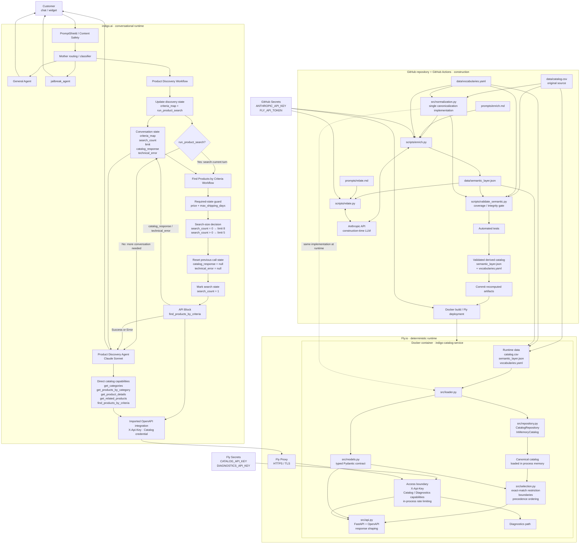

# Catalog Service · Product Discovery Agent

An end-to-end product discovery system for a gift shop, built around a deterministic **Catalog Service** and a conversational **Product Discovery Agent** in indigo.ai.

The project takes a raw ecommerce catalog that was never designed for conversational discovery, canonicalizes it, enriches it with a controlled semantic layer, validates that derived data in CI, and exposes the resulting catalog through a typed FastAPI service. indigo.ai sits on top of that service and handles conversation, routing, state and tool orchestration.

The central architectural principle is that **the LLM does not search, clean or classify the raw catalog at request time**. Semantic enrichment happens during the build pipeline. At runtime, the Catalog Service works only with validated, canonical data already loaded in memory and performs deterministic filtering, precedence ordering and relationship resolution.

This separates two jobs that are easy to conflate:

- the **Catalog Service** is responsible for what products exist, what their canonical data means, which constraints they satisfy, how candidates are ordered, and which relationships between products are valid;
- the **Product Discovery Agent** is responsible for understanding the conversation, gathering what is still needed, choosing the appropriate capability, interpreting the service response and explaining recommendations naturally to the customer.

The service is containerized with Docker, deployed on Fly.io and exposed through an authenticated OpenAPI contract. The conversational layer is implemented in indigo.ai through routing, workflows, agents and API capabilities.

**Live service**

- API: `https://indigo-catalog-service.fly.dev`
- OpenAPI: `https://indigo-catalog-service.fly.dev/openapi.json`
- Swagger UI: `https://indigo-catalog-service.fly.dev/docs`

---

## The problem

Gift discovery is not the same problem as conventional catalog search.

A customer rarely arrives with a complete product query. They are more likely to say something like:

> “I need something for my sister. She has just moved house. Around €50, and I need it this week.”

The source catalog, however, was built for ecommerce storage and navigation. It contains product attributes, categories, prices and descriptive text, but it does not directly encode all the concepts needed to reason reliably about a gift conversation.

Several different problems have to be solved at once.

### Hard constraints and preferences are not the same thing

Some conditions define whether a product is actually usable. A delivery deadline or a strict maximum price cannot be treated as a vague preference.

Other signals should influence which valid products appear first without automatically eliminating everything else. The occasion, what the recipient might use the gift for, the intended function of the gift or the relationship to the recipient belong to a different class of reasoning.

Treating every signal as a hard filter produces brittle searches and unnecessary zero-result cases. Treating everything as a soft preference can produce recommendations that simply violate the customer's request.

The system therefore needs to distinguish **selection boundaries** from **signals used to order valid candidates**.

### The source data is not yet a reliable reasoning model

The input file contains real catalog imperfections that have to be absorbed by the integration layer rather than exposed to the conversational system.

The original source contains **152 rows across 17 columns**, but those rows do not correspond one-to-one with the products that should be shown to a customer. Duplicate products appear under different identifiers, category names contain formatting variants, some attributes are missing, some descriptions contain too little information to support a useful recommendation, and commercial recipient labels do not always describe a genuine restriction of the product.

After deterministic canonicalization, the service works with **150 canonical products** rather than 152 independent rows.

This distinction matters. If raw rows were treated as products:

- the same item could appear twice in a recommendation;
- category navigation could fragment across spelling or formatting variants;
- missing values could accidentally be turned into invented facts;
- commercial labels could create inappropriate ranking bias;
- alternate identifiers could fail to resolve to the same real product.

The raw catalog must therefore remain the source of truth while a deterministic integration layer converts it into a stable model suitable for discovery.

### Product attributes are not enough for gift discovery

A conventional ecommerce catalog can tell us that an item is a knife, costs €69, belongs to Kitchen & Dining and ships in two days.

That still does not fully answer questions such as:

- Is it useful for someone who enjoys cooking?
- Does it make sense as a housewarming gift?
- Is it a relatively safe choice when the buyer does not know the recipient very well?
- Is it suitable as a small additional gift rather than the main present?
- Is there another product that performs a similar function?
- Is there something that naturally pairs with it?
- If the customer wants a better version, what should count as a meaningful alternative rather than an unrelated expensive product?

Those are not facts that can be recovered reliably from price and category alone.

The project therefore introduces a **controlled semantic layer** that describes how products participate in gift-discovery decisions. This layer adds structured concepts such as intended use, functional role, gifting context, risk, relationships between products and alternative or complementary options.

The purpose is not to replace the original catalog. It is to make the catalog usable by a reasoning system without requiring the conversational model to infer those concepts from scratch on every request.

### Natural language and catalog language do not match exactly

Customers do not know the internal vocabulary of a catalog.

They may ask for a “chef knife”, a “chef's knife”, a “gyuto”, something “for cooking”, something “for someone who just moved”, or simply “something practical”.

The service therefore needs a controlled mechanism for mapping natural expressions to canonical domain concepts without forcing the customer to know internal field names or exact catalog labels.

This is also why `product_type` is not treated as a question that the agent must ask. If the customer provides a concrete object type, it can be interpreted. If they do not, discovery can proceed from function, use case and context instead.

### Zero results do not all mean the same thing

A particularly important distinction is the difference between:

- a product not existing;
- a relevant product existing but failing a hard constraint;
- the service understanding a criterion but being unable to apply it reliably;
- no valid product remaining after all applicable constraints are evaluated.

Those situations require different responses.

For example, if the shop carries a €149 chef's knife and the customer has a strict €50 limit, the correct answer is not:

> “We don't sell chef's knives.”

The service must be able to preserve the fact that the product exists while explaining that it was **excluded** because it exceeds the customer's budget.

Likewise, if part of a request cannot be mapped safely to the controlled vocabulary, the system should expose that limitation rather than pretending the criterion was applied.

This is why the API distinguishes successful results from structures such as `excluded` and `not_applied`.

### A conversational agent needs stable state, not repeated guesswork

Gift discovery normally takes more than one turn.

A customer may first provide the recipient, then a budget, then a deadline, then add that the person enjoys cooking, later increase the budget, ask to see the second result again, or request something similar but more premium.

The system must preserve what is already known while allowing later information to refine or replace earlier criteria.

It must also avoid:

- asking again for information already provided;
- rerunning identical searches unnecessarily;
- treating every user message as a completely new query;
- losing the relationship between phrases such as “the second one” and products shown earlier.

Conversational state therefore lives explicitly in the orchestration layer rather than being left entirely to the model's implicit memory.

### The LLM should not become the catalog database

A tempting implementation would be to place the CSV in model context or a retrieval system and ask an LLM to find products directly.

That would mix several responsibilities that benefit from being separated:

- data cleaning;
- canonicalization;
- filtering;
- ranking;
- relationship resolution;
- constraint enforcement;
- conversational reasoning;
- natural-language generation.

It would also make core catalog behaviour dependent on probabilistic interpretation at request time.

This project instead treats the LLM as the conversational reasoning layer and the Catalog Service as the authoritative product layer.

The agent can decide **what it needs to ask or search for**. The service decides **what the catalog actually contains and what satisfies the requested conditions**.

---

## The solution

The solution is split into three deliberately separate stages: **build-time semantic preparation, deterministic catalog runtime, and conversational orchestration**.

```text
                         BUILD / CI
                             │
                             ▼
                      raw catalog.csv
                             │
                  deterministic normalization
                             │
                             ▼
                    canonical product set
                             │
               semantic enrichment + relations
                             │
                             ▼
             validated semantic_layer.json
                    + vocabularies.yaml
                             │
                 validation + automated tests
                             │
                             ▼
                         deployment
                             │
                             │
                 ─────────────────────
                             │
                             ▼
                    CATALOG SERVICE
                             │
              catalog + semantic layer loaded
                       into memory
                             │
          deterministic filtering / precedence /
                relationships / API contract
                             │
                             ▼
                     FastAPI on Fly.io
                             │
                             │
                 ─────────────────────
                             │
                             ▼
                         indigo.ai
                             │
                     routing + state
                             │
                  discovery workflows
                             │
                     API capabilities
                             │
               Product Discovery Agent
                             │
                             ▼
                          customer
```

### 1. Build-time semantic preparation

The raw catalog remains versioned and unchanged.

A deterministic normalization layer first converts the source rows into the canonical product universe used everywhere else in the system. The same normalization implementation is shared between CI and runtime so that semantic validation and production cannot silently operate on different interpretations of the catalog.

The semantic pipeline then enriches those canonical products with the information required for gift discovery and builds relationships between them.

The result is stored as versioned derived data rather than recomputed during customer conversations.

The build pipeline validates that the semantic layer remains complete and internally coherent before deployment. If the derived catalog does not satisfy the required invariants, the new version is not deployed.

This means that semantic classification is a **controlled build concern**, not a runtime side effect.

### 2. Deterministic Catalog Service

At process startup, the service:

1. reads the original catalog;
2. applies the same deterministic canonicalization used during construction;
3. loads the validated semantic layer;
4. joins both representations;
5. builds the in-memory catalog consumed by the API.

Once startup is complete, customer requests do not trigger catalog classification or enrichment.

The service performs deterministic operations over data already in memory:

- category discovery;
- category browsing;
- criteria-based product discovery;
- product-detail retrieval;
- related-product resolution;
- hard-constraint enforcement;
- precedence ordering;
- alias resolution;
- excluded-product reporting;
- unresolved-criterion reporting.

The Catalog Service is therefore the authority for product truth.

It does not ask an LLM whether a €149 product satisfies a €50 maximum, whether two identifiers refer to the same canonical product, or whether an out-of-stock product should be returned. Those behaviours are encoded and tested as application logic.

### 3. Conversational orchestration in indigo.ai

indigo.ai provides the conversational layer on top of the API.

It is responsible for routing each turn to the correct conversational path, maintaining discovery state across turns, deciding whether enough information is available to search, calling the Catalog Service when necessary and giving the Product Discovery Agent access to the appropriate capabilities.

A dedicated discovery workflow maintains the accumulated search criteria. When the current turn creates or changes a discovery search and the required price and delivery information are available, the search workflow calls `find_products_by_criteria` and stores the returned envelope in `catalog_response`.

The Product Discovery Agent then starts from that service response rather than recreating the same catalog search independently.

The agent still has direct access to discovery capabilities when the conversation genuinely creates a new need inside its own reasoning — for example, looking for a complement, filling remaining budget, finding a related product or exploring a higher-priced alternative.

This keeps tool use flexible without allowing the LLM to replace the deterministic search path.

### Clear ownership between layers

The resulting responsibility boundary is intentional:

| Concern | Owner |
|---|---|
| Raw catalog | Versioned source data |
| Canonicalization | Catalog Service code |
| Semantic classification | Build pipeline |
| Semantic relationships | Build pipeline |
| Semantic validation | CI |
| Product truth | Catalog Service |
| Constraint enforcement | Catalog Service |
| Candidate ordering | Catalog Service |
| API contract | Catalog Service |
| Conversation routing | indigo.ai |
| Conversational state | indigo.ai workflows |
| Choosing when a capability is needed | Workflows + Product Discovery Agent |
| Interpreting API responses for the customer | Product Discovery Agent |
| Recommendation wording and reasons | Product Discovery Agent |

The separation has an important operational consequence:

> **No customer conversation can change the catalog, classify a product, alter the semantic layer or cause the Catalog Service to invoke an LLM.**

The only LLM activity related to catalog classification happens during the controlled build pipeline. At runtime, the conversational LLM consumes an authenticated API whose behaviour is deterministic and independently testable.

That architecture gives the agent the flexibility needed for natural conversation without giving it authority over facts that should remain deterministic.

---

## Architecture

The system is deliberately split into **three execution environments with different responsibilities and different trust boundaries**:

1. **GitHub Actions** constructs and validates the semantic representation of the catalog.
2. **The Catalog Service on Fly.io** serves validated catalog data through deterministic application logic.
3. **indigo.ai** owns the conversational runtime: routing, state, workflow orchestration, tool use and natural-language responses.

The same product catalog moves through those environments, but the work performed in each one is intentionally different. Semantic classification belongs to CI. Product truth and selection belong to the Catalog Service. Conversational reasoning belongs to indigo.ai.

The complete architecture is:



### Construction plane: GitHub and CI

The repository contains both the source catalog and the machinery used to turn it into a validated semantic catalog.

The three data artifacts have different roles:

- `data/catalog.csv` is the original store export and remains the source of factual product data;
- `data/vocabularies.yaml` defines the controlled domain vocabulary, definitions and aliases used by the semantic system;
- `data/semantic_layer.json` contains the derived semantic classification and product relationships.

The key architectural decision is that **canonicalization has one implementation only**: `src/normalization.py`.

That implementation is consumed in both worlds:

- by the construction and validation path in CI;
- by `loader.py` when the production process starts.

This prevents CI from validating one interpretation of the catalog while the deployed service serves another.

Two separate prompts define the model-backed construction tasks:

- `prompts/enrich.md` defines how product-owned semantic fields are classified;
- `prompts/relate.md` defines how product relationships are constructed.

The corresponding scripts are:

- `scripts/enrich.py`;
- `scripts/relate.py`.

The Anthropic model is available **only in this construction environment**. `ANTHROPIC_API_KEY` is supplied to those steps from GitHub Secrets. The model is not a dependency of the production service and its credential never enters the runtime container.

Semantic construction is also not performed unnecessarily on every CI run. The workflow checks which inputs changed and only runs the model-backed construction path when semantic inputs require it. Code, API or infrastructure changes still pass through validation and tests without forcing a new semantic classification.

After construction, `scripts/validate_semantic.py` acts as the semantic gate. It validates the derived artifact that production would actually consume. Automated tests then validate the deterministic service behaviour.

Only after those checks pass can the pipeline:

1. commit updated `semantic_layer.json` and `vocabularies.yaml` when construction changed them;
2. build and deploy the application to Fly.io.

The semantic artifacts are therefore **versioned build outputs with a validation gate**, not ephemeral information generated inside a customer conversation.

---

### Runtime plane: the Catalog Service

The deployed service is intentionally smaller than the construction environment.

The Docker image contains:

- `src/`;
- `data/`;
- `requirements.txt` and the installed runtime dependencies.

It deliberately does **not** contain:

- `prompts/`;
- `scripts/`;
- `tests/`;
- the Anthropic SDK installed specifically for construction;
- `ANTHROPIC_API_KEY`.

The production container therefore contains neither the classification instructions nor the script and credential combination required to invoke the construction-time model.

At startup, `src/api.py` creates the in-memory catalog once. The service does not reload and rebuild it for every request.

The runtime path is:

```text
catalog.csv
      +
vocabularies.yaml
      +
semantic_layer.json
      ↓
loader.py
      ↓
normalization.py
      ↓
canonical products + semantic fields + resolved relations
      ↓
InMemoryCatalog
      ↓
selection.py
      ↓
api.py
      ↓
typed HTTP response
```

#### `normalization.py`

Owns deterministic interpretation of the source catalog.

It is the single implementation used by both construction and runtime.

#### `loader.py`

Has a narrow responsibility:

1. read `semantic_layer.json`;
2. call the canonicalization logic over the source catalog;
3. verify that the semantic artifact covers exactly the canonical catalog;
4. join source facts and semantic fields;
5. resolve relationships into the runtime representation;
6. construct the `Product` objects consumed by the service.

If the canonical catalog and semantic layer do not cover the same product universe, startup fails rather than silently serving partially classified data.

#### `models.py`

Defines the typed Pydantic models used by the service and therefore participates directly in the generated OpenAPI contract.

The API is not an untyped JSON wrapper around Python dictionaries. The shapes exposed to indigo.ai are explicit models with declared fields, limits and descriptions for the concepts whose interpretation matters to the agent.

#### `repository.py`

Separates the rest of the application from the current storage decision.

`CatalogRepository` defines what the service needs from a catalog. `InMemoryCatalog` is the current implementation: the canonical products, off-contract runtime data and resolved relation information are loaded into process memory once.

The rest of the service does not need to know that the source is currently a CSV plus two derived files.

#### `selection.py`

Owns **which products qualify and in which order they are returned**.

The module separates three mechanics that must not be confused:

1. exact `product_type` restriction when the customer has identified a concrete object;
2. selection boundaries that determine whether a candidate qualifies;
3. precedence ordering of the candidates that remain.

There is no LLM call in this path and no derived numeric recommendation score. The ordering is deterministic and reproducible.

#### `api.py`

Owns the external boundary.

It translates declared request parameters into service operations, resolves controlled vocabulary where required, checks access, delegates product selection to the deterministic layer and shapes the typed response.

It also produces the OpenAPI specification that indigo.ai imports to construct the catalog capabilities.

`api.py` deliberately does **not** decide recommendation ranking itself: product qualification and ordering remain in `selection.py`.

---

### Deployment plane: Docker and Fly.io

The Catalog Service runs as the Fly application:

`indigo-catalog-service`

The container runs FastAPI through Uvicorn on port `8080`.

Fly Proxy sits in front of the application and provides the public HTTPS boundary. Plain HTTP is forced to HTTPS before authenticated catalog traffic reaches the service.

The application is deployed in the Frankfurt region (`fra`), chosen because indigo.ai is the runtime caller waiting synchronously for catalog responses during a conversation.

The current configuration keeps one Machine available. This serves two purposes:

- avoiding a customer-facing cold start during the first catalog call;
- keeping the process-local rate limiter consistent with the declared rate rather than splitting its counters across multiple independent Machines.

The health check uses:

`GET /openapi.json`

This verifies that FastAPI itself is responding after the catalog has loaded, rather than merely checking that a TCP port is open.

The two runtime credentials arrive through Fly Secrets:

- `CATALOG_API_KEY`;
- `DIAGNOSTICS_API_KEY`.

They are environment variables at runtime and are not stored in the Docker image or `fly.toml`.

---

### API and access boundary

The Catalog Service exposes two distinct capabilities at the security boundary.

The **Catalog credential** is used by indigo.ai to access the five product operations.

The **Diagnostics credential** is reserved for operator diagnostics and cannot be substituted by the Catalog credential.

Both use the same HTTP header:

`X-Api-Key`

but map to different capabilities inside the service.

The access layer also enforces an in-process sliding-window rate limit before allowing the request to reach the corresponding operation.

The API separates two different classes of failure:

- transport/access/technical failures use the appropriate non-2xx HTTP status;
- foreseeable requests that cannot be executed safely are represented as recoverable API content, allowing the conversational layer to handle them without treating them as infrastructure failures.

The security model is described in detail later in this README, but architecturally the important point is that **Fly provides transport security while the application independently controls authorization and request limits**.

---

### Conversational plane: indigo.ai

indigo.ai is not the product database and does not own catalog truth. It owns the conversation around that catalog.

The conversational path begins with the platform's safety processing and routing layer.

A Mother classifier uses the conversation to choose the appropriate destination:

- general store conversation can go to the **General Agent**;
- gift discovery and its continuation turns go to the **Product Discovery Workflow**;
- requests identified as jailbreak/security attempts can be routed to `jailbreak_agent`.

This matters particularly for short continuation messages. A reply such as:

> “€60”

or:

> “the second one”

is not meaningful as an isolated query, but is meaningful inside an active discovery conversation.

---

### Product Discovery Workflow

The Product Discovery Workflow owns the structured evolution of the discovery request.

Its state-update step receives what is already known together with the customer's latest message and produces the updated `criteria_map`.

It also decides whether the current turn creates or changes a product search through `run_product_search`.

That produces two paths.

#### No search required

If the turn does not yet justify a new catalog search, control goes to the Product Discovery Agent.

Typical examples include:

- required information is still missing;
- the agent needs to ask a conversational question;
- the customer has not changed the effective discovery criteria.

#### Search required

If the current turn does create or refine a search, control goes to the **Find Products by Criteria Workflow**.

This deliberately separates:

> understanding that a search is needed

from:

> executing the deterministic catalog search.

---

### Find Products by Criteria Workflow

This workflow is the normal search path for conversational discovery.

It has several responsibilities before the API call is allowed to happen.

First, it acts as a final guard: a discovery search requires both:

- a price criterion;
- `max_shipping_days`.

If either is missing, the catalog search is not executed and control returns to the Product Discovery Agent so the missing information can be collected.

When search can proceed, the workflow determines response size from the conversation state:

- the first discovery search uses `limit = 8`;
- later searches use `limit = 5`.

Before a new API call, the previous:

- `catalog_response`;
- `technical_error`

are cleared so that the agent cannot accidentally reason over stale success data alongside a new failure.

`search_count` is then marked so subsequent searches use the refined-search size.

The workflow calls the deployed `find_products_by_criteria` endpoint using the structured criteria and captures the returned body as `catalog_response`.

Both API Success and API Error return control to the **Product Discovery Agent**. The difference is preserved in the state the agent receives rather than by creating a second conversational endpoint.

---

### Explicit conversational state

The orchestration does not rely exclusively on the LLM remembering previous prose.

The discovery flow maintains explicit state:

| Variable | Responsibility |
|---|---|
| `criteria_map` | The accumulated structured discovery criteria |
| `search_count` | Whether the first discovery search has already been consumed |
| `limit` | The result size selected for the current search |
| `catalog_response` | The latest valid catalog envelope returned by the search workflow |
| `technical_error` | The latest technical failure state |

`run_product_search` is produced by the state-update step to decide the route for the current turn.

This explicit state is what allows a conversation to evolve from:

> “a gift for my sister”

to:

> “around €60”

to:

> “within three days”

to:

> “she likes cooking”

without treating each message as an unrelated search.

---

### Product Discovery Agent

The Product Discovery Agent is the customer-facing reasoning layer for products.

When the Find Products by Criteria Workflow has already executed the current search, the agent starts from `catalog_response`.

It is instructed to **read that response first rather than automatically repeating the same search**.

This is an important distinction because the agent also has direct access to the catalog capabilities.

The normal current-turn discovery search belongs to the workflow, but the agent may initiate a genuinely new search when its own reasoning creates a new purpose or materially different criteria.

Examples include:

- finding an additional small gift to use remaining budget;
- checking a higher-priced trade-up;
- responding to a customer who explicitly asks to explore a materially different alternative.

The agent therefore retains flexibility without becoming the default executor of a search that has already been performed.

---

### The five catalog capabilities available to the conversational system

All five operations come from the same authenticated OpenAPI service:

- `get_categories`;
- `get_products_by_category`;
- `find_products_by_criteria`;
- `get_related_products`;
- `get_product_details`.

Their responsibilities remain separate.

The Product Discovery Agent uses the appropriate operation according to the conversation rather than treating `find_products_by_criteria` as a universal replacement for every catalog interaction.

For example:

```text
"What sections do you have?"
        ↓
get_categories

"Show me Kitchen & Dining."
        ↓
get_products_by_category

"Tell me more about the Slate Cheese Board Set."
        ↓
get_product_details

"Do you have something like this?"
        ↓
get_related_products

"I want something for my sister, around €60, within 3 days."
        ↓
Product Discovery Workflow
        ↓
Find Products by Criteria Workflow
        ↓
find_products_by_criteria
```

All of those paths eventually reach the **same Catalog Service and the same product truth**.

---

### OpenAPI as the integration contract

The boundary between indigo.ai and the Catalog Service is the service's published OpenAPI specification.

indigo.ai does not need access to the source CSV, Python objects, semantic artifact or selection implementation.

It sees:

- operation names;
- parameters;
- parameter descriptions;
- schemas;
- response shapes;
- authentication requirements.

This makes the API contract part of the agent architecture rather than merely API documentation.

The wording and typing of the contract matter because they define what the conversational system is allowed to ask the service to do and how it interprets what comes back.

The Catalog Service remains independently testable without indigo.ai, while indigo.ai remains decoupled from the internal storage and selection implementation.

---

### Two different uses of LLMs

The architecture contains LLMs in two places, but they perform fundamentally different jobs.

| Environment | LLM responsibility | Access to raw catalog construction |
|---|---|---|
| GitHub Actions | Build semantic classification and product relations | Yes, during controlled construction |
| indigo.ai | Understand conversation, choose capabilities and write customer-facing responses | No construction responsibility |
| Catalog Service runtime | **No LLM** | Not applicable |

This separation is intentional.

The construction-time model can help turn product descriptions into structured semantic information because its output is subsequently persisted, validated and tested.

The conversational model can reason flexibly about what the customer means because the facts it consumes come from a deterministic service.

The production Catalog Service itself does neither job probabilistically.

---

### End-to-end request example

A normal discovery request therefore crosses the architecture like this:

```text
Customer:
"I need something for my sister, around €60, within 3 days."
        │
        ▼
indigo.ai safety layer
        │
        ▼
Mother routing
        │
        ▼
Product Discovery Workflow
        │
        ├─ updates criteria_map
        └─ run_product_search = true
        │
        ▼
Find Products by Criteria Workflow
        │
        ├─ validates required discovery state
        ├─ chooses limit
        ├─ clears stale response/error state
        └─ calls find_products_by_criteria
        │
        ▼
Fly Proxy · HTTPS
        │
        ▼
FastAPI access boundary
        │
        ├─ X-Api-Key
        └─ rate limit
        │
        ▼
Catalog Service
        │
        ├─ resolve declared criteria
        ├─ identify exact object when applicable
        ├─ apply selection boundaries
        ├─ order by deterministic precedence
        └─ shape results / excluded / not_applied
        │
        ▼
catalog_response
        │
        ▼
Product Discovery Agent
        │
        ├─ interprets the returned products
        ├─ writes a reason for each recommendation
        └─ decides what conversational move is useful next
        │
        ▼
Customer
```

At no point in that request does the Catalog Service clean the CSV, reclassify a product or invoke a language model.

Those decisions were already made and validated before the container was deployed.

That boundary — **probabilistic construction where it can be validated, deterministic catalog behaviour where product truth matters, and probabilistic conversation where flexibility is useful** — is the core of the architecture.

---

## Data lifecycle

The catalog has **three distinct moments in its lifecycle**:

1. **construction**, where deterministic source normalization and model-assisted semantic enrichment produce a validated derived artifact;
2. **process startup**, where the deployed service reconstructs the same canonical product universe and joins it with that artifact;
3. **request time**, where already-loaded products are filtered, ordered and returned without rebuilding or reinterpreting the catalog.

Keeping these moments separate is a core system invariant.

```text
                       1 · CONSTRUCTION
                       GitHub Actions
                             │
          source data + vocabularies + prompts
                             │
                             ▼
                 deterministic canonicalization
                             │
                             ▼
               semantic enrichment + relations
                             │
                             ▼
                     semantic validation
                             │
                         automated tests
                             │
                             ▼
                versioned semantic artifacts
                             │
                          deploy
                             │
                             │
              ───────────────────────────
                             │
                             ▼
                    2 · PROCESS STARTUP
                        Fly.io container
                             │
               source catalog canonicalized
                 with THE SAME implementation
                             +
                  semantic artifact loaded
                             │
                             ▼
                    canonical Product model
                             │
                      InMemoryCatalog
                             │
                             │
              ───────────────────────────
                             │
                             ▼
                       3 · REQUEST TIME
                             │
                     already-loaded data
                             │
             filter → order → relate → serialize
                             │
                             ▼
                         API response
```

The same files participate differently at each moment. What must not happen is for one stage to silently invent a second interpretation of the catalog.

---

### 1. Construction

Construction runs in GitHub Actions, not inside the production application.

Its purpose is to transform the store's source catalog into a **validated semantic representation that can later be consumed deterministically**.

The construction inputs are:

- `data/catalog.csv` — factual product source;
- `data/vocabularies.yaml` — controlled semantic vocabulary, definitions and aliases;
- `prompts/enrich.md` — semantic classification criterion;
- `prompts/relate.md` — relationship classification criterion;
- `src/normalization.py` — deterministic canonicalization rules.

The principal derived output is:

- `data/semantic_layer.json`.

`data/vocabularies.yaml` can also change during construction when a genuinely new product introduces a new `product_type`.

Construction itself contains several different kinds of work and deliberately does not treat all of them as model tasks.

---

### Deterministic canonicalization happens before semantic reasoning

The first important distinction is between **normalizing information that is already present** and **classifying information that does not exist explicitly in the source**.

`src/normalization.py` handles the first category.

It performs deterministic operations such as:

- parsing supported price formats;
- preserving a missing price as missing rather than inventing one;
- interpreting stock quantity and availability;
- normalizing category formatting;
- normalizing booleans and numeric fields;
- detecting product duplicates;
- selecting one canonical `product_id`;
- preserving absorbed identifiers as `alt_product_ids`;
- carrying additional categories into `secondary_categories`;
- preserving missing `rating` and `reviews_count` as missing;
- marking insufficient descriptions through `description_quality`;
- expanding `recipient` with `anyone` where the product is not genuinely gender-specific or restricted to children;
- emitting data-quality warnings.

If a value is genuinely ambiguous, the code does **not** guess.

For example, a price representation that cannot be distinguished safely between decimal and thousands notation raises `AmbiguousCatalog` with the row, column, value and reason.

This is an intentional boundary:

> Formatting variation may be normalized. Missing or ambiguous facts may not be invented.

The result of this stage is the canonical product universe against which both semantic construction and production runtime operate.

For the current source:

```text
152 source rows
      ↓
deterministic canonicalization
      ↓
150 canonical products
```

The distinction between rows and products therefore exists before any semantic recommendation logic begins.

---

### Semantic enrichment adds information the source does not contain

Once products have a stable canonical identity, `scripts/enrich.py` constructs the semantic fields required by discovery.

This is where a language model is useful: not to answer customer requests, but to convert product descriptions and catalog facts into **controlled, persistent domain classifications**.

The semantic decision is model-assisted, but its output is not accepted as arbitrary text.

The classifier must operate within the vocabulary and structural rules defined by the project.

For the controlled fields, proposed values are checked against `vocabularies.yaml` before being written.

If the model places a real value in the wrong vocabulary, invents an undeclared value, omits a required field or returns an invalid type, the script does not silently repair the answer and continue.

Instead:

1. the exact validation problem is identified;
2. that problem is returned to the model;
3. the model receives a bounded opportunity to correct its answer;
4. if the output remains invalid after the configured attempts, construction fails without accepting the invalid classification.

The current implementation allows **three attempts**.

This creates a useful division of responsibility:

- the model makes the semantic judgement;
- deterministic code decides whether that judgement is admissible.

---

### `product_type` is controlled but intentionally open

Most semantic vocabularies are closed: the classifier must choose among concepts that already exist.

`product_type` is different because inventory can legitimately introduce a type of object that has never appeared before.

For that reason it is controlled but extensible.

When a new product genuinely requires a new `product_type`, `enrich.py` can register it together with:

- its definition;
- its aliases.

That registration happens in the same construction run so that the semantic artifact cannot refer to a type that the vocabulary does not yet know.

A new `product_type` caused only by inventory growth is not considered a change in the meaning of the existing classification system. It therefore does **not** by itself increment the vocabulary version or require every existing product to be reclassified.

This distinction prevents ordinary catalog growth from unnecessarily rebuilding the entire semantic model.

---

### Enrichment is incremental unless the classification criterion changes

Model-backed work is not repeated merely because CI runs.

`enrich.py` distinguishes between two situations.

#### Inventory growth

If the classification criterion has not changed, products that already have a valid semantic entry keep it.

Only canonical products without an entry need classification.

This makes ordinary catalog growth incremental.

#### Criterion change

If the meaning of the classification has changed, existing classifications can no longer safely be assumed to mean the same thing.

A criterion change includes changes such as:

- modifications to `prompts/enrich.md`;
- changes to the closed vocabularies;
- redefinition or removal of an existing `product_type`;
- changes to an existing type's definition or aliases;
- a vocabulary version change.

In those cases, the whole catalog is reclassified.

The reason is more important than the optimization:

> A semantic artifact in which half the products were classified under one meaning and half under another can still be structurally valid while being semantically wrong.

The pipeline therefore distinguishes **new inventory** from **changed meaning**.

---

### Product relationships are recomputed globally

`scripts/relate.py` follows a different lifecycle from product-owned semantic fields.

Relationships are **not incremental**.

A new product can change the correct relationships of products that already existed. Adding a new chef's knife, for example, may create a new valid complement or alternative for products that were previously related only to the existing knife.

For this reason, when relation construction is required, the relationship mesh is reconsidered over the complete canonical catalog.

The script constructs and validates two different relationship families:

- `pairs_with`;
- `alternative_to`.

They are persisted differently because they mean different things.

#### `pairs_with`

A pairing has direction in the persisted artifact.

It is stored from the accessory toward the main product.

That direction contains semantic meaning, so it is not normalized away by sorting identifiers.

#### `alternative_to`

An alternative relation is symmetric.

It is persisted only once, under the lexicographically smaller `product_id`, together with its `relation_type`.

The loader later makes the other side aware of that relationship at runtime.

This avoids storing the same semantic fact twice and prevents two copies of the relationship from drifting apart.

As with enrichment, the model proposes semantic relationships but deterministic validation controls what is allowed to become persistent data.

Invalid references, self-relations, invalid relation types, conflicting duplicate relations and other structural violations cause the proposed result to be rejected rather than repaired silently.

---

### The semantic gate validates what production will actually consume

After construction, `scripts/validate_semantic.py` acts as a **deployment gate**.

It does not ask whether the model made aesthetically good recommendations. Its responsibility is structural and referential integrity.

The validator reconstructs the canonical catalog using the same `normalization.py` implementation and checks the derived artifact against that universe.

Among the invariants it enforces are:

- the semantic layer and vocabulary declare the expected version;
- the set of semantic entries matches the set of canonical products exactly;
- no canonical product is missing a semantic entry;
- no semantic entry exists without a canonical product;
- required semantic fields are present;
- required semantic fields are non-empty where the contract requires it;
- closed-vocabulary values really belong to their declared vocabulary;
- every `product_type` used by a product is declared;
- `product_type` definitions exist;
- aliases do not resolve ambiguously to multiple types;
- gender-specific declarations use admitted values;
- boolean semantic fields are actually boolean;
- relationship references point only to canonical products;
- a product is never related to itself;
- relationships are persisted only once according to their storage rule;
- `relation_type` contains an admitted value;
- redundant derived `same_function` relationships are not persisted when shared `product_type` already expresses them;
- newly introduced product types are justified by actual catalog growth;
- newly registered types are actually used.

Referential integrity is deliberately based on the **150 canonical product identifiers**, not the 152 raw identifiers.

An absorbed `alt_product_id` represents another identifier for the same object; it is not a second semantic node.

If the gate reports any failure, it exits unsuccessfully and **the deployment does not continue**.

There is no runtime fallback that says “deploy it anyway and let the agent work around the missing classification.”

The artifact either satisfies the contract or it is not production data.

---

### Automated tests follow semantic validation

The semantic gate and the automated test suite have complementary purposes.

The gate asks:

> Is the derived catalog internally complete and structurally coherent?

The tests ask:

> Does the service behave according to the implemented catalog contract?

Both run before deployment.

This distinction matters because structural semantic validity alone does not prove selection behaviour, API behaviour, authentication, error handling or ordering semantics.

The complete test strategy is documented later in this README.

---

### Derived artifacts are versioned

When construction modifies `semantic_layer.json` or legitimately extends `vocabularies.yaml`, the pipeline commits those artifacts back to the repository.

This is deliberate.

The production semantic state is therefore:

- inspectable;
- versioned;
- diffable;
- reproducible;
- tied to the source and criterion that produced it.

The semantic layer is not hidden transient state inside an LLM call.

It is part of the application data model.

---

## 2. Process startup

The second lifecycle moment begins when the deployed Docker container starts.

No construction-time LLM is available here.

The runtime image contains the application code and the three data files:

```text
catalog.csv
vocabularies.yaml
semantic_layer.json
```

`loader.py` combines them into the model the service will use for the lifetime of that process.

Importantly, the service does **not** simply trust that because CI previously validated the files, every possible runtime mismatch should be ignored.

Startup maintains its own critical invariant.

---

### The same canonicalization runs again

`loader.py` reads the semantic layer and then invokes `normalization.canonicalize(...)` over the original CSV.

This is the **same Python implementation used during construction**.

There is no second set of CSV-cleaning rules inside `loader.py`.

That means:

```text
CI's idea of "the canonical catalog"
                  =
runtime's idea of "the canonical catalog"
```

This equality is fundamental.

If CI validated one set of product identities but runtime independently constructed another, semantic coverage would no longer guarantee anything.

---

### The semantic layer must cover exactly the runtime catalog

Once canonicalization is complete, the loader compares:

- canonical identifiers derived from the source catalog;
- identifiers present in `semantic_layer.json`.

The sets must be exactly equal.

If products are missing from the semantic layer or semantic entries exist without a canonical source product, startup raises `IncompleteSemanticLayer`.

The service does not:

- fabricate a classification;
- ignore the product;
- partially start;
- ask an LLM to repair it.

It fails before serving an incomplete catalog.

CI is the first protection against an invalid artifact; startup is the final protection at the point of use.

---

### Source facts and semantic facts are joined

For every canonical product, `loader.py` constructs the runtime `Product` from two sources.

The canonical source contributes factual catalog information such as:

- identity;
- name;
- description;
- price;
- delivery;
- gift-wrap availability;
- brand;
- color;
- material;
- availability;
- categories;
- recipient information;
- occasion;
- rating and review count.

The semantic artifact contributes derived discovery information such as:

- `product_type`;
- `functional_family`;
- `use_case`;
- `suitable_relationships`;
- `gift_risk`;
- `is_standalone_gift`;
- `stocking_filler`;
- product relationships.

Neither file replaces the other.

The semantic layer augments the canonical source.

---

### Persisted relationships are resolved for runtime use

Relations are deliberately stored once in `semantic_layer.json`, but the runtime needs to query them from either endpoint.

The loader therefore resolves the persisted representation into the bidirectional runtime view where appropriate.

For `pairs_with` and `alternative_to`, both related products become aware of the relation in memory.

`relation_type` remains separate from `Product` because it describes **the relation between two products**, not an intrinsic property of either product.

This is an example of a broader design rule used throughout the service:

> Data is stored and exposed according to what it means, not merely according to what is convenient to serialize.

---

### Some runtime information deliberately stays outside the public `Product` contract

The loader also keeps information needed internally by the service but not intended to travel with every product response.

This includes:

- `description_quality`;
- `tags`;
- `stock`;
- `alt_product_ids`.

Those fields still have runtime purposes.

For example:

- `description_quality` participates in precedence ordering;
- `alt_product_ids` allow an absorbed identifier to resolve to its canonical product.

Keeping something outside the public product envelope does not mean discarding it. It means the API contract does not expose information the conversational agent does not need.

---

### The in-memory repository is built once

The resulting products are loaded into `InMemoryCatalog`.

It provides:

- the complete canonical product set;
- lookup by canonical identifier;
- lookup through absorbed identifiers;
- off-contract runtime information;
- relationship metadata;
- normalized category names.

At this point startup is complete.

The service has moved from **versioned source + derived files** to **ready-to-query runtime objects**.

No database migration, vector index construction or model warm-up is required.

---

## 3. Request time

The third lifecycle moment is deliberately the simplest.

When indigo.ai calls the deployed service, the catalog has already been:

- normalized;
- deduplicated;
- semantically classified;
- related;
- validated;
- loaded;
- joined;
- indexed for identifier lookup.

A request does **not** repeat those operations.

The request path operates on the in-memory model.

Depending on the operation, it can:

- resolve declared aliases;
- identify an exact requested object;
- apply selection boundaries;
- order valid candidates by precedence;
- browse a category;
- retrieve a product;
- resolve alternatives or complements;
- construct `excluded`;
- construct `not_applied`;
- shape the typed response.

The result is then serialized through the FastAPI/Pydantic contract.

There is:

- no call to Anthropic;
- no semantic reclassification;
- no relation reconstruction;
- no CSV mutation;
- no database query;
- no vector search;
- no embedding request.

The conversational LLM exists above this boundary in indigo.ai. It decides what capability is useful and explains what the API returns, but it does not perform the catalog's deterministic work itself.

---

### Why normalization is not repeated per request

The source catalog is immutable during the lifetime of a deployed process.

Running canonicalization for every customer turn would therefore produce the same result repeatedly while adding unnecessary latency and another opportunity for request-time failure.

Canonicalization belongs at process startup because that is the point where raw persisted data becomes runtime application state.

After that, request handling can remain a pure operation over known objects.

---

### Why semantic enrichment is not performed at startup either

Semantic enrichment is different from deterministic normalization.

It uses a model and can produce new derived data.

Running it every time a container starts would create several problems:

- two instances could derive different semantic states from the same deployment;
- startup would depend on an external model provider;
- cold starts would become expensive and slow;
- the semantic state actually serving customers would no longer be versioned;
- a model failure could make an otherwise valid deployment unavailable;
- CI could no longer validate exactly what production would consume.

For those reasons, semantic construction happens **before deployment**, while deterministic assembly happens **at startup**.

---

## The lifecycle invariant

The complete design can be summarized as:

```text
BUILD
probabilistic semantic judgement
        +
deterministic validation
        ↓
versioned artifact

STARTUP
deterministic reconstruction
        +
exact artifact/catalog join
        ↓
in-memory product model

REQUEST
deterministic selection
        +
typed serialization
        ↓
catalog response
```

The probabilistic part of catalog construction therefore happens at a moment where its result can be **persisted, inspected, validated, tested and rejected**.

By the time a customer is waiting for an answer, that uncertainty has already been converted into validated application data.

That is the central reason for the lifecycle split.