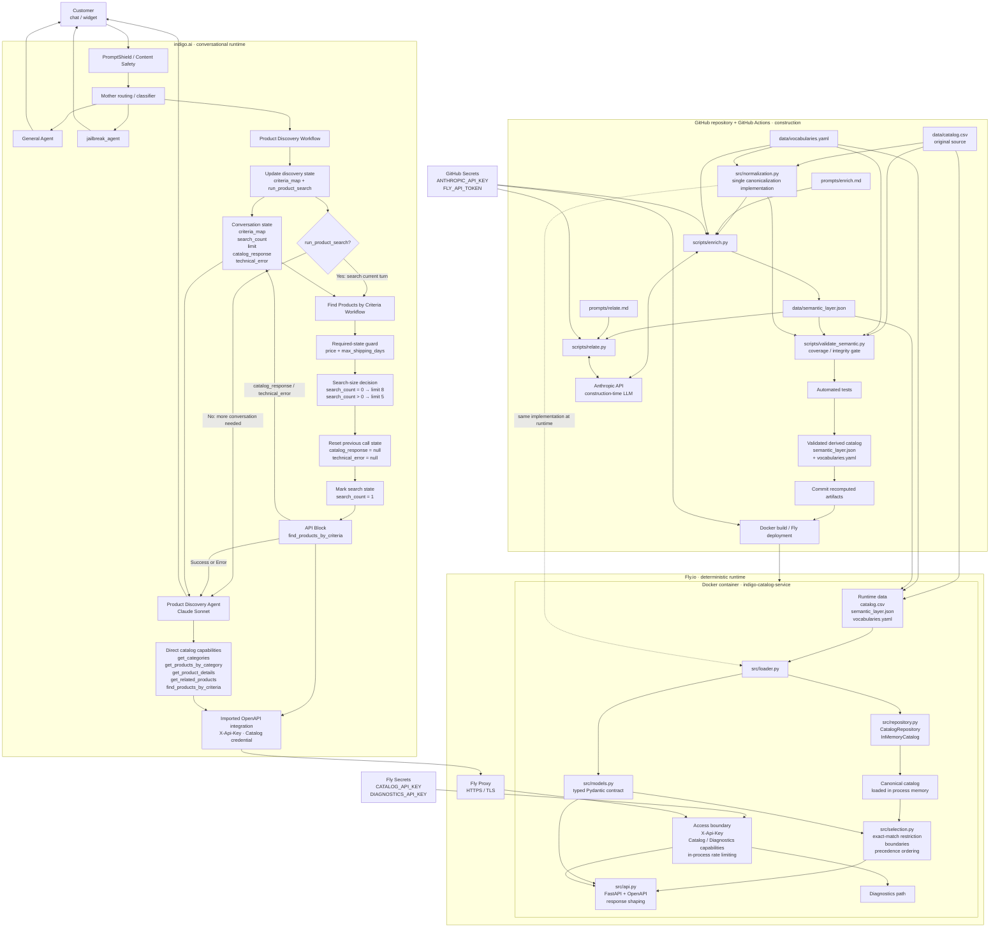

# Catalog Service · Product Discovery Agent

An end-to-end product discovery system for a gift shop, built around a deterministic **Catalog Service** and a conversational **Product Discovery Agent** in indigo.ai.

The project takes a raw ecommerce catalog that was never designed for conversational discovery, canonicalizes it, enriches it with a controlled semantic layer, validates that derived data in CI, and exposes the resulting catalog through a typed FastAPI service. indigo.ai sits on top of that service and handles conversation, routing, state and tool orchestration.

The central architectural principle is that **the LLM does not search, clean or classify the raw catalog at request time**. Semantic enrichment happens during the build pipeline. At runtime, the Catalog Service works only with validated, canonical data already loaded in memory and performs deterministic filtering, precedence ordering and relationship resolution.

This separates two jobs that are easy to conflate:

- the **Catalog Service** is responsible for what products exist, what their canonical data means, which constraints they satisfy, how candidates are ordered, and which relationships between products are valid;
- the **Product Discovery Agent** is responsible for understanding the conversation, gathering what is still needed, choosing the appropriate capability, interpreting the service response and explaining recommendations naturally to the customer.

The service is containerized with Docker, deployed on Fly.io and exposed through an authenticated OpenAPI contract. The conversational layer is implemented in indigo.ai through routing, workflows, agents and API capabilities.

**Live service**

- API: `https://indigo-catalog-service.fly.dev`
- OpenAPI: `https://indigo-catalog-service.fly.dev/openapi.json`
- Swagger UI: `https://indigo-catalog-service.fly.dev/docs`

---

## The problem

Gift discovery is not the same problem as conventional catalog search.

A customer rarely arrives with a complete product query. They are more likely to say something like:

> “I need something for my sister. She has just moved house. Around €50, and I need it this week.”

The source catalog, however, was built for ecommerce storage and navigation. It contains product attributes, categories, prices and descriptive text, but it does not directly encode all the concepts needed to reason reliably about a gift conversation.

Several different problems have to be solved at once.

### Hard constraints and preferences are not the same thing

Some conditions define whether a product is actually usable. A delivery deadline or a strict maximum price cannot be treated as a vague preference.

Other signals should influence which valid products appear first without automatically eliminating everything else. The occasion, what the recipient might use the gift for, the intended function of the gift or the relationship to the recipient belong to a different class of reasoning.

Treating every signal as a hard filter produces brittle searches and unnecessary zero-result cases. Treating everything as a soft preference can produce recommendations that simply violate the customer's request.

The system therefore needs to distinguish **selection boundaries** from **signals used to order valid candidates**.

### The source data is not yet a reliable reasoning model

The input file contains real catalog imperfections that have to be absorbed by the integration layer rather than exposed to the conversational system.

The original source contains **152 rows across 17 columns**, but those rows do not correspond one-to-one with the products that should be shown to a customer. Duplicate products appear under different identifiers, category names contain formatting variants, some attributes are missing, some descriptions contain too little information to support a useful recommendation, and commercial recipient labels do not always describe a genuine restriction of the product.

After deterministic canonicalization, the service works with **150 canonical products** rather than 152 independent rows.

This distinction matters. If raw rows were treated as products:

- the same item could appear twice in a recommendation;
- category navigation could fragment across spelling or formatting variants;
- missing values could accidentally be turned into invented facts;
- commercial labels could create inappropriate ranking bias;
- alternate identifiers could fail to resolve to the same real product.

The raw catalog must therefore remain the source of truth while a deterministic integration layer converts it into a stable model suitable for discovery.

### Product attributes are not enough for gift discovery

A conventional ecommerce catalog can tell us that an item is a knife, costs €69, belongs to Kitchen & Dining and ships in two days.

That still does not fully answer questions such as:

- Is it useful for someone who enjoys cooking?
- Does it make sense as a housewarming gift?
- Is it a relatively safe choice when the buyer does not know the recipient very well?
- Is it suitable as a small additional gift rather than the main present?
- Is there another product that performs a similar function?
- Is there something that naturally pairs with it?
- If the customer wants a better version, what should count as a meaningful alternative rather than an unrelated expensive product?

Those are not facts that can be recovered reliably from price and category alone.

The project therefore introduces a **controlled semantic layer** that describes how products participate in gift-discovery decisions. This layer adds structured concepts such as intended use, functional role, gifting context, risk, relationships between products and alternative or complementary options.

The purpose is not to replace the original catalog. It is to make the catalog usable by a reasoning system without requiring the conversational model to infer those concepts from scratch on every request.

### Natural language and catalog language do not match exactly

Customers do not know the internal vocabulary of a catalog.

They may ask for a “chef knife”, a “chef's knife”, a “gyuto”, something “for cooking”, something “for someone who just moved”, or simply “something practical”.

The service therefore needs a controlled mechanism for mapping natural expressions to canonical domain concepts without forcing the customer to know internal field names or exact catalog labels.

This is also why `product_type` is not treated as a question that the agent must ask. If the customer provides a concrete object type, it can be interpreted. If they do not, discovery can proceed from function, use case and context instead.

### Zero results do not all mean the same thing

A particularly important distinction is the difference between:

- a product not existing;
- a relevant product existing but failing a hard constraint;
- the service understanding a criterion but being unable to apply it reliably;
- no valid product remaining after all applicable constraints are evaluated.

Those situations require different responses.

For example, if the shop carries a €149 chef's knife and the customer has a strict €50 limit, the correct answer is not:

> “We don't sell chef's knives.”

The service must be able to preserve the fact that the product exists while explaining that it was **excluded** because it exceeds the customer's budget.

Likewise, if part of a request cannot be mapped safely to the controlled vocabulary, the system should expose that limitation rather than pretending the criterion was applied.

This is why the API distinguishes successful results from structures such as `excluded` and `not_applied`.

### A conversational agent needs stable state, not repeated guesswork

Gift discovery normally takes more than one turn.

A customer may first provide the recipient, then a budget, then a deadline, then add that the person enjoys cooking, later increase the budget, ask to see the second result again, or request something similar but more premium.

The system must preserve what is already known while allowing later information to refine or replace earlier criteria.

It must also avoid:

- asking again for information already provided;
- rerunning identical searches unnecessarily;
- treating every user message as a completely new query;
- losing the relationship between phrases such as “the second one” and products shown earlier.

Conversational state therefore lives explicitly in the orchestration layer rather than being left entirely to the model's implicit memory.

### The LLM should not become the catalog database

A tempting implementation would be to place the CSV in model context or a retrieval system and ask an LLM to find products directly.

That would mix several responsibilities that benefit from being separated:

- data cleaning;
- canonicalization;
- filtering;
- ranking;
- relationship resolution;
- constraint enforcement;
- conversational reasoning;
- natural-language generation.

It would also make core catalog behaviour dependent on probabilistic interpretation at request time.

This project instead treats the LLM as the conversational reasoning layer and the Catalog Service as the authoritative product layer.

The agent can decide **what it needs to ask or search for**. The service decides **what the catalog actually contains and what satisfies the requested conditions**.

---

## The solution

The solution is split into three deliberately separate stages: **build-time semantic preparation, deterministic catalog runtime, and conversational orchestration**.

```text
                         BUILD / CI
                             │
                             ▼
                      raw catalog.csv
                             │
                  deterministic normalization
                             │
                             ▼
                    canonical product set
                             │
               semantic enrichment + relations
                             │
                             ▼
             validated semantic_layer.json
                    + vocabularies.yaml
                             │
                 validation + automated tests
                             │
                             ▼
                         deployment
                             │
                             │
                 ─────────────────────
                             │
                             ▼
                    CATALOG SERVICE
                             │
              catalog + semantic layer loaded
                       into memory
                             │
          deterministic filtering / precedence /
                relationships / API contract
                             │
                             ▼
                     FastAPI on Fly.io
                             │
                             │
                 ─────────────────────
                             │
                             ▼
                         indigo.ai
                             │
                     routing + state
                             │
                  discovery workflows
                             │
                     API capabilities
                             │
               Product Discovery Agent
                             │
                             ▼
                          customer
```

### 1. Build-time semantic preparation

The raw catalog remains versioned and unchanged.

A deterministic normalization layer first converts the source rows into the canonical product universe used everywhere else in the system. The same normalization implementation is shared between CI and runtime so that semantic validation and production cannot silently operate on different interpretations of the catalog.

The semantic pipeline then enriches those canonical products with the information required for gift discovery and builds relationships between them.

The result is stored as versioned derived data rather than recomputed during customer conversations.

The build pipeline validates that the semantic layer remains complete and internally coherent before deployment. If the derived catalog does not satisfy the required invariants, the new version is not deployed.

This means that semantic classification is a **controlled build concern**, not a runtime side effect.

### 2. Deterministic Catalog Service

At process startup, the service:

1. reads the original catalog;
2. applies the same deterministic canonicalization used during construction;
3. loads the validated semantic layer;
4. joins both representations;
5. builds the in-memory catalog consumed by the API.

Once startup is complete, customer requests do not trigger catalog classification or enrichment.

The service performs deterministic operations over data already in memory:

- category discovery;
- category browsing;
- criteria-based product discovery;
- product-detail retrieval;
- related-product resolution;
- hard-constraint enforcement;
- precedence ordering;
- alias resolution;
- excluded-product reporting;
- unresolved-criterion reporting.

The Catalog Service is therefore the authority for product truth.

It does not ask an LLM whether a €149 product satisfies a €50 maximum, whether two identifiers refer to the same canonical product, or whether an out-of-stock product should be returned. Those behaviours are encoded and tested as application logic.

### 3. Conversational orchestration in indigo.ai

indigo.ai provides the conversational layer on top of the API.

It is responsible for routing each turn to the correct conversational path, maintaining discovery state across turns, deciding whether enough information is available to search, calling the Catalog Service when necessary and giving the Product Discovery Agent access to the appropriate capabilities.

A dedicated discovery workflow maintains the accumulated search criteria. When the current turn creates or changes a discovery search and the required price and delivery information are available, the search workflow calls `find_products_by_criteria` and stores the returned envelope in `catalog_response`.

The Product Discovery Agent then starts from that service response rather than recreating the same catalog search independently.

The agent still has direct access to discovery capabilities when the conversation genuinely creates a new need inside its own reasoning — for example, looking for a complement, filling remaining budget, finding a related product or exploring a higher-priced alternative.

This keeps tool use flexible without allowing the LLM to replace the deterministic search path.

### Clear ownership between layers

The resulting responsibility boundary is intentional:

| Concern | Owner |
|---|---|
| Raw catalog | Versioned source data |
| Canonicalization | Catalog Service code |
| Semantic classification | Build pipeline |
| Semantic relationships | Build pipeline |
| Semantic validation | CI |
| Product truth | Catalog Service |
| Constraint enforcement | Catalog Service |
| Candidate ordering | Catalog Service |
| API contract | Catalog Service |
| Conversation routing | indigo.ai |
| Conversational state | indigo.ai workflows |
| Choosing when a capability is needed | Workflows + Product Discovery Agent |
| Interpreting API responses for the customer | Product Discovery Agent |
| Recommendation wording and reasons | Product Discovery Agent |

The separation has an important operational consequence:

> **No customer conversation can change the catalog, classify a product, alter the semantic layer or cause the Catalog Service to invoke an LLM.**

The only LLM activity related to catalog classification happens during the controlled build pipeline. At runtime, the conversational LLM consumes an authenticated API whose behaviour is deterministic and independently testable.

That architecture gives the agent the flexibility needed for natural conversation without giving it authority over facts that should remain deterministic.

---

## Architecture

The system is deliberately split into **three execution environments with different responsibilities and different trust boundaries**:

1. **GitHub Actions** constructs and validates the semantic representation of the catalog.
2. **The Catalog Service on Fly.io** serves validated catalog data through deterministic application logic.
3. **indigo.ai** owns the conversational runtime: routing, state, workflow orchestration, tool use and natural-language responses.

The same product catalog moves through those environments, but the work performed in each one is intentionally different. Semantic classification belongs to CI. Product truth and selection belong to the Catalog Service. Conversational reasoning belongs to indigo.ai.

The complete architecture is:



[Existing README content through the end of `## API contract and response design` remains unchanged from commit `fcf253f3d3f924c4debb7b398f33d5bae79032aa`.]

---

## Agent orchestration in indigo.ai

The conversational layer is implemented in indigo.ai as a **multi-stage orchestration**, not as a single agent with unrestricted tool access.

The main runtime components are:

```text
Mother routing
        │
        ├── General Agent
        ├── jailbreak_agent
        └── Product Discovery Workflow
                    │
                    ├── update discovery state
                    ├── run_product_search = false
                    │       ↓
                    │   Product Discovery Agent
                    │
                    └── run_product_search = true
                            ↓
                  Find Products by Criteria Workflow
                            ↓
                       Catalog Service
                            ↓
                     catalog_response
                            ↓
                  Product Discovery Agent
```

This architecture separates four different responsibilities:

| Responsibility | Owner |
|---|---|
| Decide which conversational domain owns the turn | Mother routing |
| Convert natural language into structured discovery state | Product Discovery Workflow |
| Execute the normal current-turn catalog search | Find Products by Criteria Workflow |
| Interpret results and continue the conversation | Product Discovery Agent |

The separation is intentional.

The Product Discovery Agent is not expected to infer the complete search state from scratch on every turn, and it is not the default executor of a discovery search that the workflow has already performed.

---

## Entry routing

A conversation first passes through indigo.ai's platform safety and routing layer.

The Mother routing component determines which conversational path should receive the turn.

The implemented product architecture distinguishes at least three destinations:

```text
general store conversation
        ↓
General Agent

gift/product discovery
or continuation of an active discovery
        ↓
Product Discovery Workflow

jailbreak / security-sensitive request
        ↓
jailbreak_agent
```

The routing decision must consider conversation context rather than only the isolated latest message.

This matters because product discovery is naturally multi-turn.

A message such as:

```text
"€60"
```

may be meaningless by itself but can be the missing budget in an active gift search.

Likewise:

```text
"three days"
"the second one"
"I can go a bit over"
"what about something for cooking?"
```

may all be continuation turns rather than new intents.

The orchestration therefore treats conversational continuity as part of routing.

---

# Product Discovery Workflow

The **Product Discovery Workflow** is responsible for converting the evolving customer conversation into structured discovery state.

It receives both:

- what is already known from earlier turns;
- the customer's new message.

Its output includes:

```text
criteria_map
run_product_search
```

These outputs answer two different questions.

`criteria_map` answers:

> What do we currently know about the product request?

`run_product_search` answers:

> Does this turn require a new catalog search?

The distinction prevents every conversational turn from automatically becoming an API call.

---

## `criteria_map`

`criteria_map` is the accumulated structured representation of the current discovery request.

It can contain the criteria supported by the Catalog Service, such as:

```text
max_price
target_price
min_price
max_shipping_days

recipient
relationship
buyer_knows_recipient
occasion

functional_family
use_case
product_type

category
subcategory

brand
color
material
gift_wrap_required

stocking_filler
```

The workflow updates this object as the conversation evolves.

The important property is that it represents **current state**, not merely the entities extracted from the latest sentence.

For example:

```text
Customer:
"I need something for my sister."
        ↓
criteria_map:
recipient = her
```

then:

```text
Customer:
"Around €60."
        ↓
criteria_map:
recipient = her
target_price = 60
```

then:

```text
Customer:
"I need it within three days."
        ↓
criteria_map:
recipient = her
target_price = 60
max_shipping_days = 3
```

The earlier information is not discarded merely because it was not repeated.

---

## Later information can refine earlier information

The state is conversational rather than immutable.

If the customer changes their mind, the workflow must represent the new request rather than preserving obsolete criteria indefinitely.

For example:

```text
"Actually, I can spend up to €100."
```

can change the active price interpretation.

Likewise, moving from:

```text
"something for cooking"
```

to:

```text
"specifically a chef's knife"
```

changes the product intention from broad semantic discovery to an exact object request.

The structured state therefore exists to preserve continuity **without freezing the conversation**.

---

# `run_product_search`

`run_product_search` determines whether the updated turn requires the normal discovery search to execute.

Conceptually:

```text
new message
    +
existing state
        ↓
Product Discovery Workflow
        ↓
has the effective product search changed?
        │
        ├── no
        │     ↓
        │ Product Discovery Agent
        │
        └── yes
              ↓
      Find Products by Criteria Workflow
```

A turn does not require a new search merely because the customer sent another message.

Examples that may not require a fresh discovery call include:

- a conversational clarification;
- asking about a result already returned;
- answering a question that does not modify the effective search;
- a turn where required discovery information is still missing.

Conversely, a new or materially changed product intention can set:

```text
run_product_search = true
```

and enter the dedicated search workflow.

---

# Required information before the normal discovery search

The indigo.ai discovery policy adds a conversational requirement that does not exist as a backend API limitation.

Before the normal discovery workflow launches `find_products_by_criteria`, it requires:

```text
a price criterion
        +
max_shipping_days
```

A valid price criterion means at least one of:

```text
max_price
target_price
min_price
```

This is a product-discovery policy.

The Catalog Service itself can technically process many searches without those values, but the conversational system deliberately collects them before the normal recommendation search because budget and delivery materially affect whether a gift is usable.

---

## Missing information is asked for, not invented

If both price and delivery are missing, the Product Discovery Agent can ask for both.

If only one is missing, it asks only for the missing one.

For example:

```text
known:
target_price = 60

missing:
max_shipping_days
```

should not produce:

> “What's your budget and delivery deadline?”

because the budget is already known.

The expected conversational behaviour is instead equivalent to:

> “And when do you need it to arrive?”

This is one reason the guard exists in workflow state rather than relying only on free-form model memory.

---

# Find Products by Criteria Workflow

When `run_product_search = true`, the normal search passes to the **Find Products by Criteria Workflow**.

This workflow does not decide what products are relevant.

Its purpose is to prepare and execute the Catalog Service call consistently.

The implemented flow is:

```text
Find Products by Criteria Workflow
        ↓
required-state guard
        ↓
search-size decision
        ↓
clear previous API state
        ↓
mark search_count
        ↓
POST /find_products_by_criteria
        ↓
catalog_response / technical_error
        ↓
Product Discovery Agent
```

---

## Final required-state guard

The workflow performs its own guard even though the Product Discovery Workflow has already interpreted the conversation.

The search is prevented if:

```text
criteria_map
DOES NOT CONTAIN
max_shipping_days
```

or if it contains none of:

```text
max_price
target_price
min_price
```

In those cases:

```text
catalog_response = null
technical_error = null
```

and control returns to the Product Discovery Agent.

The catalog is not called.

This creates a second layer of protection between conversational interpretation and backend execution.

The workflow therefore does not rely on:

> “The previous model probably remembered not to search yet.”

It verifies the required state explicitly.

---

# Search size and `search_count`

The workflow uses `search_count` to distinguish the first discovery result set from later searches.

The current state is intentionally simple:

```text
search_count = 0
        ↓
no discovery search has yet been launched

search_count = 1
        ↓
at least one discovery search has been launched
```

It is therefore effectively a binary search-state marker rather than a literal counter of every search ever performed.

The result limit is selected as:

```text
search_count = 0
        ↓
limit = 8

search_count > 0
        ↓
limit = 5
```

This gives the first recommendation turn more breadth while keeping later refinement calls smaller.

---

## Why the first result set is larger

At the beginning of discovery, the agent benefits from seeing a broader representation of the valid catalog.

The customer has not yet reacted to any recommendation, so there is more uncertainty about which direction will resonate.

After that first search, later calls usually represent:

- refinement;
- changed criteria;
- a more specific alternative;
- a post-selection move.

Returning another eight full products on every turn would consume more context without necessarily improving the conversation.

The orchestration therefore uses:

```text
8 → first discovery
5 → later discovery
```

while the backend independently enforces the absolute maximum of eight.

---

# Clearing stale API state

Immediately before a new search, the workflow clears:

```text
catalog_response
technical_error
```

by setting both to `null`.

This is a small but important state-management decision.

Without it, the agent could receive a state containing:

```text
old catalog_response
        +
new technical_error
```

and accidentally answer from stale products after the latest search had actually failed.

Clearing both values before each call ensures that the post-call state refers to the current request.

---

# `search_count` is marked before the API result is known

The workflow then sets:

```text
search_count = 1
```

before executing the Catalog Service request.

This means a technical failure still consumes the “first search” state.

That is an accepted implementation tradeoff.

The variable answers:

> Has the discovery flow already attempted its initial search path?

rather than:

> Has the customer definitely received one successful result set?

The distinction keeps the state machine simple and avoids adding another success-dependent counter.

---

# The workflow uses the hidden POST transport

The API Block calls:

```http
POST /find_products_by_criteria?limit={{limit}}
```

with the structured:

```text
criteria_map
```

in the request body.

This is the hidden workflow transport documented earlier in the API section.

It does not expose another search capability to the agent and does not contain another discovery implementation.

The request eventually reaches the same deterministic backend logic as the public `GET /find_products_by_criteria`.

---

# API response state

The workflow captures:

```text
catalog_response
```

from the response body.

It also captures:

```text
technical_error
```

from:

```text
body.error_code
```

when the service returns a technical failure.

The distinction aligns with the API contract:

```text
RecoverableError
        ↓
HTTP 200
        ↓
catalog_response

TechnicalFailure
        ↓
non-2xx
        ↓
technical_error
```

A recoverable catalog problem therefore remains conversational content.

A real service failure remains a technical condition.

---

# Success and Error converge on the same agent

Both API branches return control to the:

**Product Discovery Agent**

There is no separate customer-facing “error agent”.

Conceptually:

```text
API Success ─────┐
                 │
                 ▼
        Product Discovery Agent

API Error ───────┘
```

The difference between the two branches is preserved in state rather than in a duplicated conversational architecture.

The Product Discovery Agent can therefore decide how to respond depending on whether it received:

- valid products;
- zero results;
- `excluded`;
- `not_applied`;
- a recoverable `error_type`;
- or a technical `error_code`.

---

# Explicit conversational state

The main discovery state currently consists of:

| Variable | Role |
|---|---|
| `criteria_map` | Accumulated structured product criteria |
| `run_product_search` | Whether the current turn requires a normal discovery search |
| `search_count` | Whether an initial discovery search has already been launched |
| `limit` | Number of products requested in the current workflow search |
| `catalog_response` | Current Catalog Service response available to the Product Discovery Agent |
| `technical_error` | Current technical API failure state |

This state exists alongside the natural-language conversation.

The architecture therefore uses two forms of memory for different purposes:

```text
conversation
        ↓
natural continuity and references

structured variables
        ↓
operational search state
```

The model does not need to reconstruct price, delivery and search execution history exclusively from prose every time.

---

# Product Discovery Agent

The **Product Discovery Agent** is the customer-facing product reasoning layer.

Its job begins where deterministic catalog selection ends.

It receives:

- the conversation;
- the structured discovery state;
- `catalog_response` when the current workflow has already searched;
- access to the catalog capabilities for further product actions.

Its responsibilities include:

- asking for missing information;
- explaining returned recommendations;
- preserving the distinction between `results`, `excluded` and `not_applied`;
- resolving natural references such as “the second one” from conversation context;
- deciding whether the customer's next request genuinely requires another capability;
- performing one useful post-selection commercial move when appropriate.

It does **not** own product truth.

---

# The workflow result is the starting point

A critical orchestration rule is:

> When `catalog_response` already contains the current turn's discovery result, the Product Discovery Agent starts from that response.

The agent does not automatically invoke `find_products_by_criteria` again merely because it has direct access to that capability.

This avoids:

```text
workflow search
        ↓
valid catalog_response
        ↓
agent repeats same search
```

which would create:

- duplicated backend calls;
- unnecessary latency;
- extra token consumption;
- potential divergence between two calls;
- and incorrect conversation logic if the second call were interpreted differently.

---

# Duplicate-search prevention

The Product Discovery Agent's tool-selection policy explicitly distinguishes:

```text
search already executed for this turn
```

from:

```text
conversation now requires a genuinely new search
```

If `catalog_response` contains the result of the current turn, the agent must read it before deciding whether any additional capability is needed.

It should not repeat `find_products_by_criteria` with:

- the same purpose;
- the same effective criteria.

This rule was added after observing that an agent with direct tool access could otherwise repeat a search already completed by the workflow.

The final architecture keeps direct search capability while removing the assumption that:

> tool available = tool should be called again.

---

# Why the agent still has direct discovery access

Removing `find_products_by_criteria` from the Product Discovery Agent entirely would solve duplicate calls but would remove useful conversational autonomy.

There are legitimate cases where the agent itself creates a **new search purpose after reading the current result**.

Examples include:

```text
main recommendation selected
        ↓
look for a small additional gift
```

or:

```text
customer explicitly accepts a higher budget
        ↓
search a materially different trade-up
```

or:

```text
customer asks to explore a genuinely different direction
        ↓
new criteria
```

The final design therefore keeps direct access but adds a semantic condition:

```text
same search
        ↓
do not call again

new purpose or materially changed criteria
        ↓
direct search may be appropriate
```

This gives the agent flexibility without making the workflow redundant.

---

# Direct catalog capabilities

The Product Discovery Agent has access to the five public Catalog Service capabilities:

```text
get_categories
get_products_by_category
find_products_by_criteria
get_related_products
get_product_details
```

They remain semantically separate.

---

## `get_categories`

Used when the customer asks what sections the shop contains.

For example:

```text
"What categories do you have?"
```

The agent should not simulate the shop structure from products already present in context.

It can ask the Catalog Service for the current category map.

---

## `get_products_by_category`

Used when the customer explicitly wants to browse one section.

For example:

```text
"Show me Kitchen & Dining."
```

The agent should preserve already-known purchase boundaries such as budget and delivery when they remain applicable.

A category browse must not be presented as satisfying unrelated criteria that were not actually passed to that operation.

---

## `get_product_details`

Used for one already-identified product.

It is not a generic enrichment mechanism.

Products returned by normal discovery already arrive complete, so the agent should not call `get_product_details` simply to recover fields that are already in `catalog_response`.

---

## `get_related_products`

Used when the customer wants:

```text
something like this
```

or:

```text
something that goes with this
```

depending on whether the requested relationship is:

```text
alternative_to
pairs_with
```

A concrete complement requires an identified product because the relation needs an anchor.

---

## `find_products_by_criteria`

Used directly only when the Product Discovery Agent genuinely needs a **new discovery search** after considering the current state and current `catalog_response`.

It remains the broad cross-category search capability, but it is no longer treated as the first reaction to every product-related turn.

---

# Product references remain conversational

The service returns products in array order, but phrases such as:

```text
"the first one"
"the second one"
"that knife"
"the cheaper option"
```

belong to the conversational layer.

The Product Discovery Agent uses conversation context to associate those phrases with previously presented products.

The Catalog Service does not receive:

```text
"the second one"
```

as a product identifier.

The conversational layer first resolves what the customer is referring to; only then is a direct catalog capability used if another backend call is actually required.

---

# Recommendation reasons are composed by the agent

The Catalog Service does not return prewritten recommendation copy.

It returns the complete product data and semantic context.

The Product Discovery Agent uses that information to explain why a product is relevant to the current customer.

Conceptually:

```text
Catalog Service
        ↓
Product
        +
query_understood
        ↓
Product Discovery Agent
        ↓
customer-facing reason
```

The reason must remain grounded in fields the service actually returned.

The agent should not invent:

- product features;
- recipient restrictions;
- gift-wrap behaviour;
- delivery guarantees;
- or other facts not supported by the product envelope.

The backend determines the available facts; the agent determines how to communicate them.

---

# `excluded` is explanatory, not recommendable

The Product Discovery Agent must preserve the contract-level distinction between:

```text
results
```

and:

```text
excluded
```

For example:

```text
results = []
excluded =
Chef's Knife · €149 · over_budget
```

does **not** mean:

> “There are no chef's knives.”

It means:

> “The shop does carry one, but it is outside the current €50 maximum.”

The agent may mention the excluded product because the backend intentionally preserved it.

It must not present it as though it satisfied the customer's criteria.

---

# `not_applied` constrains what the agent may claim

Likewise, if the Catalog Service returns:

```text
not_applied:
material = ...
```

the agent cannot say:

> “These products match your requested material.”

The service has explicitly said that criterion was not safely applied.

The conversational layer can:

- explain the limitation;
- ask for clarification;
- continue from the criteria that were successfully applied.

It cannot silently pretend the backend understood more than it did.

---

# Zero results are not automatically an error

A normal response can validly contain:

```text
results = []
```

without:

```text
error_type
```

or:

```text
error_code
```

This means:

> the query was valid, but no product satisfies the applied conditions.

The Product Discovery Agent can then reason conversationally about what may be worth relaxing.

It should not tell the customer that the Catalog Service failed.

The distinction comes directly from the API contract.

---

# Post-selection behaviour

Once the main gift need is substantially settled, the Product Discovery Agent can make **one additional commercial move** when it is genuinely useful.

This behaviour is conversational policy, not deterministic Catalog Service ranking.

The intended hierarchy is:

```text
main gift settled
        ↓
1. meaningful complement?
        │
        ├── yes → offer complement
        │
        └── no
              ↓
2. meaningful remaining budget?
        │
        ├── yes → search filler
        │
        └── no
              ↓
3. meaningful trade-up?
        │
        ├── yes → offer trade-up
        │
        └── no → stop
```

Only one move should be made.

The agent is not supposed to turn the conversation into an endless upselling chain.

---

# Complement first

A complement is preferred when there is a real product relationship.

The appropriate capability is:

```text
get_related_products
relation = pairs_with
```

The Product Discovery Agent should not manufacture a pairing merely because two products share:

- a category;
- a brand;
- a use case;
- or a general lifestyle context.

The Catalog Service determines whether the concrete relation exists.

This keeps complement recommendations grounded in the semantic relationship layer.

---

# Fill remaining budget

If the main gift is settled and meaningful budget remains, the agent can perform a new discovery search using:

```text
stocking_filler = true
```

together with the usable remaining budget and other constraints that still apply.

This is a genuinely new search purpose.

It therefore does not violate the duplicate-search rule.

Conceptually:

```text
original discovery:
main gift
        ↓
customer settles on product
        ↓
remaining budget calculated
        ↓
new purpose:
small additional gift
        ↓
find_products_by_criteria
stocking_filler = true
```

The semantic field in the backend constrains what qualifies; the conversational model does not decide from intuition alone which products count as fillers.

---

# Trade-up

A trade-up is another legitimate new search.

It may deliberately explore a higher price boundary when a materially better alternative exists or the customer has indicated openness to spending more.

This differs from simply violating a budget.

If the higher-priced option exceeds the customer's previously stated maximum, the Product Discovery Agent should state both:

```text
original customer limit
        +
higher alternative price
```

before presenting it as a trade-up.

The higher price must therefore be explicit rather than hidden behind language such as:

> “For just a little more…”

when the actual difference is significant.

---

# One move, no repeated pressure

The post-selection rule is intentionally bounded.

After the agent makes one complement, filler or trade-up move:

- if the customer accepts it, the conversation continues from that choice;
- if the customer declines it, the agent stops;
- if the customer ignores it and moves on, the agent does not automatically try the next commercial tactic on the following turn.

A later upsell should occur only if the customer explicitly creates a new need for more options or details.

This preserves the usefulness of commercial assistance without turning the agent into a persistent sales loop.

---

# Post-selection logic remains probabilistic

The Catalog Service supplies deterministic data for:

- complementary relationships;
- filler qualification;
- alternatives;
- prices;
- boundaries.

But the decision:

> “Is this a useful moment to make one additional offer?”

belongs to the Product Discovery Agent.

That distinction is deliberate.

It would be undesirable for the backend to mechanically append an upsell to every product response.

The service knows product facts.

The agent knows the conversational moment.

---

# Normal search and post-selection search are different intents

A useful way to understand the architecture is:

```text
NORMAL CURRENT-TURN DISCOVERY
        ↓
Product Discovery Workflow
        ↓
Find Products by Criteria Workflow
        ↓
catalog_response
        ↓
Product Discovery Agent
```

versus:

```text
NEW NEED CREATED INSIDE THE CONVERSATION
        ↓
Product Discovery Agent
        ↓
direct capability
        ↓
Catalog Service
```

The first path is workflow-owned.

The second can be agent-owned.

That distinction is what makes it possible to give the Product Discovery Agent useful autonomy without allowing it to duplicate every workflow action.

---

# Agent authority stops at the Catalog Service boundary

The Product Discovery Agent can decide:

```text
what to ask
when to search
which capability is appropriate
how to explain the answer
whether a useful post-selection move exists
```

It cannot decide:

```text
whether a product exists
whether it is in stock
whether it satisfies max_price
whether it meets max_shipping_days
whether an alias resolves
whether a pair relationship exists
which valid candidate outranks another
```

Those belong to the Catalog Service.

The complete authority boundary is therefore:

```text
CUSTOMER
    ↓
natural language
    ↓
INDIGO.AI
    │
    ├── routing
    ├── state
    ├── intention
    ├── tool choice
    └── explanation
    ↓
structured API request
    ↓
CATALOG SERVICE
    │
    ├── product truth
    ├── exact object identity
    ├── hard boundaries
    ├── deterministic precedence
    ├── relations
    └── response semantics
    ↓
structured API response
    ↓
INDIGO.AI
    ↓
natural-language answer
```

Neither layer attempts to replace the other.

---

# Why orchestration is split across workflows and an agent

A single Product Discovery Agent with all tools could technically perform the whole process.

The project deliberately does not use that architecture.

If one model owned everything, each turn would require it to decide probabilistically:

```text
what state already exists
whether the state changed
whether price is known
whether delivery is known
whether a search has already happened
how many products to request
whether an old result is stale
whether to call the API again
```

Those are largely orchestration questions.

Moving them into explicit workflow state makes the runtime easier to observe and less dependent on the model making the same procedural decision consistently every time.

The Product Discovery Agent is then used where probabilistic reasoning is actually valuable:

```text
understanding natural references
asking naturally
interpreting structured results
explaining recommendations
deciding whether a genuinely new product need has emerged
```

The result is not “less agentic”.

It is **agentic reasoning inside deterministic operational boundaries**.

---

# End-to-end conversational example

A normal multi-turn conversation can therefore evolve like this:

```text
Customer:
"I need a gift for my sister. She likes cooking."
        │
        ▼
Mother
        │
        ▼
Product Discovery Workflow
        │
        ├── recipient = her
        ├── use_case = cooking
        └── run_product_search = false
        │
        ▼
Product Discovery Agent
        │
        └── asks for missing price + delivery
```

Then:

```text
Customer:
"Around €60, within three days."
        │
        ▼
Product Discovery Workflow
        │
        ├── recipient = her
        ├── use_case = cooking
        ├── target_price = 60
        ├── max_shipping_days = 3
        └── run_product_search = true
        │
        ▼
Find Products by Criteria Workflow
        │
        ├── required state present
        ├── search_count = 0
        ├── limit = 8
        ├── clear previous API state
        ├── search_count = 1
        └── POST criteria_map
        │
        ▼
Catalog Service
        │
        ▼
catalog_response
        │
        ▼
Product Discovery Agent
        │
        └── explains the returned recommendations
```

If the customer then says:

```text
"I like the second one."
```

that does not automatically create another broad search.

The Product Discovery Agent can resolve the reference from conversation context.

If the selected product has a meaningful complement, it may make the single permitted post-selection move.

If the customer later says:

```text
"Actually, show me something more premium."
```

that does create a genuinely new search purpose.

The agent can then invoke the appropriate catalog capability with materially changed criteria.

---

# Orchestration summary

The final indigo.ai design can be summarized as:

```text
ROUTE
Mother decides who owns the turn
        ↓
STRUCTURE
Product Discovery Workflow updates criteria_map
        ↓
DECIDE
run_product_search
        ↓
EXECUTE
Find Products by Criteria Workflow performs
the normal current-turn discovery call
        ↓
STORE
catalog_response / technical_error
        ↓
REASON
Product Discovery Agent interprets the current state
        ↓
ACT
answer, clarify, inspect a product,
browse, relate, or perform a genuinely new search
```

The key principle is:

> **Workflows make the normal search path explicit; the Product Discovery Agent provides conversational judgement around that path rather than replacing it.**

That gives the system continuity and predictable execution while preserving the flexibility required for real gift-discovery conversations.
