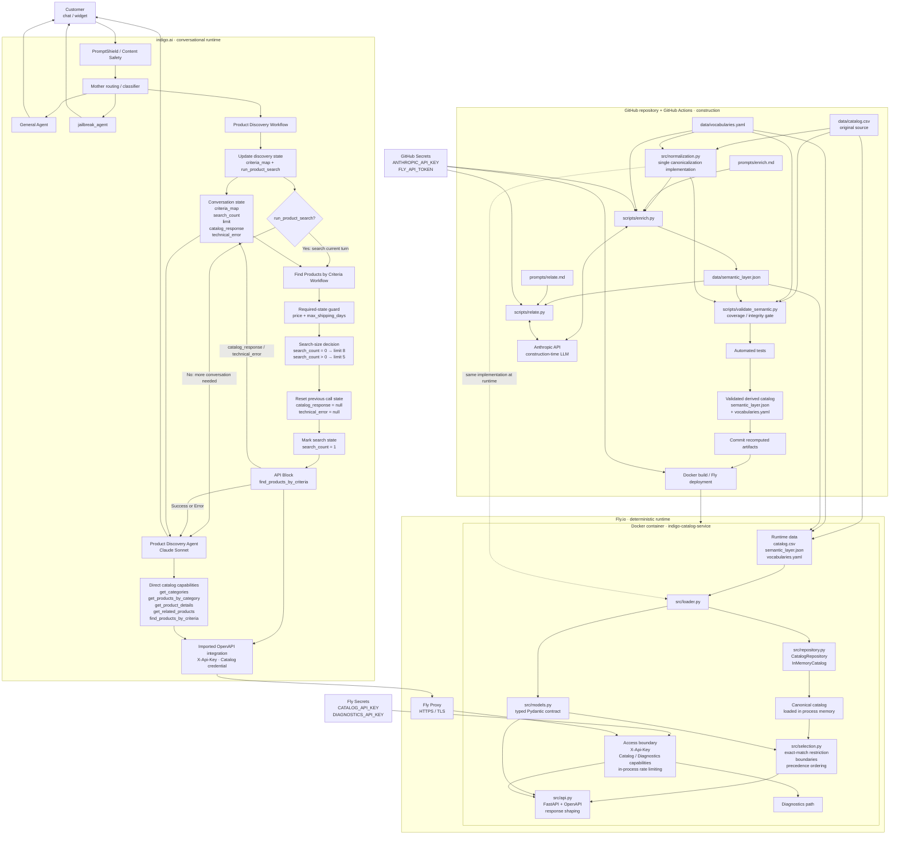

# Catalog Service · Product Discovery Agent

An end-to-end product discovery system for a gift shop, built around a deterministic **Catalog Service** and a conversational **Product Discovery Agent** in indigo.ai.

The project takes a raw ecommerce catalog that was never designed for conversational discovery, canonicalizes it, enriches it with a controlled semantic layer, validates that derived data in CI, and exposes the resulting catalog through a typed FastAPI service. indigo.ai sits on top of that service and handles conversation, routing, state and tool orchestration.

The central architectural principle is that **the LLM does not search, clean or classify the raw catalog at request time**. Semantic enrichment happens during the build pipeline. At runtime, the Catalog Service works only with validated, canonical data already loaded in memory and performs deterministic filtering, precedence ordering and relationship resolution.

This separates two jobs that are easy to conflate:

- the **Catalog Service** is responsible for what products exist, what their canonical data means, which constraints they satisfy, how candidates are ordered, and which relationships between products are valid;
- the **Product Discovery Agent** is responsible for understanding the conversation, gathering what is still needed, choosing the appropriate capability, interpreting the service response and explaining recommendations naturally to the customer.

The service is containerized with Docker, deployed on Fly.io and exposed through an authenticated OpenAPI contract. The conversational layer is implemented in indigo.ai through routing, workflows, agents and API capabilities.

**Live service**

- API: `https://indigo-catalog-service.fly.dev`
- OpenAPI: `https://indigo-catalog-service.fly.dev/openapi.json`
- Swagger UI: `https://indigo-catalog-service.fly.dev/docs`

---

## The problem

Gift discovery is not the same problem as conventional catalog search.

A customer rarely arrives with a complete product query. They are more likely to say something like:

> “I need something for my sister. She has just moved house. Around €50, and I need it this week.”

The source catalog, however, was built for ecommerce storage and navigation. It contains product attributes, categories, prices and descriptive text, but it does not directly encode all the concepts needed to reason reliably about a gift conversation.

Several different problems have to be solved at once.

### Hard constraints and preferences are not the same thing

Some conditions define whether a product is actually usable. A delivery deadline or a strict maximum price cannot be treated as a vague preference.

Other signals should influence which valid products appear first without automatically eliminating everything else. The occasion, what the recipient might use the gift for, the intended function of the gift or the relationship to the recipient belong to a different class of reasoning.

Treating every signal as a hard filter produces brittle searches and unnecessary zero-result cases. Treating everything as a soft preference can produce recommendations that simply violate the customer's request.

The system therefore needs to distinguish **selection boundaries** from **signals used to order valid candidates**.

### The source data is not yet a reliable reasoning model

The input file contains real catalog imperfections that have to be absorbed by the integration layer rather than exposed to the conversational system.

The original source contains **152 rows across 17 columns**, but those rows do not correspond one-to-one with the products that should be shown to a customer. Duplicate products appear under different identifiers, category names contain formatting variants, some attributes are missing, some descriptions contain too little information to support a useful recommendation, and commercial recipient labels do not always describe a genuine restriction of the product.

After deterministic canonicalization, the service works with **150 canonical products** rather than 152 independent rows.

This distinction matters. If raw rows were treated as products:

- the same item could appear twice in a recommendation;
- category navigation could fragment across spelling or formatting variants;
- missing values could accidentally be turned into invented facts;
- commercial labels could create inappropriate ranking bias;
- alternate identifiers could fail to resolve to the same real product.

The raw catalog must therefore remain the source of truth while a deterministic integration layer converts it into a stable model suitable for discovery.

### Product attributes are not enough for gift discovery

A conventional ecommerce catalog can tell us that an item is a knife, costs €69, belongs to Kitchen & Dining and ships in two days.

That still does not fully answer questions such as:

- Is it useful for someone who enjoys cooking?
- Does it make sense as a housewarming gift?
- Is it a relatively safe choice when the buyer does not know the recipient very well?
- Is it suitable as a small additional gift rather than the main present?
- Is there another product that performs a similar function?
- Is there something that naturally pairs with it?
- If the customer wants a better version, what should count as a meaningful alternative rather than an unrelated expensive product?

Those are not facts that can be recovered reliably from price and category alone.

The project therefore introduces a **controlled semantic layer** that describes how products participate in gift-discovery decisions. This layer adds structured concepts such as intended use, functional role, gifting context, risk, relationships between products and alternative or complementary options.

The purpose is not to replace the original catalog. It is to make the catalog usable by a reasoning system without requiring the conversational model to infer those concepts from scratch on every request.

### Natural language and catalog language do not match exactly

Customers do not know the internal vocabulary of a catalog.

They may ask for a “chef knife”, a “chef's knife”, a “gyuto”, something “for cooking”, something “for someone who just moved”, or simply “something practical”.

The service therefore needs a controlled mechanism for mapping natural expressions to canonical domain concepts without forcing the customer to know internal field names or exact catalog labels.

This is also why `product_type` is not treated as a question that the agent must ask. If the customer provides a concrete object type, it can be interpreted. If they do not, discovery can proceed from function, use case and context instead.

### Zero results do not all mean the same thing

A particularly important distinction is the difference between:

- a product not existing;
- a relevant product existing but failing a hard constraint;
- the service understanding a criterion but being unable to apply it reliably;
- no valid product remaining after all applicable constraints are evaluated.

Those situations require different responses.

For example, if the shop carries a €149 chef's knife and the customer has a strict €50 limit, the correct answer is not:

> “We don't sell chef's knives.”

The service must be able to preserve the fact that the product exists while explaining that it was **excluded** because it exceeds the customer's budget.

Likewise, if part of a request cannot be mapped safely to the controlled vocabulary, the system should expose that limitation rather than pretending the criterion was applied.

This is why the API distinguishes successful results from structures such as `excluded` and `not_applied`.

### A conversational agent needs stable state, not repeated guesswork

Gift discovery normally takes more than one turn.

A customer may first provide the recipient, then a budget, then a deadline, then add that the person enjoys cooking, later increase the budget, ask to see the second result again, or request something similar but more premium.

The system must preserve what is already known while allowing later information to refine or replace earlier criteria.

It must also avoid:

- asking again for information already provided;
- rerunning identical searches unnecessarily;
- treating every user message as a completely new query;
- losing the relationship between phrases such as “the second one” and products shown earlier.

Conversational state therefore lives explicitly in the orchestration layer rather than being left entirely to the model's implicit memory.

### The LLM should not become the catalog database

A tempting implementation would be to place the CSV in model context or a retrieval system and ask an LLM to find products directly.

That would mix several responsibilities that benefit from being separated:

- data cleaning;
- canonicalization;
- filtering;
- ranking;
- relationship resolution;
- constraint enforcement;
- conversational reasoning;
- natural-language generation.

It would also make core catalog behaviour dependent on probabilistic interpretation at request time.

This project instead treats the LLM as the conversational reasoning layer and the Catalog Service as the authoritative product layer.

The agent can decide **what it needs to ask or search for**. The service decides **what the catalog actually contains and what satisfies the requested conditions**.

---

## The solution

The solution is split into three deliberately separate stages: **build-time semantic preparation, deterministic catalog runtime, and conversational orchestration**.

```text
                         BUILD / CI
                             │
                             ▼
                      raw catalog.csv
                             │
                  deterministic normalization
                             │
                             ▼
                    canonical product set
                             │
               semantic enrichment + relations
                             │
                             ▼
             validated semantic_layer.json
                    + vocabularies.yaml
                             │
                 validation + automated tests
                             │
                             ▼
                         deployment
                             │
                             │
                 ─────────────────────
                             │
                             ▼
                    CATALOG SERVICE
                             │
              catalog + semantic layer loaded
                       into memory
                             │
          deterministic filtering / precedence /
                relationships / API contract
                             │
                             ▼
                     FastAPI on Fly.io
                             │
                             │
                 ─────────────────────
                             │
                             ▼
                         indigo.ai
                             │
                     routing + state
                             │
                  discovery workflows
                             │
                     API capabilities
                             │
               Product Discovery Agent
                             │
                             ▼
                          customer
```

### 1. Build-time semantic preparation

The raw catalog remains versioned and unchanged.

A deterministic normalization layer first converts the source rows into the canonical product universe used everywhere else in the system. The same normalization implementation is shared between CI and runtime so that semantic validation and production cannot silently operate on different interpretations of the catalog.

The semantic pipeline then enriches those canonical products with the information required for gift discovery and builds relationships between them.

The result is stored as versioned derived data rather than recomputed during customer conversations.

The build pipeline validates that the semantic layer remains complete and internally coherent before deployment. If the derived catalog does not satisfy the required invariants, the new version is not deployed.

This means that semantic classification is a **controlled build concern**, not a runtime side effect.

### 2. Deterministic Catalog Service

At process startup, the service:

1. reads the original catalog;
2. applies the same deterministic canonicalization used during construction;
3. loads the validated semantic layer;
4. joins both representations;
5. builds the in-memory catalog consumed by the API.

Once startup is complete, customer requests do not trigger catalog classification or enrichment.

The service performs deterministic operations over data already in memory:

- category discovery;
- category browsing;
- criteria-based product discovery;
- product-detail retrieval;
- related-product resolution;
- hard-constraint enforcement;
- precedence ordering;
- alias resolution;
- excluded-product reporting;
- unresolved-criterion reporting.

The Catalog Service is therefore the authority for product truth.

It does not ask an LLM whether a €149 product satisfies a €50 maximum, whether two identifiers refer to the same canonical product, or whether an out-of-stock product should be returned. Those behaviours are encoded and tested as application logic.

### 3. Conversational orchestration in indigo.ai

indigo.ai provides the conversational layer on top of the API.

It is responsible for routing each turn to the correct conversational path, maintaining discovery state across turns, deciding whether enough information is available to search, calling the Catalog Service when necessary and giving the Product Discovery Agent access to the appropriate capabilities.

A dedicated discovery workflow maintains the accumulated search criteria. When the current turn creates or changes a discovery search and the required price and delivery information are available, the search workflow calls `find_products_by_criteria` and stores the returned envelope in `catalog_response`.

The Product Discovery Agent then starts from that service response rather than recreating the same catalog search independently.

The agent still has direct access to discovery capabilities when the conversation genuinely creates a new need inside its own reasoning — for example, looking for a complement, filling remaining budget, finding a related product or exploring a higher-priced alternative.

This keeps tool use flexible without allowing the LLM to replace the deterministic search path.

### Clear ownership between layers

The resulting responsibility boundary is intentional:

| Concern | Owner |
|---|---|
| Raw catalog | Versioned source data |
| Canonicalization | Catalog Service code |
| Semantic classification | Build pipeline |
| Semantic relationships | Build pipeline |
| Semantic validation | CI |
| Product truth | Catalog Service |
| Constraint enforcement | Catalog Service |
| Candidate ordering | Catalog Service |
| API contract | Catalog Service |
| Conversation routing | indigo.ai |
| Conversational state | indigo.ai workflows |
| Choosing when a capability is needed | Workflows + Product Discovery Agent |
| Interpreting API responses for the customer | Product Discovery Agent |
| Recommendation wording and reasons | Product Discovery Agent |

The separation has an important operational consequence:

> **No customer conversation can change the catalog, classify a product, alter the semantic layer or cause the Catalog Service to invoke an LLM.**

The only LLM activity related to catalog classification happens during the controlled build pipeline. At runtime, the conversational LLM consumes an authenticated API whose behaviour is deterministic and independently testable.

That architecture gives the agent the flexibility needed for natural conversation without giving it authority over facts that should remain deterministic.

---

## Architecture

The system is deliberately split into **three execution environments with different responsibilities and different trust boundaries**:

1. **GitHub Actions** constructs and validates the semantic representation of the catalog.
2. **The Catalog Service on Fly.io** serves validated catalog data through deterministic application logic.
3. **indigo.ai** owns the conversational runtime: routing, state, workflow orchestration, tool use and natural-language responses.

The same product catalog moves through those environments, but the work performed in each one is intentionally different. Semantic classification belongs to CI. Product truth and selection belong to the Catalog Service. Conversational reasoning belongs to indigo.ai.

The complete architecture is:



### Construction plane: GitHub and CI

The repository contains both the source catalog and the machinery used to turn it into a validated semantic catalog.

The three data artifacts have different roles:

- `data/catalog.csv` is the original store export and remains the source of factual product data;
- `data/vocabularies.yaml` defines the controlled domain vocabulary, definitions and aliases used by the semantic system;
- `data/semantic_layer.json` contains the derived semantic classification and product relationships.

The key architectural decision is that **canonicalization has one implementation only**: `src/normalization.py`.

That implementation is consumed in both worlds:

- by the construction and validation path in CI;
- by `loader.py` when the production process starts.

This prevents CI from validating one interpretation of the catalog while the deployed service serves another.

Two separate prompts define the model-backed construction tasks:

- `prompts/enrich.md` defines how product-owned semantic fields are classified;
- `prompts/relate.md` defines how product relationships are constructed.

The corresponding scripts are:

- `scripts/enrich.py`;
- `scripts/relate.py`.

The Anthropic model is available **only in this construction environment**. `ANTHROPIC_API_KEY` is supplied to those steps from GitHub Secrets. The model is not a dependency of the production service and its credential never enters the runtime container.

Semantic construction is also not performed unnecessarily on every CI run. The workflow checks which inputs changed and only runs the model-backed construction path when semantic inputs require it. Code, API or infrastructure changes still pass through validation and tests without forcing a new semantic classification.

After construction, `scripts/validate_semantic.py` acts as the semantic gate. It validates the derived artifact that production would actually consume. Automated tests then validate the deterministic service behaviour.

Only after those checks pass can the pipeline:

1. commit updated `semantic_layer.json` and `vocabularies.yaml` when construction changed them;
2. build and deploy the application to Fly.io.

The semantic artifacts are therefore **versioned build outputs with a validation gate**, not ephemeral information generated inside a customer conversation.

---

### Runtime plane: the Catalog Service

The deployed service is intentionally smaller than the construction environment.

The Docker image contains:

- `src/`;
- `data/`;
- `requirements.txt` and the installed runtime dependencies.

It deliberately does **not** contain:

- `prompts/`;
- `scripts/`;
- `tests/`;
- the Anthropic SDK installed specifically for construction;
- `ANTHROPIC_API_KEY`.

The production container therefore contains neither the classification instructions nor the script and credential combination required to invoke the construction-time model.

At startup, `src/api.py` creates the in-memory catalog once. The service does not reload and rebuild it for every request.

The runtime path is:

```text
catalog.csv
      +
vocabularies.yaml
      +
semantic_layer.json
      ↓
loader.py
      ↓
normalization.py
      ↓
canonical products + semantic fields + resolved relations
      ↓
InMemoryCatalog
      ↓
selection.py
      ↓
api.py
      ↓
typed HTTP response
```

#### `normalization.py`

Owns deterministic interpretation of the source catalog.

It is the single implementation used by both construction and runtime.

#### `loader.py`

Has a narrow responsibility:

1. read `semantic_layer.json`;
2. call the canonicalization logic over the source catalog;
3. verify that the semantic artifact covers exactly the canonical catalog;
4. join source facts and semantic fields;
5. resolve relationships into the runtime representation;
6. construct the `Product` objects consumed by the service.

If the canonical catalog and semantic layer do not cover the same product universe, startup fails rather than silently serving partially classified data.

#### `models.py`

Defines the typed Pydantic models used by the service and therefore participates directly in the generated OpenAPI contract.

The API is not an untyped JSON wrapper around Python dictionaries. The shapes exposed to indigo.ai are explicit models with declared fields, limits and descriptions for the concepts whose interpretation matters to the agent.

#### `repository.py`

Separates the rest of the application from the current storage decision.

`CatalogRepository` defines what the service needs from a catalog. `InMemoryCatalog` is the current implementation: the canonical products, off-contract runtime data and resolved relation information are loaded into process memory once.

The rest of the service does not need to know that the source is currently a CSV plus two derived files.

#### `selection.py`

Owns **which products qualify and in which order they are returned**.

The module separates three mechanics that must not be confused:

1. exact `product_type` restriction when the customer has identified a concrete object;
2. selection boundaries that determine whether a candidate qualifies;
3. precedence ordering of the candidates that remain.

There is no LLM call in this path and no derived numeric recommendation score. The ordering is deterministic and reproducible.

#### `api.py`

Owns the external boundary.

It translates declared request parameters into service operations, resolves controlled vocabulary where required, checks access, delegates product selection to the deterministic layer and shapes the typed response.

It also produces the OpenAPI specification that indigo.ai imports to construct the catalog capabilities.

`api.py` deliberately does **not** decide recommendation ranking itself: product qualification and ordering remain in `selection.py`.

---

### Deployment plane: Docker and Fly.io

The Catalog Service runs as the Fly application:

`indigo-catalog-service`

The container runs FastAPI through Uvicorn on port `8080`.

Fly Proxy sits in front of the application and provides the public HTTPS boundary. Plain HTTP is forced to HTTPS before authenticated catalog traffic reaches the service.

The application is deployed in the Frankfurt region (`fra`), chosen because indigo.ai is the runtime caller waiting synchronously for catalog responses during a conversation.

The current configuration keeps one Machine available. This serves two purposes:

- avoiding a customer-facing cold start during the first catalog call;
- keeping the process-local rate limiter consistent with the declared rate rather than splitting its counters across multiple independent Machines.

The health check uses:

`GET /openapi.json`

This verifies that FastAPI itself is responding after the catalog has loaded, rather than merely checking that a TCP port is open.

The two runtime credentials arrive through Fly Secrets:

- `CATALOG_API_KEY`;
- `DIAGNOSTICS_API_KEY`.

They are environment variables at runtime and are not stored in the Docker image or `fly.toml`.

---

### API and access boundary

The Catalog Service exposes two distinct capabilities at the security boundary.

The **Catalog credential** is used by indigo.ai to access the five product operations.

The **Diagnostics credential** is reserved for operator diagnostics and cannot be substituted by the Catalog credential.

Both use the same HTTP header:

`X-Api-Key`

but map to different capabilities inside the service.

The access layer also enforces an in-process sliding-window rate limit before allowing the request to reach the corresponding operation.

The API separates two different classes of failure:

- transport/access/technical failures use the appropriate non-2xx HTTP status;
- foreseeable requests that cannot be executed safely are represented as recoverable API content, allowing the conversational layer to handle them without treating them as infrastructure failures.

The security model is described in detail later in this README, but architecturally the important point is that **Fly provides transport security while the application independently controls authorization and request limits**.

---

### Conversational plane: indigo.ai

indigo.ai is not the product database and does not own catalog truth. It owns the conversation around that catalog.

The conversational path begins with the platform's safety processing and routing layer.

A Mother classifier uses the conversation to choose the appropriate destination:

- general store conversation can go to the **General Agent**;
- gift discovery and its continuation turns go to the **Product Discovery Workflow**;
- requests identified as jailbreak/security attempts can be routed to `jailbreak_agent`.

This matters particularly for short continuation messages. A reply such as:

> “€60”

or:

> “the second one”

is not meaningful as an isolated query, but is meaningful inside an active discovery conversation.

---

### Product Discovery Workflow

The Product Discovery Workflow owns the structured evolution of the discovery request.

Its state-update step receives what is already known together with the customer's latest message and produces the updated `criteria_map`.

It also decides whether the current turn creates or changes a product search through `run_product_search`.

That produces two paths.

#### No search required

If the turn does not yet justify a new catalog search, control goes to the Product Discovery Agent.

Typical examples include:

- required information is still missing;
- the agent needs to ask a conversational question;
- the customer has not changed the effective discovery criteria.

#### Search required

If the current turn does create or refine a search, control goes to the **Find Products by Criteria Workflow**.

This deliberately separates:

> understanding that a search is needed

from:

> executing the deterministic catalog search.

---

### Find Products by Criteria Workflow

This workflow is the normal search path for conversational discovery.

It has several responsibilities before the API call is allowed to happen.

First, it acts as a final guard: a discovery search requires both:

- a price criterion;
- `max_shipping_days`.

If either is missing, the catalog search is not executed and control returns to the Product Discovery Agent so the missing information can be collected.

When search can proceed, the workflow determines response size from the conversation state:

- the first discovery search uses `limit = 8`;
- later searches use `limit = 5`.

Before a new API call, the previous:

- `catalog_response`;
- `technical_error`

are cleared so that the agent cannot accidentally reason over stale success data alongside a new failure.

`search_count` is then marked so subsequent searches use the refined-search size.

The workflow calls the deployed `find_products_by_criteria` endpoint using the structured criteria and captures the returned body as `catalog_response`.

Both API Success and API Error return control to the **Product Discovery Agent**. The difference is preserved in the state the agent receives rather than by creating a second conversational endpoint.

---

### Explicit conversational state

The orchestration does not rely exclusively on the LLM remembering previous prose.

The discovery flow maintains explicit state:

| Variable | Responsibility |
|---|---|
| `criteria_map` | The accumulated structured discovery criteria |
| `search_count` | Whether the first discovery search has already been consumed |
| `limit` | The result size selected for the current search |
| `catalog_response` | The latest valid catalog envelope returned by the search workflow |
| `technical_error` | The latest technical failure state |

`run_product_search` is produced by the state-update step to decide the route for the current turn.

This explicit state is what allows a conversation to evolve from:

> “a gift for my sister”

to:

> “around €60”

to:

> “within three days”

to:

> “she likes cooking”

without treating each message as an unrelated search.

---

### Product Discovery Agent

The Product Discovery Agent is the customer-facing reasoning layer for products.

When the Find Products by Criteria Workflow has already executed the current search, the agent starts from `catalog_response`.

It is instructed to **read that response first rather than automatically repeating the same search**.

This is an important distinction because the agent also has direct access to the catalog capabilities.

The normal current-turn discovery search belongs to the workflow, but the agent may initiate a genuinely new search when its own reasoning creates a new purpose or materially different criteria.

Examples include:

- finding an additional small gift to use remaining budget;
- checking a higher-priced trade-up;
- responding to a customer who explicitly asks to explore a materially different alternative.

The agent therefore retains flexibility without becoming the default executor of a search that has already been performed.

---

### The five catalog capabilities available to the conversational system

All five operations come from the same authenticated OpenAPI service:

- `get_categories`;
- `get_products_by_category`;
- `find_products_by_criteria`;
- `get_related_products`;
- `get_product_details`.

Their responsibilities remain separate.

The Product Discovery Agent uses the appropriate operation according to the conversation rather than treating `find_products_by_criteria` as a universal replacement for every catalog interaction.

For example:

```text
"What sections do you have?"
        ↓
get_categories

"Show me Kitchen & Dining."
        ↓
get_products_by_category

"Tell me more about the Slate Cheese Board Set."
        ↓
get_product_details

"Do you have something like this?"
        ↓
get_related_products

"I want something for my sister, around €60, within 3 days."
        ↓
Product Discovery Workflow
        ↓
Find Products by Criteria Workflow
        ↓
find_products_by_criteria
```

All of those paths eventually reach the **same Catalog Service and the same product truth**.

---

### OpenAPI as the integration contract

The boundary between indigo.ai and the Catalog Service is the service's published OpenAPI specification.

indigo.ai does not need access to the source CSV, Python objects, semantic artifact or selection implementation.

It sees:

- operation names;
- parameters;
- parameter descriptions;
- schemas;
- response shapes;
- authentication requirements.

This makes the API contract part of the agent architecture rather than merely API documentation.

The wording and typing of the contract matter because they define what the conversational system is allowed to ask the service to do and how it interprets what comes back.

The Catalog Service remains independently testable without indigo.ai, while indigo.ai remains decoupled from the internal storage and selection implementation.

---

### Two different uses of LLMs

The architecture contains LLMs in two places, but they perform fundamentally different jobs.

| Environment | LLM responsibility | Access to raw catalog construction |
|---|---|---|
| GitHub Actions | Build semantic classification and product relations | Yes, during controlled construction |
| indigo.ai | Understand conversation, choose capabilities and write customer-facing responses | No construction responsibility |
| Catalog Service runtime | **No LLM** | Not applicable |

This separation is intentional.

The construction-time model can help turn product descriptions into structured semantic information because its output is subsequently persisted, validated and tested.

The conversational model can reason flexibly about what the customer means because the facts it consumes come from a deterministic service.

The production Catalog Service itself does neither job probabilistically.

---

### End-to-end request example

A normal discovery request therefore crosses the architecture like this:

```text
Customer:
"I need something for my sister, around €60, within 3 days."
        │
        ▼
indigo.ai safety layer
        │
        ▼
Mother routing
        │
        ▼
Product Discovery Workflow
        │
        ├─ updates criteria_map
        └─ run_product_search = true
        │
        ▼
Find Products by Criteria Workflow
        │
        ├─ validates required discovery state
        ├─ chooses limit
        ├─ clears stale response/error state
        └─ calls find_products_by_criteria
        │
        ▼
Fly Proxy · HTTPS
        │
        ▼
FastAPI access boundary
        │
        ├─ X-Api-Key
        └─ rate limit
        │
        ▼
Catalog Service
        │
        ├─ resolve declared criteria
        ├─ identify exact object when applicable
        ├─ apply selection boundaries
        ├─ order by deterministic precedence
        └─ shape results / excluded / not_applied
        │
        ▼
catalog_response
        │
        ▼
Product Discovery Agent
        │
        ├─ interprets the returned products
        ├─ writes a reason for each recommendation
        └─ decides what conversational move is useful next
        │
        ▼
Customer
```

At no point in that request does the Catalog Service clean the CSV, reclassify a product or invoke a language model.

Those decisions were already made and validated before the container was deployed.

That boundary — **probabilistic construction where it can be validated, deterministic catalog behaviour where product truth matters, and probabilistic conversation where flexibility is useful** — is the core of the architecture.

---

## Data lifecycle

The catalog has **three distinct moments in its lifecycle**:

1. **construction**, where deterministic source normalization and model-assisted semantic enrichment produce a validated derived artifact;
2. **process startup**, where the deployed service reconstructs the same canonical product universe and joins it with that artifact;
3. **request time**, where already-loaded products are filtered, ordered and returned without rebuilding or reinterpreting the catalog.

Keeping these moments separate is a core system invariant.

```text
                       1 · CONSTRUCTION
                       GitHub Actions
                             │
          source data + vocabularies + prompts
                             │
                             ▼
                 deterministic canonicalization
                             │
                             ▼
               semantic enrichment + relations
                             │
                             ▼
                     semantic validation
                             │
                         automated tests
                             │
                             ▼
                versioned semantic artifacts
                             │
                          deploy
                             │
                             │
              ───────────────────────────
                             │
                             ▼
                    2 · PROCESS STARTUP
                        Fly.io container
                             │
               source catalog canonicalized
                 with THE SAME implementation
                             +
                  semantic artifact loaded
                             │
                             ▼
                    canonical Product model
                             │
                      InMemoryCatalog
                             │
                             │
              ───────────────────────────
                             │
                             ▼
                       3 · REQUEST TIME
                             │
                     already-loaded data
                             │
             filter → order → relate → serialize
                             │
                             ▼
                         API response
```

The same files participate differently at each moment. What must not happen is for one stage to silently invent a second interpretation of the catalog.

---

### 1. Construction

Construction runs in GitHub Actions, not inside the production application.

Its purpose is to transform the store's source catalog into a **validated semantic representation that can later be consumed deterministically**.

The construction inputs are:

- `data/catalog.csv` — factual product source;
- `data/vocabularies.yaml` — controlled semantic vocabulary, definitions and aliases;
- `prompts/enrich.md` — semantic classification criterion;
- `prompts/relate.md` — relationship classification criterion;
- `src/normalization.py` — deterministic canonicalization rules.

The principal derived output is:

- `data/semantic_layer.json`.

`data/vocabularies.yaml` can also change during construction when a genuinely new product introduces a new `product_type`.

Construction itself contains several different kinds of work and deliberately does not treat all of them as model tasks.

---

### Deterministic canonicalization happens before semantic reasoning

The first important distinction is between **normalizing information that is already present** and **classifying information that does not exist explicitly in the source**.

`src/normalization.py` handles the first category.

It performs deterministic operations such as:

- parsing supported price formats;
- preserving a missing price as missing rather than inventing one;
- interpreting stock quantity and availability;
- normalizing category formatting;
- normalizing booleans and numeric fields;
- detecting product duplicates;
- selecting one canonical `product_id`;
- preserving absorbed identifiers as `alt_product_ids`;
- carrying additional categories into `secondary_categories`;
- preserving missing `rating` and `reviews_count` as missing;
- marking insufficient descriptions through `description_quality`;
- expanding `recipient` with `anyone` where the product is not genuinely gender-specific or restricted to children;
- emitting data-quality warnings.

If a value is genuinely ambiguous, the code does **not** guess.

For example, a price representation that cannot be distinguished safely between decimal and thousands notation raises `AmbiguousCatalog` with the row, column, value and reason.

This is an intentional boundary:

> Formatting variation may be normalized. Missing or ambiguous facts may not be invented.

The result of this stage is the canonical product universe against which both semantic construction and production runtime operate.

For the current source:

```text
152 source rows
      ↓
deterministic canonicalization
      ↓
150 canonical products
```

The distinction between rows and products therefore exists before any semantic recommendation logic begins.

---

### Semantic enrichment adds information the source does not contain

Once products have a stable canonical identity, `scripts/enrich.py` constructs the semantic fields required by discovery.

This is where a language model is useful: not to answer customer requests, but to convert product descriptions and catalog facts into **controlled, persistent domain classifications**.

The semantic decision is model-assisted, but its output is not accepted as arbitrary text.

The classifier must operate within the vocabulary and structural rules defined by the project.

For the controlled fields, proposed values are checked against `vocabularies.yaml` before being written.

If the model places a real value in the wrong vocabulary, invents an undeclared value, omits a required field or returns an invalid type, the script does not silently repair the answer and continue.

Instead:

1. the exact validation problem is identified;
2. that problem is returned to the model;
3. the model receives a bounded opportunity to correct its answer;
4. if the output remains invalid after the configured attempts, construction fails without accepting the invalid classification.

The current implementation allows **three attempts**.

This creates a useful division of responsibility:

- the model makes the semantic judgement;
- deterministic code decides whether that judgement is admissible.

---

### `product_type` is controlled but intentionally open

Most semantic vocabularies are closed: the classifier must choose among concepts that already exist.

`product_type` is different because inventory can legitimately introduce a type of object that has never appeared before.

For that reason it is controlled but extensible.

When a new product genuinely requires a new `product_type`, `enrich.py` can register it together with:

- its definition;
- its aliases.

That registration happens in the same construction run so that the semantic artifact cannot refer to a type that the vocabulary does not yet know.

A new `product_type` caused only by inventory growth is not considered a change in the meaning of the existing classification system. It therefore does **not** by itself increment the vocabulary version or require every existing product to be reclassified.

This distinction prevents ordinary catalog growth from unnecessarily rebuilding the entire semantic model.

---

### Enrichment is incremental unless the classification criterion changes

Model-backed work is not repeated merely because CI runs.

`enrich.py` distinguishes between two situations.

#### Inventory growth

If the classification criterion has not changed, products that already have a valid semantic entry keep it.

Only canonical products without an entry need classification.

This makes ordinary catalog growth incremental.

#### Criterion change

If the meaning of the classification has changed, existing classifications can no longer safely be assumed to mean the same thing.

A criterion change includes changes such as:

- modifications to `prompts/enrich.md`;
- changes to the closed vocabularies;
- redefinition or removal of an existing `product_type`;
- changes to an existing type's definition or aliases;
- a vocabulary version change.

In those cases, the whole catalog is reclassified.

The reason is more important than the optimization:

> A semantic artifact in which half the products were classified under one meaning and half under another can still be structurally valid while being semantically wrong.

The pipeline therefore distinguishes **new inventory** from **changed meaning**.

---

### Product relationships are recomputed globally

`scripts/relate.py` follows a different lifecycle from product-owned semantic fields.

Relationships are **not incremental**.

A new product can change the correct relationships of products that already existed. Adding a new chef's knife, for example, may create a new valid complement or alternative for products that were previously related only to the existing knife.

For this reason, when relation construction is required, the relationship mesh is reconsidered over the complete canonical catalog.

The script constructs and validates two different relationship families:

- `pairs_with`;
- `alternative_to`.

They are persisted differently because they mean different things.

#### `pairs_with`

A pairing has direction in the persisted artifact.

It is stored from the accessory toward the main product.

That direction contains semantic meaning, so it is not normalized away by sorting identifiers.

#### `alternative_to`

An alternative relation is symmetric.

It is persisted only once, under the lexicographically smaller `product_id`, together with its `relation_type`.

The loader later makes the other side aware of that relationship at runtime.

This avoids storing the same semantic fact twice and prevents two copies of the relationship from drifting apart.

As with enrichment, the model proposes semantic relationships but deterministic validation controls what is allowed to become persistent data.

Invalid references, self-relations, invalid relation types, conflicting duplicate relations and other structural violations cause the proposed result to be rejected rather than repaired silently.

---

### The semantic gate validates what production will actually consume

After construction, `scripts/validate_semantic.py` acts as a **deployment gate**.

It does not ask whether the model made aesthetically good recommendations. Its responsibility is structural and referential integrity.

The validator reconstructs the canonical catalog using the same `normalization.py` implementation and checks the derived artifact against that universe.

Among the invariants it enforces are:

- the semantic layer and vocabulary declare the expected version;
- the set of semantic entries matches the set of canonical products exactly;
- no canonical product is missing a semantic entry;
- no semantic entry exists without a canonical product;
- required semantic fields are present;
- required semantic fields are non-empty where the contract requires it;
- closed-vocabulary values really belong to their declared vocabulary;
- every `product_type` used by a product is declared;
- `product_type` definitions exist;
- aliases do not resolve ambiguously to multiple types;
- gender-specific declarations use admitted values;
- boolean semantic fields are actually boolean;
- relationship references point only to canonical products;
- a product is never related to itself;
- relationships are persisted only once according to their storage rule;
- `relation_type` contains an admitted value;
- redundant derived `same_function` relationships are not persisted when shared `product_type` already expresses them;
- newly introduced product types are justified by actual catalog growth;
- newly registered types are actually used.

Referential integrity is deliberately based on the **150 canonical product identifiers**, not the 152 raw identifiers.

An absorbed `alt_product_id` represents another identifier for the same object; it is not a second semantic node.

If the gate reports any failure, it exits unsuccessfully and **the deployment does not continue**.

There is no runtime fallback that says “deploy it anyway and let the agent work around the missing classification.”

The artifact either satisfies the contract or it is not production data.

---

### Automated tests follow semantic validation

The semantic gate and the automated test suite have complementary purposes.

The gate asks:

> Is the derived catalog internally complete and structurally coherent?

The tests ask:

> Does the service behave according to the implemented catalog contract?

Both run before deployment.

This distinction matters because structural semantic validity alone does not prove selection behaviour, API behaviour, authentication, error handling or ordering semantics.

The complete test strategy is documented later in this README.

---

### Derived artifacts are versioned

When construction modifies `semantic_layer.json` or legitimately extends `vocabularies.yaml`, the pipeline commits those artifacts back to the repository.

This is deliberate.

The production semantic state is therefore:

- inspectable;
- versioned;
- diffable;
- reproducible;
- tied to the source and criterion that produced it.

The semantic layer is not hidden transient state inside an LLM call.

It is part of the application data model.

---

## 2. Process startup

The second lifecycle moment begins when the deployed Docker container starts.

No construction-time LLM is available here.

The runtime image contains the application code and the three data files:

```text
catalog.csv
vocabularies.yaml
semantic_layer.json
```

`loader.py` combines them into the model the service will use for the lifetime of that process.

Importantly, the service does **not** simply trust that because CI previously validated the files, every possible runtime mismatch should be ignored.

Startup maintains its own critical invariant.

---

### The same canonicalization runs again

`loader.py` reads the semantic layer and then invokes `normalization.canonicalize(...)` over the original CSV.

This is the **same Python implementation used during construction**.

There is no second set of CSV-cleaning rules inside `loader.py`.

That means:

```text
CI's idea of "the canonical catalog"
                  =
runtime's idea of "the canonical catalog"
```

This equality is fundamental.

If CI validated one set of product identities but runtime independently constructed another, semantic coverage would no longer guarantee anything.

---

### The semantic layer must cover exactly the runtime catalog

Once canonicalization is complete, the loader compares:

- canonical identifiers derived from the source catalog;
- identifiers present in `semantic_layer.json`.

The sets must be exactly equal.

If products are missing from the semantic layer or semantic entries exist without a canonical source product, startup raises `IncompleteSemanticLayer`.

The service does not:

- fabricate a classification;
- ignore the product;
- partially start;
- ask an LLM to repair it.

It fails before serving an incomplete catalog.

CI is the first protection against an invalid artifact; startup is the final protection at the point of use.

---

### Source facts and semantic facts are joined

For every canonical product, `loader.py` constructs the runtime `Product` from two sources.

The canonical source contributes factual catalog information such as:

- identity;
- name;
- description;
- price;
- delivery;
- gift-wrap availability;
- brand;
- color;
- material;
- availability;
- categories;
- recipient information;
- occasion;
- rating and review count.

The semantic artifact contributes derived discovery information such as:

- `product_type`;
- `functional_family`;
- `use_case`;
- `suitable_relationships`;
- `gift_risk`;
- `is_standalone_gift`;
- `stocking_filler`;
- product relationships.

Neither file replaces the other.

The semantic layer augments the canonical source.

---

### Persisted relationships are resolved for runtime use

Relations are deliberately stored once in `semantic_layer.json`, but the runtime needs to query them from either endpoint.

The loader therefore resolves the persisted representation into the bidirectional runtime view where appropriate.

For `pairs_with` and `alternative_to`, both related products become aware of the relation in memory.

`relation_type` remains separate from `Product` because it describes **the relation between two products**, not an intrinsic property of either product.

This is an example of a broader design rule used throughout the service:

> Data is stored and exposed according to what it means, not merely according to what is convenient to serialize.

---

### Some runtime information deliberately stays outside the public `Product` contract

The loader also keeps information needed internally by the service but not intended to travel with every product response.

This includes:

- `description_quality`;
- `tags`;
- `stock`;
- `alt_product_ids`.

Those fields still have runtime purposes.

For example:

- `description_quality` participates in precedence ordering;
- `alt_product_ids` allow an absorbed identifier to resolve to its canonical product.

Keeping something outside the public product envelope does not mean discarding it. It means the API contract does not expose information the conversational agent does not need.

---

### The in-memory repository is built once

The resulting products are loaded into `InMemoryCatalog`.

It provides:

- the complete canonical product set;
- lookup by canonical identifier;
- lookup through absorbed identifiers;
- off-contract runtime information;
- relationship metadata;
- normalized category names.

At this point startup is complete.

The service has moved from **versioned source + derived files** to **ready-to-query runtime objects**.

No database migration, vector index construction or model warm-up is required.

---

## 3. Request time

The third lifecycle moment is deliberately the simplest.

When indigo.ai calls the deployed service, the catalog has already been:

- normalized;
- deduplicated;
- semantically classified;
- related;
- validated;
- loaded;
- joined;
- indexed for identifier lookup.

A request does **not** repeat those operations.

The request path operates on the in-memory model.

Depending on the operation, it can:

- resolve declared aliases;
- identify an exact requested object;
- apply selection boundaries;
- order valid candidates by precedence;
- browse a category;
- retrieve a product;
- resolve alternatives or complements;
- construct `excluded`;
- construct `not_applied`;
- shape the typed response.

The result is then serialized through the FastAPI/Pydantic contract.

There is:

- no call to Anthropic;
- no semantic reclassification;
- no relation reconstruction;
- no CSV mutation;
- no database query;
- no vector search;
- no embedding request.

The conversational LLM exists above this boundary in indigo.ai. It decides what capability is useful and explains what the API returns, but it does not perform the catalog's deterministic work itself.

---

### Why normalization is not repeated per request

The source catalog is immutable during the lifetime of a deployed process.

Running canonicalization for every customer turn would therefore produce the same result repeatedly while adding unnecessary latency and another opportunity for request-time failure.

Canonicalization belongs at process startup because that is the point where raw persisted data becomes runtime application state.

After that, request handling can remain a pure operation over known objects.

---

### Why semantic enrichment is not performed at startup either

Semantic enrichment is different from deterministic normalization.

It uses a model and can produce new derived data.

Running it every time a container starts would create several problems:

- two instances could derive different semantic states from the same deployment;
- startup would depend on an external model provider;
- cold starts would become expensive and slow;
- the semantic state actually serving customers would no longer be versioned;
- a model failure could make an otherwise valid deployment unavailable;
- CI could no longer validate exactly what production would consume.

For those reasons, semantic construction happens **before deployment**, while deterministic assembly happens **at startup**.

---

## The lifecycle invariant

The complete design can be summarized as:

```text
BUILD
probabilistic semantic judgement
        +
deterministic validation
        ↓
versioned artifact

STARTUP
deterministic reconstruction
        +
exact artifact/catalog join
        ↓
in-memory product model

REQUEST
deterministic selection
        +
typed serialization
        ↓
catalog response
```

The probabilistic part of catalog construction therefore happens at a moment where its result can be **persisted, inspected, validated, tested and rejected**.

By the time a customer is waiting for an answer, that uncertainty has already been converted into validated application data.

That is the central reason for the lifecycle split.

---

## Data model and semantic layer

The Catalog Service does not replace the source catalog with an AI-generated version of it.

Instead, it maintains a strict distinction between three forms of product information:

```text
SOURCE DATA
facts supplied by the store
        │
        ▼
CANONICAL DATA
the same facts after deterministic normalization
        │
        +
        │
SEMANTIC DATA
controlled classifications derived during construction
        │
        ▼
RUNTIME PRODUCT
canonical facts + validated semantic meaning
```

This separation is essential.

A price, brand or shipping time is a fact supplied by the source system. A `functional_family` or `gift_risk` is a derived interpretation used by the discovery system.

Those two kinds of information should not have the same provenance, should not be generated in the same way and should not be silently substituted for one another.

The runtime `Product` therefore represents a **join between canonical source facts and validated semantic fields**, not a rewritten copy of the original CSV.

---

### The source catalog

The original catalog contains **152 rows and 17 columns**:

| Source field | Meaning |
|---|---|
| `product_id` | Identifier supplied by the catalog |
| `name` | Customer-facing product name |
| `category` | Commercial category |
| `subcategory` | Commercial subcategory |
| `brand` | Product brand |
| `price_eur` | Price expressed in euros |
| `stock` | Available stock quantity |
| `rating` | Product rating when present |
| `reviews_count` | Number of reviews when present |
| `recipient` | Commercial recipient label supplied by the source |
| `occasion` | Occasions associated with the product |
| `tags` | Source tags |
| `color` | Product color when present |
| `material` | Product material when present |
| `gift_wrap` | Whether gift wrapping is available |
| `shipping_days` | Delivery time |
| `description` | Product description |

The file itself is not edited to make it easier for the application.

This is deliberate.

If duplicate rows were manually deleted, inconsistent categories manually renamed or missing information silently filled inside the CSV, the integration would no longer demonstrate how the real source is handled. It would instead hide that work inside a curated input file.

The source remains intact and the application absorbs its irregularities deterministically.

---

### From source rows to canonical products

Canonicalization changes **representation and identity**, not product meaning.

The current source contains 152 rows but resolves to 150 canonical products because two pairs of rows describe the same underlying products under different identifiers.

The canonical representation introduces or derives several pieces of information needed by the service:

| Canonical field | Origin / purpose |
|---|---|
| `product_id` | Canonical identifier selected deterministically |
| `alt_product_ids` | Absorbed identifiers that still resolve to the canonical product |
| `secondary_categories` | Additional normalized categories carried by absorbed duplicates |
| `price` | Normalized representation of `price_eur` |
| `stock` | Normalized quantity where the source provides one |
| `in_stock` | Availability derived from the stock representation |
| `recipient` | Source recipient information after the deterministic `anyone` expansion |
| `description_quality` | Whether the description contains enough information to support a recommendation reason |

The rest of the factual catalog fields are preserved in canonical form.

No semantic classification is needed to decide that two supported price representations mean the same numeric value, that two duplicate rows refer to one product or that an absorbed identifier should still resolve.

Those are integration rules.

---

### Canonical identity

Duplicate handling is not merely cosmetic.

If two rows represent the same real object, the service needs **one product identity** for:

- discovery;
- details;
- relations;
- semantic classification;
- exclusions;
- API responses.

The canonical `product_id` is selected deterministically. The other identifier is retained in `alt_product_ids`.

This means an old or alternate identifier is not treated as an unknown product.

```text
alternate identifier
        ↓
alt_product_ids
        ↓
canonical product_id
        ↓
same runtime Product
```

Semantic relationships are also built only between canonical identifiers.

An `alt_product_id` is an identity alias, not another semantic node.

---

### Missing data remains missing

The canonical model does not manufacture certainty.

A missing value is preserved as a missing value whenever the source does not justify something stronger.

For example:

```text
missing rating
      ≠
rating 0

missing reviews_count
      ≠
0 reviews

missing price
      ≠
€0
```

This distinction matters because those values later participate in selection or ordering.

Turning a missing rating into zero would not merely be a display decision: it would create a new product fact and could change where that product appears.

The service therefore reasons explicitly about whether information exists instead of replacing unknown information with convenient defaults.

---

### `recipient` is normalized as commercial metadata, not treated as a property of the object

The source catalog contains values such as `him`, `her`, `anyone`, `couple` and `kids`.

Those labels are useful, but they cannot automatically be interpreted as physical restrictions of a product.

A keyboard labelled `him`, for example, is not thereby a male-only object.

The canonicalization layer therefore preserves the original recipient value but adds `anyone` when the object itself is not genuinely gender-specific and is not restricted to children.

```text
source:
recipient = ["him"]

product is not genuinely gender-specific
        ↓

canonical:
recipient = ["him", "anyone"]
```

Gender-specific exceptions are not guessed from the product name. They are explicitly declared at `product_type` level in the controlled vocabulary.

This allows the system to use recipient information without reproducing the source catalog's commercial labeling as an artificial recommendation boundary.

---

## The semantic layer

The canonical catalog still describes **what the products are factually**.

It does not yet fully describe **how those products participate in gift discovery**.

That second responsibility belongs to `data/semantic_layer.json`.

The current artifact declares:

```text
vocabulary_version = 4
```

and contains one semantic entry for every canonical product.

Each product entry contains **nine derived fields**:

| Semantic field | Purpose |
|---|---|
| `product_type` | What concrete object the product is |
| `functional_family` | What work or function the product performs |
| `use_case` | In what situation or activity it is used |
| `gift_risk` | How much knowledge of the recipient is needed to choose it confidently |
| `suitable_relationships` | In which buyer-recipient relationships the gift is suitable |
| `is_standalone_gift` | Whether it can function as the main gift by itself |
| `stocking_filler` | Whether it can serve as a small standalone addition to use remaining budget |
| `pairs_with` | Explicit complementary product relationships |
| `alternative_to` | Explicit substitution relationships |

These fields do not all answer the same question.

That separation is deliberate.

---

### `product_type`: what object is it?

`product_type` represents the **concrete kind of object**.

Examples include concepts such as:

```text
chef_knife
notebook
board_game
backpack
fountain_pen
```

Its purpose is different from category, function or use case.

A commercial category answers where the store shelves something.

A `functional_family` answers what kind of work it performs.

A `use_case` answers when or for what activity it is useful.

`product_type` answers:

> What is the object itself?

This distinction allows exact object requests to remain exact.

If the customer asks specifically for a chef's knife, a paring knife is not merely a lower-scoring chef's knife. It is another object.

The discovery layer can therefore distinguish:

```text
"I need a chef's knife"
        ↓
exact object request

from

"I need something for cooking"
        ↓
broader discovery intent
```

---

### Reusing product types instead of fragmenting the vocabulary

The classifier receives the existing `product_type` definitions and aliases before assigning a type.

It must reuse an existing type whenever that type already represents the same object.

For example, if `chef_knife` already exists, a product described as a “cooking knife” must not cause a second concept such as `cooking_knife` to be created merely because the wording differs.

Otherwise the same object class would fragment:

```text
chef_knife
cooking_knife
kitchen_chef_knife
...
```

and an exact search would return only whichever fragment happened to match the customer's wording.

A new `product_type` is therefore created only when the inventory introduces a genuinely new object concept.

---

### `product_type` is controlled, but not a closed enum

This field is deliberately different from the other controlled semantic vocabularies.

The current vocabulary contains a large number of concrete product types and their aliases. New inventory can legitimately introduce another type.

For that reason, the OpenAPI contract exposes `product_type` as free text rather than publishing the entire inventory-dependent vocabulary as an enum.

The service still resolves it deterministically.

A request can contain either:

```text
canonical value
        ↓
chef_knife
```

or a known alias such as:

```text
gyuto
chef knife
chef's knife
        ↓
chef_knife
```

If the value cannot be resolved, the service does not guess a nearby type. It can instead report that the criterion was not applied.

---

### `functional_family`: what work does the product perform?

`functional_family` describes **function rather than object identity**.

Examples in the controlled vocabulary include:

```text
food_preparation
food_serving
beverage_preparation
writing_stationery
desk_workspace
storage_organisation
audio
outdoor_gear
```

A product may belong to more than one functional family because one object can perform more than one meaningful job.

This field is therefore multivalued.

It also has **no generic fallback value**.

Every product must have at least one real functional family. If the controlled vocabulary cannot describe what an object does, that is considered a vocabulary problem rather than a reason to assign a meaningless catch-all label.

This field is one of the mechanisms that allows the system to move beyond exact object search.

A customer asking for something useful for food preparation does not need to know which specific product type they want.

---

### `use_case`: in what situation is it useful?

`use_case` describes the situation or activity around the product.

The current controlled vocabulary includes concepts such as:

```text
cooking
baking
coffee
tea
home_office
travel
gardening
reading
fitness
photography
writing
```

Like `functional_family`, it is multivalued.

An object may legitimately participate in several situations.

For example, a product may support both:

```text
writing
home_office
```

without either use case being a weaker version of the other.

The system does not count the number of matching values as accumulating relevance points. Multiple query values are alternatives within the same semantic dimension, not scores.

---

### `universal` has a specific meaning

`use_case` contains one special value:

`universal`

It is reserved for products whose usefulness is **not tied to a specific situation**.

In the current classification criterion, this is intentionally narrow rather than a fallback for generically useful products.

It does not mean:

> “this product matches every possible use case.”

It means:

> “the product does not depend on a specific use case.”

That difference becomes important in precedence ordering.

When no specific `use_case` is known, `universal` can be useful.

When the customer explicitly says they want something for cooking, a concrete cooking match is stronger than a product that is merely independent of use case.

---

### `gift_risk`: how much do we need to know about the recipient?

`gift_risk` does **not** measure product quality.

It describes how much recipient knowledge is needed to recommend the product confidently.

The controlled values are:

| Value | Meaning |
|---|---|
| `low` | Can work without knowing the recipient particularly well |
| `taste_dependent` | Success depends materially on knowing their taste |
| `high_commitment` | Requires a stronger prior interest, habit, fit, equipment or commitment |

This distinction lets the system behave differently when the buyer barely knows the recipient versus when they know them well.

A highly rated but taste-dependent product is not automatically a safer gift than a lower-risk alternative.

The field is therefore semantic context for recommendation behaviour, not a score.

---

### `suitable_relationships`: who is it appropriate to give this to?

This field describes suitability across the five controlled relationship contexts:

| Value | Relationship context |
|---|---|
| `colleague` | Professional relationship |
| `acquaintance` | Someone known only loosely |
| `friend` | Friendship |
| `family` | Direct family |
| `partner` | Romantic partner |

A product may contain several values.

Each value is binary: the gift either fits that relationship context or it does not.

There is no hierarchy encoded between them and no implication that a product carrying five values is “five times more suitable” than a product carrying one.

---

### `is_standalone_gift`: can this be the gift itself?

Not every sellable product makes sense as a standalone recommendation.

Some objects exist primarily to support another object:

- refills;
- accessories;
- protective items;
- maintenance products;
- consumables tied to another product.

`is_standalone_gift` distinguishes those from products that can reasonably carry the main recommendation on their own.

`false` is not a quality judgement.

An accessory may be an excellent product and an excellent complement while still being a poor answer to:

> “What should I buy as the gift?”

This distinction is especially important because the service treats discovery and complement search differently.

A main-gift search normally requires a standalone product.

A `pairs_with` search is precisely where a non-standalone complement can become the correct answer.

---

### `stocking_filler`: can it usefully fill remaining budget?

`stocking_filler` represents a specific commercial role.

It marks a product that is:

- sufficiently small;
- relatively inexpensive;
- capable of standing on its own as an additional gift.

Its purpose is not to mark “cheap products” generally.

It supports the post-selection behaviour where a customer has already chosen the main gift but still has meaningful unused budget.

The Product Discovery Agent can request:

```text
stocking_filler = true
```

together with the remaining budget and use the service to look for a small additional gift.

Because the field is explicit, this does not require the conversational model to improvise which products “feel small enough” on each request.

---

## Product relationships

The remaining semantic fields describe **relationships between products rather than properties of one product in isolation**.

Those relationships are built separately from the product-owned fields because they require visibility of the complete canonical catalog.

The two persisted relationship families are:

```text
pairs_with
alternative_to
```

Their meanings, direction and storage rules are deliberately different.

---

### `pairs_with`: concrete complements

`pairs_with` represents a direct functional complement.

The relationship exists when one product concretely:

- improves;
- completes;
- maintains;
- replenishes;
- protects;
- or enables the use of another.

Examples include relationships such as:

```text
ink → fountain pen
film → instant camera
sharpening stone → knife
```

The test is stronger than:

> “these products could be used in the same routine.”

The value of one product has to be directly connected to using it with the other.

Sharing:

```text
brand
subcategory
tags
functional_family
```

does not by itself create a pairing.

---

### The direction of `pairs_with` carries meaning

In the persisted semantic layer, `pairs_with` is written from the accessory or complement **toward the main product**.

For example:

```text
ink_set
    │
    └── pairs_with → fountain_pen
```

That direction is semantic content.

It tells the system which object is the complement and which object it complements.

For that reason, the relation is not normalized by sorting identifiers.

At runtime, the loader makes both ends aware of the connection where needed, but the stored representation preserves the meaning of the original direction.

---

### `alternative_to`: explicit substitution

`alternative_to` expresses a different relationship.

Here the two products can substitute for one another in the same concrete purchasing decision.

Unlike `pairs_with`, the relationship is symmetric.

Each explicit relation carries a `relation_type`:

| `relation_type` | Meaning |
|---|---|
| `equivalent` | The products are supported by the catalog as versions of the same object or commercial concept |
| `same_function` | They are different objects that can independently serve the same main purchasing purpose |

`equivalent` is deliberately stronger.

Sharing a material, finish, brand, category, tags or even a `product_type` does not automatically justify it.

The source must support the idea that the complete product is another version of the other product.

When the substitution is valid but that stronger claim is not justified, the relation is `same_function`.

---

### Not every relationship needs to be persisted

The runtime already knows enough to derive some substitution relationships.

If two products share the same `product_type`, the service can derive a `same_function` relationship.

It can also use shared `functional_family` as a broader lower-level alternative set.

Therefore the semantic artifact does not need to store a complete graph connecting every vaguely related item.

Persisted relationships are reserved for information that adds something more specific:

```text
explicit equivalent relationship
or
particularly supported concrete alternative
or
direct complement
```

This prevents the graph from becoming a noisy duplicate of information that already exists elsewhere in the model.

Most products do not need a manually persisted relationship, and that is considered correct.

There is no target relationship count.

---

### Relations exist or do not exist; they are not scored

The relationship layer contains no:

```text
similarity percentage
relationship strength
distance
confidence score
```

The decision is categorical.

A relation either satisfies its semantic definition or it does not.

This follows the same principle used elsewhere in the system: the project avoids creating numerical quantities merely to make semantic decisions look precise.

---

## Controlled vocabularies

`data/vocabularies.yaml` is the semantic dictionary shared across construction and runtime.

Version 4 currently defines the controlled domains used by the service, including:

| Vocabulary | Current role |
|---|---|
| `use_case` | Situations and activities |
| `functional_family` | Functional role of the product |
| `gift_risk` | Knowledge/commitment risk of the gift |
| `suitable_relationships` | Buyer-recipient relationship suitability |
| `product_type` | Concrete object identity plus aliases |

The first four are closed vocabularies.

The current contract builds real enum definitions for:

- `UseCase`;
- `FunctionalFamily`;
- `GiftRisk`;
- `SuitableRelationship`.

Those enums are generated from `vocabularies.yaml` rather than copied manually into `models.py`.

The current controlled sets contain:

| Vocabulary | Values |
|---|---:|
| `UseCase` | 30 |
| `FunctionalFamily` | 31 |
| `GiftRisk` | 3 |
| `SuitableRelationship` | 5 |

`product_type` remains controlled but open to legitimate inventory growth.

This creates a **single semantic source of truth**.

The classifier sees the vocabulary definitions when assigning fields, the validator checks against those same definitions, and the OpenAPI contract exposes those same controlled values to the agent.

The construction model and the conversational model therefore do not receive two independently maintained interpretations of what concepts such as `food_preparation` or `taste_dependent` mean.

---

## Definitions are part of the contract

A controlled label without its meaning would not be enough.

For example:

```text
gift_risk = taste_dependent
```

only helps if both the classifier and the consumer understand what `taste_dependent` means in the same way.

`vocabularies.yaml` therefore contains a `definicion` for each controlled value.

`models.py` builds the enum descriptions from those definitions so they reach the OpenAPI schema read by indigo.ai.

That produces a semantic chain:

```text
vocabularies.yaml
        │
        ├── classification criterion
        │
        ├── semantic validation
        │
        └── OpenAPI enum descriptions
```

The system is not relying on the same label accidentally meaning the same thing in three different places.

---

## The runtime `Product` model

After canonical source data and semantic data are joined, the public runtime representation is the Pydantic `Product` model.

It contains **26 fields**:

| Group | Fields |
|---|---|
| Identity and content | `product_id`, `name`, `description` |
| Purchase conditions | `price`, `shipping_days`, `gift_wrap`, `brand`, `color`, `material`, `in_stock`, `is_standalone_gift` |
| Classification | `category`, `secondary_categories`, `subcategory`, `product_type`, `functional_family`, `use_case`, `occasion`, `recipient`, `suitable_relationships`, `gift_risk`, `rating`, `reviews_count` |
| Commercial relations | `stocking_filler`, `pairs_with`, `alternative_to` |

This is the single product shape used by the operations that return merchandise.

A product returned during discovery therefore does not arrive as a short search hit that later needs to be enriched through another call.

It already contains the product information the agent is allowed to use.

That is why `get_product_details` is reserved for a customer asking specifically about an identified product, not for repairing incomplete discovery results.

---

## What deliberately does not travel in `Product`

Four runtime fields remain outside the public `Product` contract:

| Internal field | Why it stays internal |
|---|---|
| `description_quality` | Its effect has already been applied during precedence ordering |
| `tags` | Useful during construction/context, but not part of the runtime discovery contract |
| `stock` | The exact quantity adds no required agent behaviour; availability is exposed through `in_stock` |
| `alt_product_ids` | Needed for identity resolution, not for customer-facing reasoning |

This is an important contract decision.

The agent receives what it needs to make and explain recommendations, not every field the backend happens to know.

The API is therefore neither:

> “send everything because it exists”

nor:

> “send almost nothing and let the LLM infer the rest.”

It exposes the information that belongs in the product-discovery contract.

---

## Other public shapes

`Product` is not the only shape in the data model.

The API uses specialized forms when a full product would communicate the wrong semantics.

### `ExcludedProduct`

A product in `excluded` is relevant enough to acknowledge but failed a query boundary.

It carries only:

```text
product_id
name
price
exclusion_reason
actual
required
```

It intentionally does not carry the complete recommendation envelope.

The agent should explain **why it was excluded**, not write a normal recommendation for it.

### `CategorySummary`

Category discovery returns the current state of each category:

```text
name
available_count
price_min
price_max
```

A category is part of the store map even when its current available count is zero.

### `NotApplied`

`NotApplied` represents a criterion that arrived in the request but could not safely be applied:

```text
parameter
received
reason
```

This distinction makes absence observable.

Without it, the agent could not tell whether:

```text
criterion absent from query_understood
```

means:

```text
the customer never said it
```

or:

```text
the customer said it, but the service could not resolve it
```

Those require different customer-facing behaviour.

### `RelatedProduct`

A related result is a normal `Product` plus, where applicable:

```text
relation_type
```

`relation_type` is not placed inside the base `Product` because it is not a property of the product itself.

It only has meaning relative to the product from which the related search started.

---

## One response model per operation

The service deliberately does not use a universal response envelope.

Each operation publishes only the metadata that actually has meaning for that operation.

For example:

| Operation | Operation-specific metadata |
|---|---|
| `get_categories` | none |
| `get_products_by_category` | `total`, `offset` |
| `find_products_by_criteria` | `query_understood`, `excluded`, `not_applied` |
| `get_related_products` | `relation_type`, `query_understood`, `excluded` |
| `get_product_details` | none |

`currency` travels at response level rather than being repeated inside every product.

A universal envelope containing every possible field would technically be convenient, but it would make the API less precise for an LLM consumer.

The agent would then have to infer whether a field was absent because:

- it did not apply;
- it was empty;
- the operation did not support it;
- or the backend forgot to populate it.

Separate response models encode those distinctions directly into the contract.

---

## Why the semantic layer exists

The semantic layer is not an attempt to create a richer product database for its own sake.

It exists because the source catalog and the customer describe the same purchase in different languages.

The source catalog naturally says things such as:

```text
category = Kitchen & Dining
subcategory = Knives
price = 149
shipping_days = 3
```

The customer naturally says things such as:

```text
"She loves cooking."
"I don't know her very well."
"Something useful for the new house."
"Do you have something similar?"
"Could I add something small?"
```

A direct search over source attributes leaves a large semantic gap between those two representations.

The controlled layer introduces a stable intermediate language:

```text
customer intent
        ↓
functional_family
use_case
product_type
gift_risk
suitable_relationships
        ↓
canonical products
```

and product-to-product behaviour:

```text
selected product
        ↓
pairs_with
alternative_to
        ↓
complements / alternatives
```

The LLM is therefore not asked to rediscover the meaning of every product during every conversation.

That work is performed once during controlled construction, converted into explicit data, validated, versioned and then reused deterministically.

The result is a catalog that remains factual at its core while becoming capable of supporting conversational gift discovery.

---

## Discovery and selection logic

Product discovery is implemented as a **deterministic selection process**, not as semantic similarity scoring.

The service does not assign each product a relevance percentage and then sort by the largest total.

Instead, `selection.py` separates three different questions:

```text
1. Did the customer identify a concrete object?
        ↓
   exact product_type restriction

2. Which products are actually admissible?
        ↓
   selection boundaries

3. Among the admissible products, which should come first?
        ↓
   precedence ordering
```

Those mechanics intentionally do not collapse into one another.

A product can be the wrong object even if it is otherwise attractive.

A product can be the right object but violate a price or delivery boundary.

Two products can both satisfy every boundary while one is still more relevant to the customer's situation.

The implementation represents those as different decisions.

---

### 1. Exact object restriction

`product_type` has a special role in discovery.

When the customer explicitly names a concrete object and that object resolves to a canonical `product_type`, the service first restricts the candidate universe to products of exactly that type.

```text
all canonical products
        ↓
product_type = chef_knife
        ↓
only chef_knife products
```

This happens **before** the normal selection boundaries and before precedence ordering.

It is not itself treated as a boundary and it is not a ranking signal.

It identifies what set of objects actually answers the request.

That distinction prevents a semantically related object from being presented as though it were the object the customer explicitly requested.

For example:

```text
customer asks for:
chef_knife
        ↓
paring_knife
```

does not mean:

```text
"lower-scoring chef's knife"
```

It means:

```text
different object
```

A `paring_knife` therefore does not enter the exact-match universe and is not placed in `excluded` merely because it failed to be a chef's knife.

`excluded` is for products that were relevant members of the applicable universe but failed a selection boundary. It is not a container for unrelated product types.

---

### Alias resolution happens before exact restriction

The customer is not required to know the canonical `product_type`.

The API resolves:

- the canonical value itself;
- declared aliases from `vocabularies.yaml`.

For example, different supported expressions can resolve to the same canonical object:

```text
gyuto
chef knife
chef's knife
        ↓
chef_knife
```

Once resolved, the canonical value is what appears in `query_understood`.

If a supplied `product_type` cannot be resolved, the service does **not** guess the closest type.

Instead:

- the unresolved criterion is reported in `not_applied`;
- the remaining valid criteria can still be used for discovery;
- exact object restriction is not performed because no exact object was established.

This preserves a crucial distinction between:

> “I know which object the customer requested.”

and:

> “I have a guess about what they might have meant.”

---

## 2. Selection boundaries

After the applicable candidate universe has been established, `take_what_qualifies(...)` decides which products are allowed to remain.

The current implementation contains **12 selection boundaries** when the separate price forms are counted individually:

| Boundary | Behaviour |
|---|---|
| `in_stock` | Always required |
| `is_standalone_gift` | Required for normal recommendations |
| `max_price` | Product price cannot exceed the declared maximum |
| `min_price` | Product price cannot fall below the declared minimum |
| `target_price` | Product must fall inside the ±20 % target band |
| `max_shipping_days` | Product must meet the delivery deadline |
| `gift_wrap_required` | When `true`, gift wrapping must be available |
| `brand` | Exact declared brand requirement |
| `color` | Resolved color requirement |
| `material` | Resolved material requirement |
| `stocking_filler` | When `true`, product must be classified as a filler |
| `recipient` | Hard restriction only in the cases described below |

These boundaries determine **admissibility**, not relative desirability.

Once a product fails an applicable boundary, later precedence levels cannot compensate for that failure.

A highly rated product does not become valid because its rating is strong if it misses the customer's delivery deadline.

---

### Two boundaries are service invariants

Two boundaries do not depend on the customer explicitly requesting them.

#### `in_stock`

Normal discovery never recommends unavailable merchandise.

`in_stock` is therefore always enforced.

There is no conversational preference that can make an unavailable product become a valid discovery result.

A direct `get_product_details` lookup is different because that operation can show the true state of a specifically identified product, including `in_stock = false`.

#### `is_standalone_gift`

Normal recommendation searches also require:

```text
is_standalone_gift = true
```

because the result is expected to work as the actual gift.

An accessory, refill or maintenance item that only makes sense together with another object should not become the main result simply because it fits the price and semantic criteria.

There is one deliberate exception:

```text
relation = pairs_with
```

When searching for a complement, `is_standalone_gift` is not required.

That is precisely the path where products such as a refill, case or accessory can legitimately be useful.

`in_stock`, by contrast, continues to apply even to complements.

---

## Price semantics

The service supports three different forms of price intent:

```text
max_price
min_price
target_price
```

They do not mean the same thing.

### `max_price`

A strict upper boundary.

```text
max_price = 50
```

means:

```text
price <= 50
```

A product above that value does not enter `results`.

### `min_price`

A strict lower boundary.

```text
min_price = 60
```

means:

```text
price >= 60
```

This supports requests where the customer does not want the result to fall below a particular spend.

### `target_price`

An approximate price is represented as a band rather than as a hidden maximum.

The current band is:

```text
target_price ± 20 %
```

For example:

```text
target_price = 60
        ↓
48 <= price <= 72
```

This is why a product slightly above €60 can be valid for an “around €60” request while it would be invalid for:

```text
max_price = 60
```

The distinction survives all the way from the API contract to deterministic selection.

---

### Missing prices are not treated as zero

When any of:

```text
max_price
min_price
target_price
```

is active, a product whose price is unknown cannot prove that it satisfies the requested price condition.

It therefore does not qualify.

When no price criterion exists, a missing price does not by itself exclude the product.

Again, unknown is not silently converted into zero.

---

## Delivery

`max_shipping_days` is a hard boundary.

If:

```text
max_shipping_days = 3
```

then a product must have a known shipping time no greater than three days.

A missing shipping value cannot prove that the deadline will be met and therefore fails the boundary.

This is one of the reasons price and delivery are treated specially in the conversational workflow as required information before the normal discovery search is launched.

---

## Gift wrapping

`gift_wrap_required` is activated only when the customer actually requires gift wrapping.

When:

```text
gift_wrap_required = true
```

only products whose `gift_wrap` value is explicitly `true` qualify.

An absent requirement does not imply that the customer prefers products without gift wrapping.

The contract therefore preserves absence as its own state.

---

## Brand, color and material

These attributes can become boundaries when the customer states them.

`brand` is an exact declared requirement.

`color` and `material` support an additional normalization step before selection.

The API first attempts to interpret the value using the controlled definitions in `vocabularies.yaml`.

A broader declared term can expand into the concrete catalog values it covers.

Otherwise, the service attempts a case-insensitive match against actual catalog values.

That allows the service to preserve the customer's level of precision rather than inventing a more specific attribute.

If `find_products_by_criteria` cannot resolve a supplied `color` or `material`:

- that criterion is removed from the applied criteria;
- it does not appear in `query_understood`;
- it is reported through `not_applied`;
- the rest of the query can still execute.

The returned products must therefore never be described as satisfying that unresolved criterion.

---

## `stocking_filler`

`stocking_filler` has intentionally asymmetric behaviour.

```text
stocking_filler = true
```

activates the boundary and returns only products classified as suitable fillers.

If it is absent, filler status does not restrict discovery.

This supports a specific post-selection search:

```text
main gift already settled
        +
remaining budget
        ↓
stocking_filler = true
        ↓
small additional gift
```

The field therefore does not generally mean “prefer cheaper things”.

It turns on a defined selection mechanic.

---

## Recipient behaviour

`recipient` combines deterministic normalization with two different forms of selection behaviour.

### `kids`

`kids` acts as a hard boundary.

When the customer asks for a child:

```text
recipient = kids
```

the product must explicitly contain:

```text
kids
```

`anyone` does not satisfy that requirement.

### `her`, `him` and `couple`

Adult recipient labels are treated more cautiously because the source catalog contains commercial recipient metadata that is not necessarily a real restriction of the object.

For ordinary non-gender-specific product types, adult recipient information is therefore primarily used later in precedence ordering.

A hard exclusion happens only when the product's `product_type` is explicitly marked as `gender_specific` in the controlled vocabulary and is incompatible with the requested recipient.

The service does not infer gender specificity from the product name or from the source's original marketing label.

---

## Criteria that order but do not cut

Several pieces of information matter strongly to recommendation relevance but are deliberately **not hard boundaries** in normal discovery.

These include:

- `functional_family`;
- `use_case`;
- `occasion`;
- `category`;
- `subcategory`;
- adult recipient compatibility where no genuine gender-specific restriction exists;
- `relationship`;
- rating and review information;
- `gift_risk`;
- `description_quality`.

This is the core distinction between:

```text
must satisfy
```

and:

```text
should come first
```

A user saying that the gift is for a housewarming, for example, should strongly influence ordering without necessarily erasing every useful product whose source `occasion` does not explicitly contain `housewarming`.

---

# 3. Precedence ordering

Once invalid products have been removed, the service orders the surviving set using **eight precedence levels**.

This is implemented as a lexicographic comparison.

Conceptually:

```text
compare level 1
    │
    ├─ different → order is decided
    │
    └─ tied
         ↓
compare level 2
    │
    ├─ different → order is decided
    │
    └─ tied
         ↓
...
```

A lower-priority level can never compensate for losing at a higher-priority level.

There is no addition.

There are no weights.

There is no final numerical relevance score.

The precedence chain is:

| Level | Criterion |
|---:|---|
| 1 | `functional_family` + `use_case`, including `universal` behaviour |
| 2 | `occasion` |
| 3 | `category` + `subcategory` |
| 4 | `recipient` |
| 5 | `relationship` / `suitable_relationships` |
| 6 | `rating` → `reviews_count` |
| 7 | `gift_risk` |
| 8 | `description_quality` |
| tie only | `product_id` for deterministic stability |

Each level has its own semantics.

---

## Level 1 — `functional_family` and `use_case`

The first level asks whether the product matches the customer's **functional need and usage situation**.

These are two independent dimensions:

```text
functional_family
use_case
```

A product can therefore satisfy:

- both;
- one;
- neither.

The number of dimensions satisfied determines the first part of the comparison.

```text
matches both
    before
matches one
    before
matches neither
```

Matching multiple values inside the **same** dimension does not create extra points.

For example, if the customer's `use_case` contains more than one acceptable value, the product only needs an intersection.

```text
requested use_case:
[cooking, baking]

product use_case:
[cooking, baking]

        =
one satisfied use_case dimension
```

It does not receive two accumulated relevance points.

The same rule applies to `functional_family`.

---

### `universal` inside level 1

`universal` has its own precedence behaviour.

When a specific `use_case` exists:

1. a concrete match to that use case comes first;
2. `universal` can come next within the same broader level;
3. a product matching neither follows.

But `universal` never allows a product to overtake another product that satisfies more of the two primary dimensions.

For example, a product satisfying both the requested `functional_family` and concrete `use_case` remains ahead of one that matches fewer dimensions but happens to carry `universal`.

When no specific `use_case` is supplied, `universal` acts as the preferred tie-break inside this level rather than pretending to match a nonexistent use case.

---

## Level 2 — occasion

Products whose `occasion` intersects with the requested occasion come before products that do not.

This is precedence, not a hard filter.

A product with no explicit occasion match can still survive if it satisfies all actual boundaries.

---

## Level 3 — category and subcategory

Commercial taxonomy enters after function, use and occasion.

The level counts whether the surviving product matches the requested:

```text
category
subcategory
```

A product matching both comes before one matching only one, which comes before one matching neither.

This is an important architectural choice.

In `find_products_by_criteria`, category information helps order the cross-category discovery set but does not redefine semantic relevance as “whatever happens to be on this shelf”.

By contrast, `get_products_by_category` is a browsing operation and explicitly establishes the category itself as the universe before applying its supported boundaries.

Those are different operations with intentionally different semantics.

---

## Level 4 — recipient

Recipient relevance is then considered.

For an adult recipient, products explicitly suitable for that recipient and products normalized with `anyone` receive the matching position.

The earlier hard boundary has already removed genuinely incompatible gender-specific types where applicable.

For `kids`, the hard selection happened before ordering.

This prevents recipient metadata from becoming a broad exclusion mechanism while still allowing it to affect which valid products appear first.

---

## Level 5 — relationship

If the customer provides the relationship between buyer and recipient, products whose `suitable_relationships` contains that value come first.

Examples include:

```text
colleague
acquaintance
friend
family
partner
```

A mismatch does not remove the product.

This reflects what `suitable_relationships` means in the semantic layer: recommendation suitability, not physical product eligibility.

---

## Level 6 — rating and review count

Commercial evidence enters only after the more meaningful semantic criteria above it.

The comparison is a cascade:

```text
rating known
    before
rating unknown
```

and, among products with ratings:

```text
higher rating
    before
lower rating
```

Then:

```text
reviews_count known
    before
reviews_count unknown
```

and, when known:

```text
more reviews
    before
fewer reviews
```

Rating and review count are **not combined into a formula**.

A rating of 4.8 with 20 reviews does not generate a synthetic value to compare against 4.6 with 400 reviews.

The declared cascade decides.

Missing values remain missing and are not converted to zero for the comparison.

---

## Level 7 — `gift_risk`

Unless the buyer has explicitly indicated that they know the recipient well, lower gift risk is preferred:

```text
low
    ↓
taste_dependent
    ↓
high_commitment
```

This does not mean `low` products are objectively better.

It means they require less recipient-specific knowledge to recommend safely.

When:

```text
buyer_knows_recipient = true
```

this precautionary level is skipped.

All products receive the same position at level 7 and comparison continues to the next level.

Absent and `false` preserve the precaution.

---

## Level 8 — `description_quality`

The final semantic level prefers products whose description is sufficiently informative:

```text
ok
    before
poor
```

`description_quality` itself does not travel in the public `Product` response.

Its effect has already been consumed by the selection process.

This is a good example of an internal field whose purpose is operational rather than conversational.

---

## Stable ties

If two products remain tied after all eight levels, the service uses:

```text
product_id
```

to make the output reproducible.

This tie-break has **no recommendation meaning**.

It exists only so identical inputs produce stable output ordering.

Price is deliberately not used as the final tie-break.

Otherwise products that were semantically identical under the declared criteria would receive an undocumented preference merely because one was cheaper or more expensive.

---

# No numeric product score

The resulting ordering key is technically a sequence of comparable values, but it is not a recommendation score.

The distinction is important.

A numerical scoring system typically behaves like:

```text
function match × weight
+
occasion match × weight
+
rating × weight
+
...
=
score
```

That allows enough strength in a low-priority dimension to compensate for weakness in a high-priority one.

This service deliberately does not do that.

Its behaviour is:

```text
first decisive criterion wins
```

A stronger rating cannot compensate for failing a higher-priority semantic level.

A larger review count cannot compensate for a worse functional match.

A cheap price cannot compensate for being the wrong object.

The ordering therefore remains explainable in terms of the declared decision hierarchy rather than an opaque aggregate number.

---

# `excluded`: preserving relevant failures

Products that fail a boundary are normally removed from `results`.

In some cases, however, simply removing them would destroy information the conversational agent needs.

The current service therefore has an `excluded` channel.

It is deliberately small and does not behave as a second recommendation list.

---

## Over-budget candidates

When `max_price` is present, the service can return up to:

```text
2
```

relevant products that satisfy the other applicable boundaries but exceed that maximum.

To construct them, the service:

1. removes only `max_price` from the boundary set;
2. identifies products that satisfy everything else;
3. keeps those whose actual price is above the maximum;
4. orders them using the same normal precedence;
5. returns at most two.

They are therefore selected because they are **relevant except for budget**, not because they are simply the cheapest products above the boundary.

Each reference carries:

```text
product_id
name
price
exclusion_reason = over_budget
actual
required
```

For example:

```text
customer max_price = 50
Chef's Knife price = 149
        ↓
excluded:
actual = 149
required = 50
```

This is the mechanism that allows the agent to say:

> the shop does carry the requested object, but it is outside the stated budget

instead of incorrectly claiming that the product does not exist.

`excluded` is only constructed when there is room after valid `results`; it is not allowed to displace valid products from the requested result limit.

---

## Exact out-of-stock case

There is also a specific exact-object case.

If:

- `product_type` resolved;
- that exact universe contains one product;
- no valid result remains;
- that product is out of stock;

the service can return that product through `excluded` with:

```text
exclusion_reason = out_of_stock
```

Again, this preserves the difference between:

```text
the product does not exist
```

and:

```text
the product exists but cannot currently be recommended
```

---

# `not_applied`: preserving unresolved criteria

`not_applied` solves a different information-loss problem.

It describes **input**, not excluded products.

If the customer supplies a criterion that the service cannot resolve safely, silently dropping it would make the remaining results look more constrained than they really are.

For supported unresolved criteria such as `product_type`, `color` or `material` in `find_products_by_criteria`, the response can therefore say:

```text
parameter
received
reason
```

while still executing the parts of the request that were understood.

The contract then separates:

```text
query_understood
```

from:

```text
not_applied
```

The conversational agent can tell exactly which claims it is entitled to make about the results.

---

# `query_understood`

`query_understood` is the normalized representation of the criteria that the service actually understood and applied.

For example, when an alias resolves successfully:

```text
customer / agent sends:
product_type = "gyuto"

service resolves:
product_type = "chef_knife"

query_understood:
product_type = "chef_knife"
```

An unresolved criterion reported in `not_applied` is not also presented as though it had been applied successfully.

This gives the conversational layer a machine-readable account of **what the search actually meant to the service**, not merely what was originally sent.

---

# Related-product selection reuses the same mechanics

`get_related_products` does not contain a second recommendation-ranking system.

It reuses:

- the same selection boundaries;
- the same precedence ordering.

What changes is how the initial candidate universe is constructed.

There are two relation paths:

```text
pairs_with
alternative_to
```

---

## `pairs_with`

A complement search requires a concrete `product_id`.

Without it, the operation returns:

```text
missing_anchor
```

The candidate universe is the explicit set in the anchor product's resolved `pairs_with` relationships.

The service then:

```text
explicit complements
        ↓
boundaries
        ↓
precedence
        ↓
limit
```

Unlike ordinary discovery, `is_standalone_gift` is not required here because the requested object is specifically a complement.

Everything else, including `in_stock`, continues to apply.

---

## `alternative_to`

Alternative search is broader.

When a concrete anchor product exists, candidates are considered in three ordered levels:

```text
1. explicit alternative_to
        ↓
2. same product_type
        ↓
3. shared functional_family
```

The levels are strict.

A candidate from level 2 cannot overtake a surviving candidate from level 1 because it has a better rating.

A candidate from level 3 cannot overtake one from level 2 because it matches the occasion more closely.

The system exhausts each higher relationship level before using the next one to fill the result limit.

Inside each level, however, the standard boundaries and standard precedence chain apply.

This creates two nested forms of order:

```text
relationship level
        ↓
normal precedence within that level
```

---

### Alternative search without a `product_id`

`alternative_to` can also operate without a concrete source product when enough of the intended product concept is known.

If `product_type` is available, it anchors the relation concept:

```text
same requested product_type
        ↓
shared functional_family
```

If no `product_type` exists but `functional_family` does, the family provides the candidate set.

Other meaningful non-boundary criteria can also establish enough intention for the service to evaluate alternatives over the catalog using the normal boundaries and precedence.

A request containing only boundaries such as:

```text
max_price
max_shipping_days
```

does **not** describe what is being substituted.

Without a product or usable concept, `alternative_to` therefore returns:

```text
missing_anchor
```

Price alone is not a semantic anchor.

---

### `product_type` means something different inside alternatives

The exact-match restriction used by `find_products_by_criteria` does not propagate blindly into `get_related_products`.

In discovery:

```text
product_type
        =
the exact object the result must be
```

In `alternative_to` without a concrete product:

```text
product_type
        =
the object being substituted
```

The answer is therefore allowed to contain a different `product_type`.

That is not a violation of exact matching; it is the purpose of an alternative search.

The same field participates differently because the operation itself has different semantics.

---

## `relation_type`

For `alternative_to`, each returned `RelatedProduct` can declare the nature of the relation.

If an explicit persisted relation exists, its stored:

```text
relation_type
```

is used.

For a relation derived through the normal fallback levels, the runtime relation is:

```text
same_function
```

This preserves the stronger `equivalent` meaning only where that stronger relationship was actually established during semantic construction.

---

## `excluded` also works inside related-product search

When `max_price` is supplied to `get_related_products`, over-budget related candidates can also be preserved through `excluded`.

The service walks the same relation levels and, within each level:

1. evaluates the other applicable boundaries;
2. identifies candidates whose price alone exceeds `max_price`;
3. orders them using the normal precedence;
4. collects them up to the global `EXCLUDED_CAP` of two.

This allows an alternative or complement conversation to remain truthful about a relevant product that exists but falls outside the stated budget.

---

# Browsing is deliberately different from discovery

`get_products_by_category` does not use the full discovery semantics.

The customer has already said they want to browse one specific shelf.

The operation therefore starts by defining:

```text
candidate universe
=
products whose category is the requested category
```

It then applies the supported boundaries:

- price;
- delivery;
- availability.

Importantly, browsing does **not** require `is_standalone_gift`.

The user asked to see the contents of a category, not for the backend to decide which items on that shelf deserve to count as main gifts.

The browsing operation also supports an explicit customer-controlled `sort`:

```text
rating
price_asc
price_desc
```

This sort belongs only to browsing.

It does not modify the recommendation precedence used by discovery or related-product search.

That distinction prevents a request such as:

> “show me the cheapest things in this category”

from silently changing how future gift recommendations are ranked.

---

# Determinism and conversational flexibility

The complete discovery boundary can therefore be expressed as:

```text
CONVERSATIONAL LAYER
understands what the customer means
        ↓
structured criteria
        ↓
CATALOG SERVICE
        │
        ├── exact object restriction
        ├── deterministic boundaries
        ├── deterministic precedence
        ├── excluded
        └── not_applied
        ↓
ordered catalog response
        ↓
CONVERSATIONAL LAYER
explains why the returned products make sense
```

The agent is free to interpret natural language and to explain recommendations naturally.

It is not free to redefine:

- what counts as the requested object;
- whether a strict budget was satisfied;
- whether delivery fits;
- whether an item is available;
- how the deterministic result order was produced;
- whether an unresolved criterion was actually applied.

That division is what allows the system to combine conversational flexibility with stable catalog behaviour.
