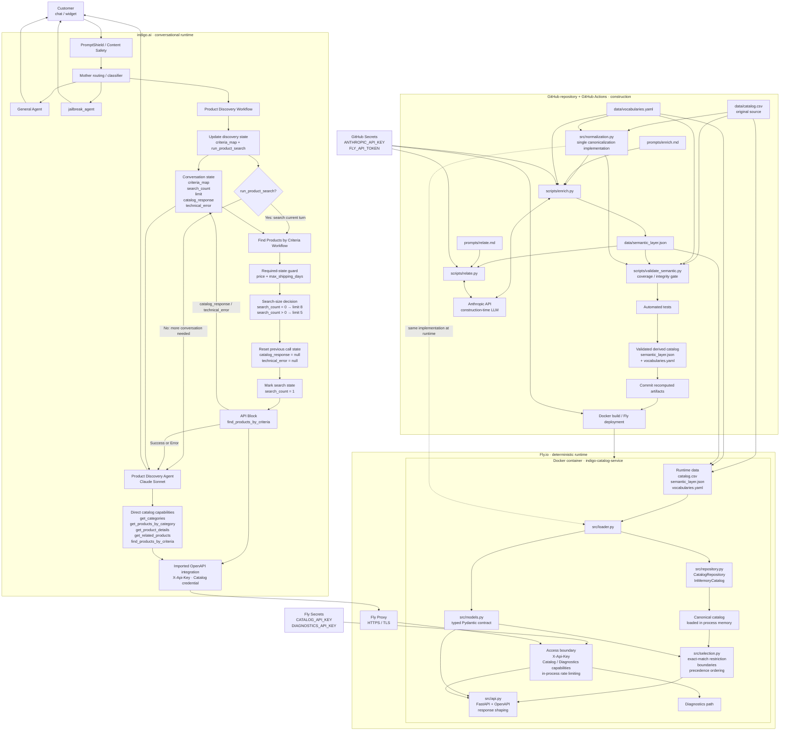

# Catalog Service · Product Discovery Agent

An end-to-end product discovery system for a gift shop, built around a deterministic **Catalog Service** and a conversational **Product Discovery Agent** in indigo.ai.

The project takes a raw ecommerce catalog that was never designed for conversational discovery, canonicalizes it, enriches it with a controlled semantic layer, validates that derived data in CI, and exposes the resulting catalog through a typed FastAPI service. indigo.ai sits on top of that service and handles conversation, routing, state and tool orchestration.

The central architectural principle is that **the LLM does not search, clean or classify the raw catalog at request time**. Semantic enrichment happens during the build pipeline. At runtime, the Catalog Service works only with validated, canonical data already loaded in memory and performs deterministic filtering, precedence ordering and relationship resolution.

This separates two jobs that are easy to conflate:

- the **Catalog Service** is responsible for what products exist, what their canonical data means, which constraints they satisfy, how candidates are ordered, and which relationships between products are valid;
- the **Product Discovery Agent** is responsible for understanding the conversation, gathering what is still needed, choosing the appropriate capability, interpreting the service response and explaining recommendations naturally to the customer.

The service is containerized with Docker, deployed on Fly.io and exposed through an authenticated OpenAPI contract. The conversational layer is implemented in indigo.ai through routing, workflows, agents and API capabilities.

**Live service**

- API: `https://indigo-catalog-service.fly.dev`
- OpenAPI: `https://indigo-catalog-service.fly.dev/openapi.json`
- Swagger UI: `https://indigo-catalog-service.fly.dev/docs`

---

## The problem

Gift discovery is not the same problem as conventional catalog search.

A customer rarely arrives with a complete product query. They are more likely to say something like:

> “I need something for my sister. She has just moved house. Around €50, and I need it this week.”

The source catalog, however, was built for ecommerce storage and navigation. It contains product attributes, categories, prices and descriptive text, but it does not directly encode all the concepts needed to reason reliably about a gift conversation.

Several different problems have to be solved at once.

### Hard constraints and preferences are not the same thing

Some conditions define whether a product is actually usable. A delivery deadline or a strict maximum price cannot be treated as a vague preference.

Other signals should influence which valid products appear first without automatically eliminating everything else. The occasion, what the recipient might use the gift for, the intended function of the gift or the relationship to the recipient belong to a different class of reasoning.

Treating every signal as a hard filter produces brittle searches and unnecessary zero-result cases. Treating everything as a soft preference can produce recommendations that simply violate the customer's request.

The system therefore needs to distinguish **selection boundaries** from **signals used to order valid candidates**.

### The source data is not yet a reliable reasoning model

The input file contains real catalog imperfections that have to be absorbed by the integration layer rather than exposed to the conversational system.

The original source contains **152 rows across 17 columns**, but those rows do not correspond one-to-one with the products that should be shown to a customer. Duplicate products appear under different identifiers, category names contain formatting variants, some attributes are missing, some descriptions contain too little information to support a useful recommendation, and commercial recipient labels do not always describe a genuine restriction of the product.

After deterministic canonicalization, the service works with **150 canonical products** rather than 152 independent rows.

This distinction matters. If raw rows were treated as products:

- the same item could appear twice in a recommendation;
- category navigation could fragment across spelling or formatting variants;
- missing values could accidentally be turned into invented facts;
- commercial labels could create inappropriate ranking bias;
- alternate identifiers could fail to resolve to the same real product.

The raw catalog must therefore remain the source of truth while a deterministic integration layer converts it into a stable model suitable for discovery.

### Product attributes are not enough for gift discovery

A conventional ecommerce catalog can tell us that an item is a knife, costs €69, belongs to Kitchen & Dining and ships in two days.

That still does not fully answer questions such as:

- Is it useful for someone who enjoys cooking?
- Does it make sense as a housewarming gift?
- Is it a relatively safe choice when the buyer does not know the recipient very well?
- Is it suitable as a small additional gift rather than the main present?
- Is there another product that performs a similar function?
- Is there something that naturally pairs with it?
- If the customer wants a better version, what should count as a meaningful alternative rather than an unrelated expensive product?

Those are not facts that can be recovered reliably from price and category alone.

The project therefore introduces a **controlled semantic layer** that describes how products participate in gift-discovery decisions. This layer adds structured concepts such as intended use, functional role, gifting context, risk, relationships between products and alternative or complementary options.

The purpose is not to replace the original catalog. It is to make the catalog usable by a reasoning system without requiring the conversational model to infer those concepts from scratch on every request.

### Natural language and catalog language do not match exactly

Customers do not know the internal vocabulary of a catalog.

They may ask for a “chef knife”, a “chef's knife”, a “gyuto”, something “for cooking”, something “for someone who just moved”, or simply “something practical”.

The service therefore needs a controlled mechanism for mapping natural expressions to canonical domain concepts without forcing the customer to know internal field names or exact catalog labels.

This is also why `product_type` is not treated as a question that the agent must ask. If the customer provides a concrete object type, it can be interpreted. If they do not, discovery can proceed from function, use case and context instead.

### Zero results do not all mean the same thing

A particularly important distinction is the difference between:

- a product not existing;
- a relevant product existing but failing a hard constraint;
- the service understanding a criterion but being unable to apply it reliably;
- no valid product remaining after all applicable constraints are evaluated.

Those situations require different responses.

For example, if the shop carries a €149 chef's knife and the customer has a strict €50 limit, the correct answer is not:

> “We don't sell chef's knives.”

The service must be able to preserve the fact that the product exists while explaining that it was **excluded** because it exceeds the customer's budget.

Likewise, if part of a request cannot be mapped safely to the controlled vocabulary, the system should expose that limitation rather than pretending the criterion was applied.

This is why the API distinguishes successful results from structures such as `excluded` and `not_applied`.

### A conversational agent needs stable state, not repeated guesswork

Gift discovery normally takes more than one turn.

A customer may first provide the recipient, then a budget, then a deadline, then add that the person enjoys cooking, later increase the budget, ask to see the second result again, or request something similar but more premium.

The system must preserve what is already known while allowing later information to refine or replace earlier criteria.

It must also avoid:

- asking again for information already provided;
- rerunning identical searches unnecessarily;
- treating every user message as a completely new query;
- losing the relationship between phrases such as “the second one” and products shown earlier.

Conversational state therefore lives explicitly in the orchestration layer rather than being left entirely to the model's implicit memory.

### The LLM should not become the catalog database

A tempting implementation would be to place the CSV in model context or a retrieval system and ask an LLM to find products directly.

That would mix several responsibilities that benefit from being separated:

- data cleaning;
- canonicalization;
- filtering;
- ranking;
- relationship resolution;
- constraint enforcement;
- conversational reasoning;
- natural-language generation.

It would also make core catalog behaviour dependent on probabilistic interpretation at request time.

This project instead treats the LLM as the conversational reasoning layer and the Catalog Service as the authoritative product layer.

The agent can decide **what it needs to ask or search for**. The service decides **what the catalog actually contains and what satisfies the requested conditions**.

---

## The solution

The solution is split into three deliberately separate stages: **build-time semantic preparation, deterministic catalog runtime, and conversational orchestration**.

```text
                         BUILD / CI
                             │
                             ▼
                      raw catalog.csv
                             │
                  deterministic normalization
                             │
                             ▼
                    canonical product set
                             │
               semantic enrichment + relations
                             │
                             ▼
             validated semantic_layer.json
                    + vocabularies.yaml
                             │
                 validation + automated tests
                             │
                             ▼
                         deployment
                             │
                             │
                 ─────────────────────
                             │
                             ▼
                    CATALOG SERVICE
                             │
              catalog + semantic layer loaded
                       into memory
                             │
          deterministic filtering / precedence /
                relationships / API contract
                             │
                             ▼
                     FastAPI on Fly.io
                             │
                             │
                 ─────────────────────
                             │
                             ▼
                         indigo.ai
                             │
                     routing + state
                             │
                  discovery workflows
                             │
                     API capabilities
                             │
               Product Discovery Agent
                             │
                             ▼
                          customer
```

### 1. Build-time semantic preparation

The raw catalog remains versioned and unchanged.

A deterministic normalization layer first converts the source rows into the canonical product universe used everywhere else in the system. The same normalization implementation is shared between CI and runtime so that semantic validation and production cannot silently operate on different interpretations of the catalog.

The semantic pipeline then enriches those canonical products with the information required for gift discovery and builds relationships between them.

The result is stored as versioned derived data rather than recomputed during customer conversations.

The build pipeline validates that the semantic layer remains complete and internally coherent before deployment. If the derived catalog does not satisfy the required invariants, the new version is not deployed.

This means that semantic classification is a **controlled build concern**, not a runtime side effect.

### 2. Deterministic Catalog Service

At process startup, the service:

1. reads the original catalog;
2. applies the same deterministic canonicalization used during construction;
3. loads the validated semantic layer;
4. joins both representations;
5. builds the in-memory catalog consumed by the API.

Once startup is complete, customer requests do not trigger catalog classification or enrichment.

The service performs deterministic operations over data already in memory:

- category discovery;
- category browsing;
- criteria-based product discovery;
- product-detail retrieval;
- related-product resolution;
- hard-constraint enforcement;
- precedence ordering;
- alias resolution;
- excluded-product reporting;
- unresolved-criterion reporting.

The Catalog Service is therefore the authority for product truth.

It does not ask an LLM whether a €149 product satisfies a €50 maximum, whether two identifiers refer to the same canonical product, or whether an out-of-stock product should be returned. Those behaviours are encoded and tested as application logic.

### 3. Conversational orchestration in indigo.ai

indigo.ai provides the conversational layer on top of the API.

It is responsible for routing each turn to the correct conversational path, maintaining discovery state across turns, deciding whether enough information is available to search, calling the Catalog Service when necessary and giving the Product Discovery Agent access to the appropriate capabilities.

A dedicated discovery workflow maintains the accumulated search criteria. When the current turn creates or changes a discovery search and the required price and delivery information are available, the search workflow calls `find_products_by_criteria` and stores the returned envelope in `catalog_response`.

The Product Discovery Agent then starts from that service response rather than recreating the same catalog search independently.

The agent still has direct access to discovery capabilities when the conversation genuinely creates a new need inside its own reasoning — for example, looking for a complement, filling remaining budget, finding a related product or exploring a higher-priced alternative.

This keeps tool use flexible without allowing the LLM to replace the deterministic search path.

### Clear ownership between layers

The resulting responsibility boundary is intentional:

| Concern | Owner |
|---|---|
| Raw catalog | Versioned source data |
| Canonicalization | Catalog Service code |
| Semantic classification | Build pipeline |
| Semantic relationships | Build pipeline |
| Semantic validation | CI |
| Product truth | Catalog Service |
| Constraint enforcement | Catalog Service |
| Candidate ordering | Catalog Service |
| API contract | Catalog Service |
| Conversation routing | indigo.ai |
| Conversational state | indigo.ai workflows |
| Choosing when a capability is needed | Workflows + Product Discovery Agent |
| Interpreting API responses for the customer | Product Discovery Agent |
| Recommendation wording and reasons | Product Discovery Agent |

The separation has an important operational consequence:

> **No customer conversation can change the catalog, classify a product, alter the semantic layer or cause the Catalog Service to invoke an LLM.**

The only LLM activity related to catalog classification happens during the controlled build pipeline. At runtime, the conversational LLM consumes an authenticated API whose behaviour is deterministic and independently testable.

That architecture gives the agent the flexibility needed for natural conversation without giving it authority over facts that should remain deterministic.

---

## Architecture

The system is deliberately split into **three execution environments with different responsibilities and different trust boundaries**:

1. **GitHub Actions** constructs and validates the semantic representation of the catalog.
2. **The Catalog Service on Fly.io** serves validated catalog data through deterministic application logic.
3. **indigo.ai** owns the conversational runtime: routing, state, workflow orchestration, tool use and natural-language responses.

The same product catalog moves through those environments, but the work performed in each one is intentionally different. Semantic classification belongs to CI. Product truth and selection belong to the Catalog Service. Conversational reasoning belongs to indigo.ai.

The complete architecture is:



### Construction plane: GitHub and CI

The repository contains both the source catalog and the machinery used to turn it into a validated semantic catalog.

The three data artifacts have different roles:

- `data/catalog.csv` is the original store export and remains the source of factual product data;
- `data/vocabularies.yaml` defines the controlled domain vocabulary, definitions and aliases used by the semantic system;
- `data/semantic_layer.json` contains the derived semantic classification and product relationships.

The key architectural decision is that **canonicalization has one implementation only**: `src/normalization.py`.

That implementation is consumed in both worlds:

- by the construction and validation path in CI;
- by `loader.py` when the production process starts.

This prevents CI from validating one interpretation of the catalog while the deployed service serves another.

Two separate prompts define the model-backed construction tasks:

- `prompts/enrich.md` defines how product-owned semantic fields are classified;
- `prompts/relate.md` defines how product relationships are constructed.

The corresponding scripts are:

- `scripts/enrich.py`;
- `scripts/relate.py`.

The Anthropic model is available **only in this construction environment**. `ANTHROPIC_API_KEY` is supplied to those steps from GitHub Secrets. The model is not a dependency of the production service and its credential never enters the runtime container.

Semantic construction is also not performed unnecessarily on every CI run. The workflow checks which inputs changed and only runs the model-backed construction path when semantic inputs require it. Code, API or infrastructure changes still pass through validation and tests without forcing a new semantic classification.

After construction, `scripts/validate_semantic.py` acts as the semantic gate. It validates the derived artifact that production would actually consume. Automated tests then validate the deterministic service behaviour.

Only after those checks pass can the pipeline:

1. commit updated `semantic_layer.json` and `vocabularies.yaml` when construction changed them;
2. build and deploy the application to Fly.io.

The semantic artifacts are therefore **versioned build outputs with a validation gate**, not ephemeral information generated inside a customer conversation.

---

### Runtime plane: the Catalog Service

The deployed service is intentionally smaller than the construction environment.

The Docker image contains:

- `src/`;
- `data/`;
- `requirements.txt` and the installed runtime dependencies.

It deliberately does **not** contain:

- `prompts/`;
- `scripts/`;
- `tests/`;
- the Anthropic SDK installed specifically for construction;
- `ANTHROPIC_API_KEY`.

The production container therefore contains neither the classification instructions nor the script and credential combination required to invoke the construction-time model.

At startup, `src/api.py` creates the in-memory catalog once. The service does not reload and rebuild it for every request.

The runtime path is:

```text
catalog.csv
      +
vocabularies.yaml
      +
semantic_layer.json
      ↓
loader.py
      ↓
normalization.py
      ↓
canonical products + semantic fields + resolved relations
      ↓
InMemoryCatalog
      ↓
selection.py
      ↓
api.py
      ↓
typed HTTP response
```

#### `normalization.py`

Owns deterministic interpretation of the source catalog.

It is the single implementation used by both construction and runtime.

#### `loader.py`

Has a narrow responsibility:

1. read `semantic_layer.json`;
2. call the canonicalization logic over the source catalog;
3. verify that the semantic artifact covers exactly the canonical catalog;
4. join source facts and semantic fields;
5. resolve relationships into the runtime representation;
6. construct the `Product` objects consumed by the service.

If the canonical catalog and semantic layer do not cover the same product universe, startup fails rather than silently serving partially classified data.

#### `models.py`

Defines the typed Pydantic models used by the service and therefore participates directly in the generated OpenAPI contract.

The API is not an untyped JSON wrapper around Python dictionaries. The shapes exposed to indigo.ai are explicit models with declared fields, limits and descriptions for the concepts whose interpretation matters to the agent.

#### `repository.py`

Separates the rest of the application from the current storage decision.

`CatalogRepository` defines what the service needs from a catalog. `InMemoryCatalog` is the current implementation: the canonical products, off-contract runtime data and resolved relation information are loaded into process memory once.

The rest of the service does not need to know that the source is currently a CSV plus two derived files.

#### `selection.py`

Owns **which products qualify and in which order they are returned**.

The module separates three mechanics that must not be confused:

1. exact `product_type` restriction when the customer has identified a concrete object;
2. selection boundaries that determine whether a candidate qualifies;
3. precedence ordering of the candidates that remain.

There is no LLM call in this path and no derived numeric recommendation score. The ordering is deterministic and reproducible.

#### `api.py`

Owns the external boundary.

It translates declared request parameters into service operations, resolves controlled vocabulary where required, checks access, delegates product selection to the deterministic layer and shapes the typed response.

It also produces the OpenAPI specification that indigo.ai imports to construct the catalog capabilities.

`api.py` deliberately does **not** decide recommendation ranking itself: product qualification and ordering remain in `selection.py`.

---

### Deployment plane: Docker and Fly.io

The Catalog Service runs as the Fly application:

`indigo-catalog-service`

The container runs FastAPI through Uvicorn on port `8080`.

Fly Proxy sits in front of the application and provides the public HTTPS boundary. Plain HTTP is forced to HTTPS before authenticated catalog traffic reaches the service.

The application is deployed in the Frankfurt region (`fra`), chosen because indigo.ai is the runtime caller waiting synchronously for catalog responses during a conversation.

The current configuration keeps one Machine available. This serves two purposes:

- avoiding a customer-facing cold start during the first catalog call;
- keeping the process-local rate limiter consistent with the declared rate rather than splitting its counters across multiple independent Machines.

The health check uses:

`GET /openapi.json`

This verifies that FastAPI itself is responding after the catalog has loaded, rather than merely checking that a TCP port is open.

The two runtime credentials arrive through Fly Secrets:

- `CATALOG_API_KEY`;
- `DIAGNOSTICS_API_KEY`.

They are environment variables at runtime and are not stored in the Docker image or `fly.toml`.

---

### API and access boundary

The Catalog Service exposes two distinct capabilities at the security boundary.

The **Catalog credential** is used by indigo.ai to access the five product operations.

The **Diagnostics credential** is reserved for operator diagnostics and cannot be substituted by the Catalog credential.

Both use the same HTTP header:

`X-Api-Key`

but map to different capabilities inside the service.

The access layer also enforces an in-process sliding-window rate limit before allowing the request to reach the corresponding operation.

The API separates two different classes of failure:

- transport/access/technical failures use the appropriate non-2xx HTTP status;
- foreseeable requests that cannot be executed safely are represented as recoverable API content, allowing the conversational layer to handle them without treating them as infrastructure failures.

The security model is described in detail later in this README, but architecturally the important point is that **Fly provides transport security while the application independently controls authorization and request limits**.

---

### Conversational plane: indigo.ai

indigo.ai is not the product database and does not own catalog truth. It owns the conversation around that catalog.

The conversational path begins with the platform's safety processing and routing layer.

A Mother classifier uses the conversation to choose the appropriate destination:

- general store conversation can go to the **General Agent**;
- gift discovery and its continuation turns go to the **Product Discovery Workflow**;
- requests identified as jailbreak/security attempts can be routed to `jailbreak_agent`.

This matters particularly for short continuation messages. A reply such as:

> “€60”

or:

> “the second one”

is not meaningful as an isolated query, but is meaningful inside an active discovery conversation.

---

### Product Discovery Workflow

The Product Discovery Workflow owns the structured evolution of the discovery request.

Its state-update step receives what is already known together with the customer's latest message and produces the updated `criteria_map`.

It also decides whether the current turn creates or changes a product search through `run_product_search`.

That produces two paths.

#### No search required

If the turn does not yet justify a new catalog search, control goes to the Product Discovery Agent.

Typical examples include:

- required information is still missing;
- the agent needs to ask a conversational question;
- the customer has not changed the effective discovery criteria.

#### Search required

If the current turn does create or refine a search, control goes to the **Find Products by Criteria Workflow**.

This deliberately separates:

> understanding that a search is needed

from:

> executing the deterministic catalog search.

---

### Find Products by Criteria Workflow

This workflow is the normal search path for conversational discovery.

It has several responsibilities before the API call is allowed to happen.

First, it acts as a final guard: a discovery search requires both:

- a price criterion;
- `max_shipping_days`.

If either is missing, the catalog search is not executed and control returns to the Product Discovery Agent so the missing information can be collected.

When search can proceed, the workflow determines response size from the conversation state:

- the first discovery search uses `limit = 8`;
- later searches use `limit = 5`.

Before a new API call, the previous:

- `catalog_response`;
- `technical_error`

are cleared so that the agent cannot accidentally reason over stale success data alongside a new failure.

`search_count` is then marked so subsequent searches use the refined-search size.

The workflow calls the deployed `find_products_by_criteria` endpoint using the structured criteria and captures the returned body as `catalog_response`.

Both API Success and API Error return control to the **Product Discovery Agent**. The difference is preserved in the state the agent receives rather than by creating a second conversational endpoint.

---

### Explicit conversational state

The orchestration does not rely exclusively on the LLM remembering previous prose.

The discovery flow maintains explicit state:

| Variable | Responsibility |
|---|---|
| `criteria_map` | The accumulated structured discovery criteria |
| `search_count` | Whether the first discovery search has already been consumed |
| `limit` | The result size selected for the current search |
| `catalog_response` | The latest valid catalog envelope returned by the search workflow |
| `technical_error` | The latest technical failure state |

`run_product_search` is produced by the state-update step to decide the route for the current turn.

This explicit state is what allows a conversation to evolve from:

> “a gift for my sister”

to:

> “around €60”

to:

> “within three days”

to:

> “she likes cooking”

without treating each message as an unrelated search.

---

### Product Discovery Agent

The Product Discovery Agent is the customer-facing reasoning layer for products.

When the Find Products by Criteria Workflow has already executed the current search, the agent starts from `catalog_response`.

It is instructed to **read that response first rather than automatically repeating the same search**.

This is an important distinction because the agent also has direct access to the catalog capabilities.

The normal current-turn discovery search belongs to the workflow, but the agent may initiate a genuinely new search when its own reasoning creates a new purpose or materially different criteria.

Examples include:

- finding an additional small gift to use remaining budget;
- checking a higher-priced trade-up;
- responding to a customer who explicitly asks to explore a materially different alternative.

The agent therefore retains flexibility without becoming the default executor of a search that has already been performed.

---

### The five catalog capabilities available to the conversational system

All five operations come from the same authenticated OpenAPI service:

- `get_categories`;
- `get_products_by_category`;
- `find_products_by_criteria`;
- `get_related_products`;
- `get_product_details`.

Their responsibilities remain separate.

The Product Discovery Agent uses the appropriate operation according to the conversation rather than treating `find_products_by_criteria` as a universal replacement for every catalog interaction.

For example:

```text
"What sections do you have?"
        ↓
get_categories

"Show me Kitchen & Dining."
        ↓
get_products_by_category

"Tell me more about the Slate Cheese Board Set."
        ↓
get_product_details

"Do you have something like this?"
        ↓
get_related_products

"I want something for my sister, around €60, within 3 days."
        ↓
Product Discovery Workflow
        ↓
Find Products by Criteria Workflow
        ↓
find_products_by_criteria
```

All of those paths eventually reach the **same Catalog Service and the same product truth**.

---

### OpenAPI as the integration contract

The boundary between indigo.ai and the Catalog Service is the service's published OpenAPI specification.

indigo.ai does not need access to the source CSV, Python objects, semantic artifact or selection implementation.

It sees:

- operation names;
- parameters;
- parameter descriptions;
- schemas;
- response shapes;
- authentication requirements.

This makes the API contract part of the agent architecture rather than merely API documentation.

The wording and typing of the contract matter because they define what the conversational system is allowed to ask the service to do and how it interprets what comes back.

The Catalog Service remains independently testable without indigo.ai, while indigo.ai remains decoupled from the internal storage and selection implementation.

---

### Two different uses of LLMs

The architecture contains LLMs in two places, but they perform fundamentally different jobs.

| Environment | LLM responsibility | Access to raw catalog construction |
|---|---|---|
| GitHub Actions | Build semantic classification and product relations | Yes, during controlled construction |
| indigo.ai | Understand conversation, choose capabilities and write customer-facing responses | No construction responsibility |
| Catalog Service runtime | **No LLM** | Not applicable |

This separation is intentional.

The construction-time model can help turn product descriptions into structured semantic information because its output is subsequently persisted, validated and tested.

The conversational model can reason flexibly about what the customer means because the facts it consumes come from a deterministic service.

The production Catalog Service itself does neither job probabilistically.

---

### End-to-end request example

A normal discovery request therefore crosses the architecture like this:

```text
Customer:
"I need something for my sister, around €60, within 3 days."
        │
        ▼
indigo.ai safety layer
        │
        ▼
Mother routing
        │
        ▼
Product Discovery Workflow
        │
        ├─ updates criteria_map
        └─ run_product_search = true
        │
        ▼
Find Products by Criteria Workflow
        │
        ├─ validates required discovery state
        ├─ chooses limit
        ├─ clears stale response/error state
        └─ calls find_products_by_criteria
        │
        ▼
Fly Proxy · HTTPS
        │
        ▼
FastAPI access boundary
        │
        ├─ X-Api-Key
        └─ rate limit
        │
        ▼
Catalog Service
        │
        ├─ resolve declared criteria
        ├─ identify exact object when applicable
        ├─ apply selection boundaries
        ├─ order by deterministic precedence
        └─ shape results / excluded / not_applied
        │
        ▼
catalog_response
        │
        ▼
Product Discovery Agent
        │
        ├─ interprets the returned products
        ├─ writes a reason for each recommendation
        └─ decides what conversational move is useful next
        │
        ▼
Customer
```

At no point in that request does the Catalog Service clean the CSV, reclassify a product or invoke a language model.

Those decisions were already made and validated before the container was deployed.

That boundary — **probabilistic construction where it can be validated, deterministic catalog behaviour where product truth matters, and probabilistic conversation where flexibility is useful** — is the core of the architecture.

---

## Data lifecycle

The catalog has **three distinct moments in its lifecycle**:

1. **construction**, where deterministic source normalization and model-assisted semantic enrichment produce a validated derived artifact;
2. **process startup**, where the deployed service reconstructs the same canonical product universe and joins it with that artifact;
3. **request time**, where already-loaded products are filtered, ordered and returned without rebuilding or reinterpreting the catalog.

Keeping these moments separate is a core system invariant.

```text
                       1 · CONSTRUCTION
                       GitHub Actions
                             │
          source data + vocabularies + prompts
                             │
                             ▼
                 deterministic canonicalization
                             │
                             ▼
               semantic enrichment + relations
                             │
                             ▼
                     semantic validation
                             │
                         automated tests
                             │
                             ▼
                versioned semantic artifacts
                             │
                          deploy
                             │
                             │
              ───────────────────────────
                             │
                             ▼
                    2 · PROCESS STARTUP
                        Fly.io container
                             │
               source catalog canonicalized
                 with THE SAME implementation
                             +
                  semantic artifact loaded
                             │
                             ▼
                    canonical Product model
                             │
                      InMemoryCatalog
                             │
                             │
              ───────────────────────────
                             │
                             ▼
                       3 · REQUEST TIME
                             │
                     already-loaded data
                             │
             filter → order → relate → serialize
                             │
                             ▼
                         API response
```

The same files participate differently at each moment. What must not happen is for one stage to silently invent a second interpretation of the catalog.

---

### 1. Construction

Construction runs in GitHub Actions, not inside the production application.

Its purpose is to transform the store's source catalog into a **validated semantic representation that can later be consumed deterministically**.

The construction inputs are:

- `data/catalog.csv` — factual product source;
- `data/vocabularies.yaml` — controlled semantic vocabulary, definitions and aliases;
- `prompts/enrich.md` — semantic classification criterion;
- `prompts/relate.md` — relationship classification criterion;
- `src/normalization.py` — deterministic canonicalization rules.

The principal derived output is:

- `data/semantic_layer.json`.

`data/vocabularies.yaml` can also change during construction when a genuinely new product introduces a new `product_type`.

Construction itself contains several different kinds of work and deliberately does not treat all of them as model tasks.

---

### Deterministic canonicalization happens before semantic reasoning

The first important distinction is between **normalizing information that is already present** and **classifying information that does not exist explicitly in the source**.

`src/normalization.py` handles the first category.

It performs deterministic operations such as:

- parsing supported price formats;
- preserving a missing price as missing rather than inventing one;
- interpreting stock quantity and availability;
- normalizing category formatting;
- normalizing booleans and numeric fields;
- detecting product duplicates;
- selecting one canonical `product_id`;
- preserving absorbed identifiers as `alt_product_ids`;
- carrying additional categories into `secondary_categories`;
- preserving missing `rating` and `reviews_count` as missing;
- marking insufficient descriptions through `description_quality`;
- expanding `recipient` with `anyone` where the product is not genuinely gender-specific or restricted to children;
- emitting data-quality warnings.

If a value is genuinely ambiguous, the code does **not** guess.

For example, a price representation that cannot be distinguished safely between decimal and thousands notation raises `AmbiguousCatalog` with the row, column, value and reason.

This is an intentional boundary:

> Formatting variation may be normalized. Missing or ambiguous facts may not be invented.

The result of this stage is the canonical product universe against which both semantic construction and production runtime operate.

For the current source:

```text
152 source rows
      ↓
deterministic canonicalization
      ↓
150 canonical products
```

The distinction between rows and products therefore exists before any semantic recommendation logic begins.

---

### Semantic enrichment adds information the source does not contain

Once products have a stable canonical identity, `scripts/enrich.py` constructs the semantic fields required by discovery.

This is where a language model is useful: not to answer customer requests, but to convert product descriptions and catalog facts into **controlled, persistent domain classifications**.

The semantic decision is model-assisted, but its output is not accepted as arbitrary text.

The classifier must operate within the vocabulary and structural rules defined by the project.

For the controlled fields, proposed values are checked against `vocabularies.yaml` before being written.

If the model places a real value in the wrong vocabulary, invents an undeclared value, omits a required field or returns an invalid type, the script does not silently repair the answer and continue.

Instead:

1. the exact validation problem is identified;
2. that problem is returned to the model;
3. the model receives a bounded opportunity to correct its answer;
4. if the output remains invalid after the configured attempts, construction fails without accepting the invalid classification.

The current implementation allows **three attempts**.

This creates a useful division of responsibility:

- the model makes the semantic judgement;
- deterministic code decides whether that judgement is admissible.

---

### `product_type` is controlled but intentionally open

Most semantic vocabularies are closed: the classifier must choose among concepts that already exist.

`product_type` is different because inventory can legitimately introduce a type of object that has never appeared before.

For that reason it is controlled but extensible.

When a new product genuinely requires a new `product_type`, `enrich.py` can register it together with:

- its definition;
- its aliases.

That registration happens in the same construction run so that the semantic artifact cannot refer to a type that the vocabulary does not yet know.

A new `product_type` caused only by inventory growth is not considered a change in the meaning of the existing classification system. It therefore does **not** by itself increment the vocabulary version or require every existing product to be reclassified.

This distinction prevents ordinary catalog growth from unnecessarily rebuilding the entire semantic model.

---

### Enrichment is incremental unless the classification criterion changes

Model-backed work is not repeated merely because CI runs.

`enrich.py` distinguishes between two situations.

#### Inventory growth

If the classification criterion has not changed, products that already have a valid semantic entry keep it.

Only canonical products without an entry need classification.

This makes ordinary catalog growth incremental.

#### Criterion change

If the meaning of the classification has changed, existing classifications can no longer safely be assumed to mean the same thing.

A criterion change includes changes such as:

- modifications to `prompts/enrich.md`;
- changes to the closed vocabularies;
- redefinition or removal of an existing `product_type`;
- changes to an existing type's definition or aliases;
- a vocabulary version change.

In those cases, the whole catalog is reclassified.

The reason is more important than the optimization:

> A semantic artifact in which half the products were classified under one meaning and half under another can still be structurally valid while being semantically wrong.

The pipeline therefore distinguishes **new inventory** from **changed meaning**.

---

### Product relationships are recomputed globally

`scripts/relate.py` follows a different lifecycle from product-owned semantic fields.

Relationships are **not incremental**.

A new product can change the correct relationships of products that already existed. Adding a new chef's knife, for example, may create a new valid complement or alternative for products that were previously related only to the existing knife.

For this reason, when relation construction is required, the relationship mesh is reconsidered over the complete canonical catalog.

The script constructs and validates two different relationship families:

- `pairs_with`;
- `alternative_to`.

They are persisted differently because they mean different things.

#### `pairs_with`

A pairing has direction in the persisted artifact.

It is stored from the accessory toward the main product.

That direction contains semantic meaning, so it is not normalized away by sorting identifiers.

#### `alternative_to`

An alternative relation is symmetric.

It is persisted only once, under the lexicographically smaller `product_id`, together with its `relation_type`.

The loader later makes the other side aware of that relationship at runtime.

This avoids storing the same semantic fact twice and prevents two copies of the relationship from drifting apart.

As with enrichment, the model proposes semantic relationships but deterministic validation controls what is allowed to become persistent data.

Invalid references, self-relations, invalid relation types, conflicting duplicate relations and other structural violations cause the proposed result to be rejected rather than repaired silently.

---

### The semantic gate validates what production will actually consume

After construction, `scripts/validate_semantic.py` acts as a **deployment gate**.

It does not ask whether the model made aesthetically good recommendations. Its responsibility is structural and referential integrity.

The validator reconstructs the canonical catalog using the same `normalization.py` implementation and checks the derived artifact against that universe.

Among the invariants it enforces are:

- the semantic layer and vocabulary declare the expected version;
- the set of semantic entries matches the set of canonical products exactly;
- no canonical product is missing a semantic entry;
- no semantic entry exists without a canonical product;
- required semantic fields are present;
- required semantic fields are non-empty where the contract requires it;
- closed-vocabulary values really belong to their declared vocabulary;
- every `product_type` used by a product is declared;
- `product_type` definitions exist;
- aliases do not resolve ambiguously to multiple types;
- gender-specific declarations use admitted values;
- boolean semantic fields are actually boolean;
- relationship references point only to canonical products;
- a product is never related to itself;
- relationships are persisted only once according to their storage rule;
- `relation_type` contains an admitted value;
- redundant derived `same_function` relationships are not persisted when shared `product_type` already expresses them;
- newly introduced product types are justified by actual catalog growth;
- newly registered types are actually used.

Referential integrity is deliberately based on the **150 canonical product identifiers**, not the 152 raw identifiers.

An absorbed `alt_product_id` represents another identifier for the same object; it is not a second semantic node.

If the gate reports any failure, it exits unsuccessfully and **the deployment does not continue**.

There is no runtime fallback that says “deploy it anyway and let the agent work around the missing classification.”

The artifact either satisfies the contract or it is not production data.

---

### Automated tests follow semantic validation

The semantic gate and the automated test suite have complementary purposes.

The gate asks:

> Is the derived catalog internally complete and structurally coherent?

The tests ask:

> Does the service behave according to the implemented catalog contract?

Both run before deployment.

This distinction matters because structural semantic validity alone does not prove selection behaviour, API behaviour, authentication, error handling or ordering semantics.

The complete test strategy is documented later in this README.

---

### Derived artifacts are versioned

When construction modifies `semantic_layer.json` or legitimately extends `vocabularies.yaml`, the pipeline commits those artifacts back to the repository.

This is deliberate.

The production semantic state is therefore:

- inspectable;
- versioned;
- diffable;
- reproducible;
- tied to the source and criterion that produced it.

The semantic layer is not hidden transient state inside an LLM call.

It is part of the application data model.

---

## 2. Process startup

The second lifecycle moment begins when the deployed Docker container starts.

No construction-time LLM is available here.

The runtime image contains the application code and the three data files:

```text
catalog.csv
vocabularies.yaml
semantic_layer.json
```

`loader.py` combines them into the model the service will use for the lifetime of that process.

Importantly, the service does **not** simply trust that because CI previously validated the files, every possible runtime mismatch should be ignored.

Startup maintains its own critical invariant.

---

### The same canonicalization runs again

`loader.py` reads the semantic layer and then invokes `normalization.canonicalize(...)` over the original CSV.

This is the **same Python implementation used during construction**.

There is no second set of CSV-cleaning rules inside `loader.py`.

That means:

```text
CI's idea of "the canonical catalog"
                  =
runtime's idea of "the canonical catalog"
```

This equality is fundamental.

If CI validated one set of product identities but runtime independently constructed another, semantic coverage would no longer guarantee anything.

---

### The semantic layer must cover exactly the runtime catalog

Once canonicalization is complete, the loader compares:

- canonical identifiers derived from the source catalog;
- identifiers present in `semantic_layer.json`.

The sets must be exactly equal.

If products are missing from the semantic layer or semantic entries exist without a canonical source product, startup raises `IncompleteSemanticLayer`.

The service does not:

- fabricate a classification;
- ignore the product;
- partially start;
- ask an LLM to repair it.

It fails before serving an incomplete catalog.

CI is the first protection against an invalid artifact; startup is the final protection at the point of use.

---

### Source facts and semantic facts are joined

For every canonical product, `loader.py` constructs the runtime `Product` from two sources.

The canonical source contributes factual catalog information such as:

- identity;
- name;
- description;
- price;
- delivery;
- gift-wrap availability;
- brand;
- color;
- material;
- availability;
- categories;
- recipient information;
- occasion;
- rating and review count.

The semantic artifact contributes derived discovery information such as:

- `product_type`;
- `functional_family`;
- `use_case`;
- `suitable_relationships`;
- `gift_risk`;
- `is_standalone_gift`;
- `stocking_filler`;
- product relationships.

Neither file replaces the other.

The semantic layer augments the canonical source.

---

### Persisted relationships are resolved for runtime use

Relations are deliberately stored once in `semantic_layer.json`, but the runtime needs to query them from either endpoint.

The loader therefore resolves the persisted representation into the bidirectional runtime view where appropriate.

For `pairs_with` and `alternative_to`, both related products become aware of the relation in memory.

`relation_type` remains separate from `Product` because it describes **the relation between two products**, not an intrinsic property of either product.

This is an example of a broader design rule used throughout the service:

> Data is stored and exposed according to what it means, not merely according to what is convenient to serialize.

---

### Some runtime information deliberately stays outside the public `Product` contract

The loader also keeps information needed internally by the service but not intended to travel with every product response.

This includes:

- `description_quality`;
- `tags`;
- `stock`;
- `alt_product_ids`.

Those fields still have runtime purposes.

For example:

- `description_quality` participates in precedence ordering;
- `alt_product_ids` allow an absorbed identifier to resolve to its canonical product.

Keeping something outside the public product envelope does not mean discarding it. It means the API contract does not expose information the conversational agent does not need.

---

### The in-memory repository is built once

The resulting products are loaded into `InMemoryCatalog`.

It provides:

- the complete canonical product set;
- lookup by canonical identifier;
- lookup through absorbed identifiers;
- off-contract runtime information;
- relationship metadata;
- normalized category names.

At this point startup is complete.

The service has moved from **versioned source + derived files** to **ready-to-query runtime objects**.

No database migration, vector index construction or model warm-up is required.

---

## 3. Request time

The third lifecycle moment is deliberately the simplest.

When indigo.ai calls the deployed service, the catalog has already been:

- normalized;
- deduplicated;
- semantically classified;
- related;
- validated;
- loaded;
- joined;
- indexed for identifier lookup.

A request does **not** repeat those operations.

The request path operates on the in-memory model.

Depending on the operation, it can:

- resolve declared aliases;
- identify an exact requested object;
- apply selection boundaries;
- order valid candidates by precedence;
- browse a category;
- retrieve a product;
- resolve alternatives or complements;
- construct `excluded`;
- construct `not_applied`;
- shape the typed response.

The result is then serialized through the FastAPI/Pydantic contract.

There is:

- no call to Anthropic;
- no semantic reclassification;
- no relation reconstruction;
- no CSV mutation;
- no database query;
- no vector search;
- no embedding request.

The conversational LLM exists above this boundary in indigo.ai. It decides what capability is useful and explains what the API returns, but it does not perform the catalog's deterministic work itself.

---

### Why normalization is not repeated per request

The source catalog is immutable during the lifetime of a deployed process.

Running canonicalization for every customer turn would therefore produce the same result repeatedly while adding unnecessary latency and another opportunity for request-time failure.

Canonicalization belongs at process startup because that is the point where raw persisted data becomes runtime application state.

After that, request handling can remain a pure operation over known objects.

---

### Why semantic enrichment is not performed at startup either

Semantic enrichment is different from deterministic normalization.

It uses a model and can produce new derived data.

Running it every time a container starts would create several problems:

- two instances could derive different semantic states from the same deployment;
- startup would depend on an external model provider;
- cold starts would become expensive and slow;
- the semantic state actually serving customers would no longer be versioned;
- a model failure could make an otherwise valid deployment unavailable;
- CI could no longer validate exactly what production would consume.

For those reasons, semantic construction happens **before deployment**, while deterministic assembly happens **at startup**.

---

## The lifecycle invariant

The complete design can be summarized as:

```text
BUILD
probabilistic semantic judgement
        +
deterministic validation
        ↓
versioned artifact

STARTUP
deterministic reconstruction
        +
exact artifact/catalog join
        ↓
in-memory product model

REQUEST
deterministic selection
        +
typed serialization
        ↓
catalog response
```

The probabilistic part of catalog construction therefore happens at a moment where its result can be **persisted, inspected, validated, tested and rejected**.

By the time a customer is waiting for an answer, that uncertainty has already been converted into validated application data.

That is the central reason for the lifecycle split.

---

## Data model and semantic layer

The Catalog Service does not replace the source catalog with an AI-generated version of it.

Instead, it maintains a strict distinction between three forms of product information:

```text
SOURCE DATA
facts supplied by the store
        │
        ▼
CANONICAL DATA
the same facts after deterministic normalization
        │
        +
        │
SEMANTIC DATA
controlled classifications derived during construction
        │
        ▼
RUNTIME PRODUCT
canonical facts + validated semantic meaning
```

This separation is essential.

A price, brand or shipping time is a fact supplied by the source system. A `functional_family` or `gift_risk` is a derived interpretation used by the discovery system.

Those two kinds of information should not have the same provenance, should not be generated in the same way and should not be silently substituted for one another.

The runtime `Product` therefore represents a **join between canonical source facts and validated semantic fields**, not a rewritten copy of the original CSV.

---

### The source catalog

The original catalog contains **152 rows and 17 columns**:

| Source field | Meaning |
|---|---|
| `product_id` | Identifier supplied by the catalog |
| `name` | Customer-facing product name |
| `category` | Commercial category |
| `subcategory` | Commercial subcategory |
| `brand` | Product brand |
| `price_eur` | Price expressed in euros |
| `stock` | Available stock quantity |
| `rating` | Product rating when present |
| `reviews_count` | Number of reviews when present |
| `recipient` | Commercial recipient label supplied by the source |
| `occasion` | Occasions associated with the product |
| `tags` | Source tags |
| `color` | Product color when present |
| `material` | Product material when present |
| `gift_wrap` | Whether gift wrapping is available |
| `shipping_days` | Delivery time |
| `description` | Product description |

The file itself is not edited to make it easier for the application.

This is deliberate.

If duplicate rows were manually deleted, inconsistent categories manually renamed or missing information silently filled inside the CSV, the integration would no longer demonstrate how the real source is handled. It would instead hide that work inside a curated input file.

The source remains intact and the application absorbs its irregularities deterministically.

---

### From source rows to canonical products

Canonicalization changes **representation and identity**, not product meaning.

The current source contains 152 rows but resolves to 150 canonical products because two pairs of rows describe the same underlying products under different identifiers.

The canonical representation introduces or derives several pieces of information needed by the service:

| Canonical field | Origin / purpose |
|---|---|
| `product_id` | Canonical identifier selected deterministically |
| `alt_product_ids` | Absorbed identifiers that still resolve to the canonical product |
| `secondary_categories` | Additional normalized categories carried by absorbed duplicates |
| `price` | Normalized representation of `price_eur` |
| `stock` | Normalized quantity where the source provides one |
| `in_stock` | Availability derived from the stock representation |
| `recipient` | Source recipient information after the deterministic `anyone` expansion |
| `description_quality` | Whether the description contains enough information to support a recommendation reason |

The rest of the factual catalog fields are preserved in canonical form.

No semantic classification is needed to decide that two supported price representations mean the same numeric value, that two duplicate rows refer to one product or that an absorbed identifier should still resolve.

Those are integration rules.

---

### Canonical identity

Duplicate handling is not merely cosmetic.

If two rows represent the same real object, the service needs **one product identity** for:

- discovery;
- details;
- relations;
- semantic classification;
- exclusions;
- API responses.

The canonical `product_id` is selected deterministically. The other identifier is retained in `alt_product_ids`.

This means an old or alternate identifier is not treated as an unknown product.

```text
alternate identifier
        ↓
alt_product_ids
        ↓
canonical product_id
        ↓
same runtime Product
```

Semantic relationships are also built only between canonical identifiers.

An `alt_product_id` is an identity alias, not another semantic node.

---

### Missing data remains missing

The canonical model does not manufacture certainty.

A missing value is preserved as a missing value whenever the source does not justify something stronger.

For example:

```text
missing rating
      ≠
rating 0

missing reviews_count
      ≠
0 reviews

missing price
      ≠
€0
```

This distinction matters because those values later participate in selection or ordering.

Turning a missing rating into zero would not merely be a display decision: it would create a new product fact and could change where that product appears.

The service therefore reasons explicitly about whether information exists instead of replacing unknown information with convenient defaults.

---

### `recipient` is normalized as commercial metadata, not treated as a property of the object

The source catalog contains values such as `him`, `her`, `anyone`, `couple` and `kids`.

Those labels are useful, but they cannot automatically be interpreted as physical restrictions of a product.

A keyboard labelled `him`, for example, is not thereby a male-only object.

The canonicalization layer therefore preserves the original recipient value but adds `anyone` when the object itself is not genuinely gender-specific and is not restricted to children.

```text
source:
recipient = ["him"]

product is not genuinely gender-specific
        ↓

canonical:
recipient = ["him", "anyone"]
```

Gender-specific exceptions are not guessed from the product name. They are explicitly declared at `product_type` level in the controlled vocabulary.

This allows the system to use recipient information without reproducing the source catalog's commercial labeling as an artificial recommendation boundary.

---

## The semantic layer

The canonical catalog still describes **what the products are factually**.

It does not yet fully describe **how those products participate in gift discovery**.

That second responsibility belongs to `data/semantic_layer.json`.

The current artifact declares:

```text
vocabulary_version = 4
```

and contains one semantic entry for every canonical product.

Each product entry contains **nine derived fields**:

| Semantic field | Purpose |
|---|---|
| `product_type` | What concrete object the product is |
| `functional_family` | What work or function the product performs |
| `use_case` | In what situation or activity it is used |
| `gift_risk` | How much knowledge of the recipient is needed to choose it confidently |
| `suitable_relationships` | In which buyer-recipient relationships the gift is suitable |
| `is_standalone_gift` | Whether it can function as the main gift by itself |
| `stocking_filler` | Whether it can serve as a small standalone addition to use remaining budget |
| `pairs_with` | Explicit complementary product relationships |
| `alternative_to` | Explicit substitution relationships |

These fields do not all answer the same question.

That separation is deliberate.

---

### `product_type`: what object is it?

`product_type` represents the **concrete kind of object**.

Examples include concepts such as:

```text
chef_knife
notebook
board_game
backpack
fountain_pen
```

Its purpose is different from category, function or use case.

A commercial category answers where the store shelves something.

A `functional_family` answers what kind of work it performs.

A `use_case` answers when or for what activity it is useful.

`product_type` answers:

> What is the object itself?

This distinction allows exact object requests to remain exact.

If the customer asks specifically for a chef's knife, a paring knife is not merely a lower-scoring chef's knife. It is another object.

The discovery layer can therefore distinguish:

```text
"I need a chef's knife"
        ↓
exact object request

from

"I need something for cooking"
        ↓
broader discovery intent
```

---

### Reusing product types instead of fragmenting the vocabulary

The classifier receives the existing `product_type` definitions and aliases before assigning a type.

It must reuse an existing type whenever that type already represents the same object.

For example, if `chef_knife` already exists, a product described as a “cooking knife” must not cause a second concept such as `cooking_knife` to be created merely because the wording differs.

Otherwise the same object class would fragment:

```text
chef_knife
cooking_knife
kitchen_chef_knife
...
```

and an exact search would return only whichever fragment happened to match the customer's wording.

A new `product_type` is therefore created only when the inventory introduces a genuinely new object concept.

---

### `product_type` is controlled, but not a closed enum

This field is deliberately different from the other controlled semantic vocabularies.

The current vocabulary contains a large number of concrete product types and their aliases. New inventory can legitimately introduce another type.

For that reason, the OpenAPI contract exposes `product_type` as free text rather than publishing the entire inventory-dependent vocabulary as an enum.

The service still resolves it deterministically.

A request can contain either:

```text
canonical value
        ↓
chef_knife
```

or a known alias such as:

```text
gyuto
chef knife
chef's knife
        ↓
chef_knife
```

If the value cannot be resolved, the service does not guess a nearby type. It can instead report that the criterion was not applied.

---

### `functional_family`: what work does the product perform?

`functional_family` describes **function rather than object identity**.

Examples in the controlled vocabulary include:

```text
food_preparation
food_serving
beverage_preparation
writing_stationery
desk_workspace
storage_organisation
audio
outdoor_gear
```

A product may belong to more than one functional family because one object can perform more than one meaningful job.

This field is therefore multivalued.

It also has **no generic fallback value**.

Every product must have at least one real functional family. If the controlled vocabulary cannot describe what an object does, that is considered a vocabulary problem rather than a reason to assign a meaningless catch-all label.

This field is one of the mechanisms that allows the system to move beyond exact object search.

A customer asking for something useful for food preparation does not need to know which specific product type they want.

---

### `use_case`: in what situation is it useful?

`use_case` describes the situation or activity around the product.

The current controlled vocabulary includes concepts such as:

```text
cooking
baking
coffee
tea
home_office
travel
gardening
reading
fitness
photography
writing
```

Like `functional_family`, it is multivalued.

An object may legitimately participate in several situations.

For example, a product may support both:

```text
writing
home_office
```

without either use case being a weaker version of the other.

The system does not count the number of matching values as accumulating relevance points. Multiple query values are alternatives within the same semantic dimension, not scores.

---

### `universal` has a specific meaning

`use_case` contains one special value:

`universal`

It is reserved for products whose usefulness is **not tied to a specific situation**.

In the current classification criterion, this is intentionally narrow rather than a fallback for generically useful products.

It does not mean:

> “this product matches every possible use case.”

It means:

> “the product does not depend on a specific use case.”

That difference becomes important in precedence ordering.

When no specific `use_case` is known, `universal` can be useful.

When the customer explicitly says they want something for cooking, a concrete cooking match is stronger than a product that is merely independent of use case.

---

### `gift_risk`: how much do we need to know about the recipient?

`gift_risk` does **not** measure product quality.

It describes how much recipient knowledge is needed to recommend the product confidently.

The controlled values are:

| Value | Meaning |
|---|---|
| `low` | Can work without knowing the recipient particularly well |
| `taste_dependent` | Success depends materially on knowing their taste |
| `high_commitment` | Requires a stronger prior interest, habit, fit, equipment or commitment |

This distinction lets the system behave differently when the buyer barely knows the recipient versus when they know them well.

A highly rated but taste-dependent product is not automatically a safer gift than a lower-risk alternative.

The field is therefore semantic context for recommendation behaviour, not a score.

---

### `suitable_relationships`: who is it appropriate to give this to?

This field describes suitability across the five controlled relationship contexts:

| Value | Relationship context |
|---|---|
| `colleague` | Professional relationship |
| `acquaintance` | Someone known only loosely |
| `friend` | Friendship |
| `family` | Direct family |
| `partner` | Romantic partner |

A product may contain several values.

Each value is binary: the gift either fits that relationship context or it does not.

There is no hierarchy encoded between them and no implication that a product carrying five values is “five times more suitable” than a product carrying one.

---

### `is_standalone_gift`: can this be the gift itself?

Not every sellable product makes sense as a standalone recommendation.

Some objects exist primarily to support another object:

- refills;
- accessories;
- protective items;
- maintenance products;
- consumables tied to another product.

`is_standalone_gift` distinguishes those from products that can reasonably carry the main recommendation on their own.

`false` is not a quality judgement.

An accessory may be an excellent product and an excellent complement while still being a poor answer to:

> “What should I buy as the gift?”

This distinction is especially important because the service treats discovery and complement search differently.

A main-gift search normally requires a standalone product.

A `pairs_with` search is precisely where a non-standalone complement can become the correct answer.

---

### `stocking_filler`: can it usefully fill remaining budget?

`stocking_filler` represents a specific commercial role.

It marks a product that is:

- sufficiently small;
- relatively inexpensive;
- capable of standing on its own as an additional gift.

Its purpose is not to mark “cheap products” generally.

It supports the post-selection behaviour where a customer has already chosen the main gift but still has meaningful unused budget.

The Product Discovery Agent can request:

```text
stocking_filler = true
```

together with the remaining budget and use the service to look for a small additional gift.

Because the field is explicit, this does not require the conversational model to improvise which products “feel small enough” on each request.

---

## Product relationships

The remaining semantic fields describe **relationships between products rather than properties of one product in isolation**.

Those relationships are built separately from the product-owned fields because they require visibility of the complete canonical catalog.

The two persisted relationship families are:

```text
pairs_with
alternative_to
```

Their meanings, direction and storage rules are deliberately different.

---

### `pairs_with`: concrete complements

`pairs_with` represents a direct functional complement.

The relationship exists when one product concretely:

- improves;
- completes;
- maintains;
- replenishes;
- protects;
- or enables the use of another.

Examples include relationships such as:

```text
ink → fountain pen
film → instant camera
sharpening stone → knife
```

The test is stronger than:

> “these products could be used in the same routine.”

The value of one product has to be directly connected to using it with the other.

Sharing:

```text
brand
subcategory
tags
functional_family
```

does not by itself create a pairing.

---

### The direction of `pairs_with` carries meaning

In the persisted semantic layer, `pairs_with` is written from the accessory or complement **toward the main product**.

For example:

```text
ink_set
    │
    └── pairs_with → fountain_pen
```

That direction is semantic content.

It tells the system which object is the complement and which object it complements.

For that reason, the relation is not normalized by sorting identifiers.

At runtime, the loader makes both ends aware of the connection where needed, but the stored representation preserves the meaning of the original direction.

---

### `alternative_to`: explicit substitution

`alternative_to` expresses a different relationship.

Here the two products can substitute for one another in the same concrete purchasing decision.

Unlike `pairs_with`, the relationship is symmetric.

Each explicit relation carries a `relation_type`:

| `relation_type` | Meaning |
|---|---|
| `equivalent` | The products are supported by the catalog as versions of the same object or commercial concept |
| `same_function` | They are different objects that can independently serve the same main purchasing purpose |

`equivalent` is deliberately stronger.

Sharing a material, finish, brand, category, tags or even a `product_type` does not automatically justify it.

The source must support the idea that the complete product is another version of the other product.

When the substitution is valid but that stronger claim is not justified, the relation is `same_function`.

---

### Not every relationship needs to be persisted

The runtime already knows enough to derive some substitution relationships.

If two products share the same `product_type`, the service can derive a `same_function` relationship.

It can also use shared `functional_family` as a broader lower-level alternative set.

Therefore the semantic artifact does not need to store a complete graph connecting every vaguely related item.

Persisted relationships are reserved for information that adds something more specific:

```text
explicit equivalent relationship
or
particularly supported concrete alternative
or
direct complement
```

This prevents the graph from becoming a noisy duplicate of information that already exists elsewhere in the model.

Most products do not need a manually persisted relationship, and that is considered correct.

There is no target relationship count.

---

### Relations exist or do not exist; they are not scored

The relationship layer contains no:

```text
similarity percentage
relationship strength
distance
confidence score
```

The decision is categorical.

A relation either satisfies its semantic definition or it does not.

This follows the same principle used elsewhere in the system: the project avoids creating numerical quantities merely to make semantic decisions look precise.

---

## Controlled vocabularies

`data/vocabularies.yaml` is the semantic dictionary shared across construction and runtime.

Version 4 currently defines the controlled domains used by the service, including:

| Vocabulary | Current role |
|---|---|
| `use_case` | Situations and activities |
| `functional_family` | Functional role of the product |
| `gift_risk` | Knowledge/commitment risk of the gift |
| `suitable_relationships` | Buyer-recipient relationship suitability |
| `product_type` | Concrete object identity plus aliases |

The first four are closed vocabularies.

The current contract builds real enum definitions for:

- `UseCase`;
- `FunctionalFamily`;
- `GiftRisk`;
- `SuitableRelationship`.

Those enums are generated from `vocabularies.yaml` rather than copied manually into `models.py`.

The current controlled sets contain:

| Vocabulary | Values |
|---|---:|
| `UseCase` | 30 |
| `FunctionalFamily` | 31 |
| `GiftRisk` | 3 |
| `SuitableRelationship` | 5 |

`product_type` remains controlled but open to legitimate inventory growth.

This creates a **single semantic source of truth**.

The classifier sees the vocabulary definitions when assigning fields, the validator checks against those same definitions, and the OpenAPI contract exposes those same controlled values to the agent.

The construction model and the conversational model therefore do not receive two independently maintained interpretations of what concepts such as `food_preparation` or `taste_dependent` mean.

---

## Definitions are part of the contract

A controlled label without its meaning would not be enough.

For example:

```text
gift_risk = taste_dependent
```

only helps if both the classifier and the consumer understand what `taste_dependent` means in the same way.

`vocabularies.yaml` therefore contains a `definicion` for each controlled value.

`models.py` builds the enum descriptions from those definitions so they reach the OpenAPI schema read by indigo.ai.

That produces a semantic chain:

```text
vocabularies.yaml
        │
        ├── classification criterion
        │
        ├── semantic validation
        │
        └── OpenAPI enum descriptions
```

The system is not relying on the same label accidentally meaning the same thing in three different places.

---

## The runtime `Product` model

After canonical source data and semantic data are joined, the public runtime representation is the Pydantic `Product` model.

It contains **26 fields**:

| Group | Fields |
|---|---|
| Identity and content | `product_id`, `name`, `description` |
| Purchase conditions | `price`, `shipping_days`, `gift_wrap`, `brand`, `color`, `material`, `in_stock`, `is_standalone_gift` |
| Classification | `category`, `secondary_categories`, `subcategory`, `product_type`, `functional_family`, `use_case`, `occasion`, `recipient`, `suitable_relationships`, `gift_risk`, `rating`, `reviews_count` |
| Commercial relations | `stocking_filler`, `pairs_with`, `alternative_to` |

This is the single product shape used by the operations that return merchandise.

A product returned during discovery therefore does not arrive as a short search hit that later needs to be enriched through another call.

It already contains the product information the agent is allowed to use.

That is why `get_product_details` is reserved for a customer asking specifically about an identified product, not for repairing incomplete discovery results.

---

## What deliberately does not travel in `Product`

Four runtime fields remain outside the public `Product` contract:

| Internal field | Why it stays internal |
|---|---|
| `description_quality` | Its effect has already been applied during precedence ordering |
| `tags` | Useful during construction/context, but not part of the runtime discovery contract |
| `stock` | The exact quantity adds no required agent behaviour; availability is exposed through `in_stock` |
| `alt_product_ids` | Needed for identity resolution, not for customer-facing reasoning |

This is an important contract decision.

The agent receives what it needs to make and explain recommendations, not every field the backend happens to know.

The API is therefore neither:

> “send everything because it exists”

nor:

> “send almost nothing and let the LLM infer the rest.”

It exposes the information that belongs in the product-discovery contract.

---

## Other public shapes

`Product` is not the only shape in the data model.

The API uses specialized forms when a full product would communicate the wrong semantics.

### `ExcludedProduct`

A product in `excluded` is relevant enough to acknowledge but failed a query boundary.

It carries only:

```text
product_id
name
price
exclusion_reason
actual
required
```

It intentionally does not carry the complete recommendation envelope.

The agent should explain **why it was excluded**, not write a normal recommendation for it.

### `CategorySummary`

Category discovery returns the current state of each category:

```text
name
available_count
price_min
price_max
```

A category is part of the store map even when its current available count is zero.

### `NotApplied`

`NotApplied` represents a criterion that arrived in the request but could not safely be applied:

```text
parameter
received
reason
```

This distinction makes absence observable.

Without it, the agent could not tell whether:

```text
criterion absent from query_understood
```

means:

```text
the customer never said it
```

or:

```text
the customer said it, but the service could not resolve it
```

Those require different customer-facing behaviour.

### `RelatedProduct`

A related result is a normal `Product` plus, where applicable:

```text
relation_type
```

`relation_type` is not placed inside the base `Product` because it is not a property of the product itself.

It only has meaning relative to the product from which the related search started.

---

## One response model per operation

The service deliberately does not use a universal response envelope.

Each operation publishes only the metadata that actually has meaning for that operation.

For example:

| Operation | Operation-specific metadata |
|---|---|
| `get_categories` | none |
| `get_products_by_category` | `total`, `offset` |
| `find_products_by_criteria` | `query_understood`, `excluded`, `not_applied` |
| `get_related_products` | `relation_type`, `query_understood`, `excluded` |
| `get_product_details` | none |

`currency` travels at response level rather than being repeated inside every product.

A universal envelope containing every possible field would technically be convenient, but it would make the API less precise for an LLM consumer.

The agent would then have to infer whether a field was absent because:

- it did not apply;
- it was empty;
- the operation did not support it;
- or the backend forgot to populate it.

Separate response models encode those distinctions directly into the contract.

---

## Why the semantic layer exists

The semantic layer is not an attempt to create a richer product database for its own sake.

It exists because the source catalog and the customer describe the same purchase in different languages.

The source catalog naturally says things such as:

```text
category = Kitchen & Dining
subcategory = Knives
price = 149
shipping_days = 3
```

The customer naturally says things such as:

```text
"She loves cooking."
"I don't know her very well."
"Something useful for the new house."
"Do you have something similar?"
"Could I add something small?"
```

A direct search over source attributes leaves a large semantic gap between those two representations.

The controlled layer introduces a stable intermediate language:

```text
customer intent
        ↓
functional_family
use_case
product_type
gift_risk
suitable_relationships
        ↓
canonical products
```

and product-to-product behaviour:

```text
selected product
        ↓
pairs_with
alternative_to
        ↓
complements / alternatives
```

The LLM is therefore not asked to rediscover the meaning of every product during every conversation.

That work is performed once during controlled construction, converted into explicit data, validated, versioned and then reused deterministically.

The result is a catalog that remains factual at its core while becoming capable of supporting conversational gift discovery.

---

## Discovery and selection logic

Product discovery is implemented as a **deterministic selection process**, not as semantic similarity scoring.

The service does not assign each product a relevance percentage and then sort by the largest total.

Instead, `selection.py` separates three different questions:

```text
1. Did the customer identify a concrete object?
        ↓
   exact product_type restriction

2. Which products are actually admissible?
        ↓
   selection boundaries

3. Among the admissible products, which should come first?
        ↓
   precedence ordering
```

Those mechanics intentionally do not collapse into one another.

A product can be the wrong object even if it is otherwise attractive.

A product can be the right object but violate a price or delivery boundary.

Two products can both satisfy every boundary while one is still more relevant to the customer's situation.

The implementation represents those as different decisions.

---

### 1. Exact object restriction

`product_type` has a special role in discovery.

When the customer explicitly names a concrete object and that object resolves to a canonical `product_type`, the service first restricts the candidate universe to products of exactly that type.

```text
all canonical products
        ↓
product_type = chef_knife
        ↓
only chef_knife products
```

This happens **before** the normal selection boundaries and before precedence ordering.

It is not itself treated as a boundary and it is not a ranking signal.

It identifies what set of objects actually answers the request.

That distinction prevents a semantically related object from being presented as though it were the object the customer explicitly requested.

For example:

```text
customer asks for:
chef_knife
        ↓
paring_knife
```

does not mean:

```text
"lower-scoring chef's knife"
```

It means:

```text
different object
```

A `paring_knife` therefore does not enter the exact-match universe and is not placed in `excluded` merely because it failed to be a chef's knife.

`excluded` is for products that were relevant members of the applicable universe but failed a selection boundary. It is not a container for unrelated product types.

---

### Alias resolution happens before exact restriction

The customer is not required to know the canonical `product_type`.

The API resolves:

- the canonical value itself;
- declared aliases from `vocabularies.yaml`.

For example, different supported expressions can resolve to the same canonical object:

```text
gyuto
chef knife
chef's knife
        ↓
chef_knife
```

Once resolved, the canonical value is what appears in `query_understood`.

If a supplied `product_type` cannot be resolved, the service does **not** guess the closest type.

Instead:

- the unresolved criterion is reported in `not_applied`;
- the remaining valid criteria can still be used for discovery;
- exact object restriction is not performed because no exact object was established.

This preserves a crucial distinction between:

> “I know which object the customer requested.”

and:

> “I have a guess about what they might have meant.”

---

## 2. Selection boundaries

After the applicable candidate universe has been established, `take_what_qualifies(...)` decides which products are allowed to remain.

The current implementation contains **12 selection boundaries** when the separate price forms are counted individually:

| Boundary | Behaviour |
|---|---|
| `in_stock` | Always required |
| `is_standalone_gift` | Required for normal recommendations |
| `max_price` | Product price cannot exceed the declared maximum |
| `min_price` | Product price cannot fall below the declared minimum |
| `target_price` | Product must fall inside the ±20 % target band |
| `max_shipping_days` | Product must meet the delivery deadline |
| `gift_wrap_required` | When `true`, gift wrapping must be available |
| `brand` | Exact declared brand requirement |
| `color` | Resolved color requirement |
| `material` | Resolved material requirement |
| `stocking_filler` | When `true`, product must be classified as a filler |
| `recipient` | Hard restriction only in the cases described below |

These boundaries determine **admissibility**, not relative desirability.

Once a product fails an applicable boundary, later precedence levels cannot compensate for that failure.

A highly rated product does not become valid because its rating is strong if it misses the customer's delivery deadline.

---

### Two boundaries are service invariants

Two boundaries do not depend on the customer explicitly requesting them.

#### `in_stock`

Normal discovery never recommends unavailable merchandise.

`in_stock` is therefore always enforced.

There is no conversational preference that can make an unavailable product become a valid discovery result.

A direct `get_product_details` lookup is different because that operation can show the true state of a specifically identified product, including `in_stock = false`.

#### `is_standalone_gift`

Normal recommendation searches also require:

```text
is_standalone_gift = true
```

because the result is expected to work as the actual gift.

An accessory, refill or maintenance item that only makes sense together with another object should not become the main result simply because it fits the price and semantic criteria.

There is one deliberate exception:

```text
relation = pairs_with
```

When searching for a complement, `is_standalone_gift` is not required.

That is precisely the path where products such as a refill, case or accessory can legitimately be useful.

`in_stock`, by contrast, continues to apply even to complements.

---

## Price semantics

The service supports three different forms of price intent:

```text
max_price
min_price
target_price
```

They do not mean the same thing.

### `max_price`

A strict upper boundary.

```text
max_price = 50
```

means:

```text
price <= 50
```

A product above that value does not enter `results`.

### `min_price`

A strict lower boundary.

```text
min_price = 60
```

means:

```text
price >= 60
```

This supports requests where the customer does not want the result to fall below a particular spend.

### `target_price`

An approximate price is represented as a band rather than as a hidden maximum.

The current band is:

```text
target_price ± 20 %
```

For example:

```text
target_price = 60
        ↓
48 <= price <= 72
```

This is why a product slightly above €60 can be valid for an “around €60” request while it would be invalid for:

```text
max_price = 60
```

The distinction survives all the way from the API contract to deterministic selection.

---

### Missing prices are not treated as zero

When any of:

```text
max_price
min_price
target_price
```

is active, a product whose price is unknown cannot prove that it satisfies the requested price condition.

It therefore does not qualify.

When no price criterion exists, a missing price does not by itself exclude the product.

Again, unknown is not silently converted into zero.

---

## Delivery

`max_shipping_days` is a hard boundary.

If:

```text
max_shipping_days = 3
```

then a product must have a known shipping time no greater than three days.

A missing shipping value cannot prove that the deadline will be met and therefore fails the boundary.

This is one of the reasons price and delivery are treated specially in the conversational workflow as required information before the normal discovery search is launched.

---

## Gift wrapping

`gift_wrap_required` is activated only when the customer actually requires gift wrapping.

When:

```text
gift_wrap_required = true
```

only products whose `gift_wrap` value is explicitly `true` qualify.

An absent requirement does not imply that the customer prefers products without gift wrapping.

The contract therefore preserves absence as its own state.

---

## Brand, color and material

These attributes can become boundaries when the customer states them.

`brand` is an exact declared requirement.

`color` and `material` support an additional normalization step before selection.

The API first attempts to interpret the value using the controlled definitions in `vocabularies.yaml`.

A broader declared term can expand into the concrete catalog values it covers.

Otherwise, the service attempts a case-insensitive match against actual catalog values.

That allows the service to preserve the customer's level of precision rather than inventing a more specific attribute.

If `find_products_by_criteria` cannot resolve a supplied `color` or `material`:

- that criterion is removed from the applied criteria;
- it does not appear in `query_understood`;
- it is reported through `not_applied`;
- the rest of the query can still execute.

The returned products must therefore never be described as satisfying that unresolved criterion.

---

## `stocking_filler`

`stocking_filler` has intentionally asymmetric behaviour.

```text
stocking_filler = true
```

activates the boundary and returns only products classified as suitable fillers.

If it is absent, filler status does not restrict discovery.

This supports a specific post-selection search:

```text
main gift already settled
        +
remaining budget
        ↓
stocking_filler = true
        ↓
small additional gift
```

The field therefore does not generally mean “prefer cheaper things”.

It turns on a defined selection mechanic.

---

## Recipient behaviour

`recipient` combines deterministic normalization with two different forms of selection behaviour.

### `kids`

`kids` acts as a hard boundary.

When the customer asks for a child:

```text
recipient = kids
```

the product must explicitly contain:

```text
kids
```

`anyone` does not satisfy that requirement.

### `her`, `him` and `couple`

Adult recipient labels are treated more cautiously because the source catalog contains commercial recipient metadata that is not necessarily a real restriction of the object.

For ordinary non-gender-specific product types, adult recipient information is therefore primarily used later in precedence ordering.

A hard exclusion happens only when the product's `product_type` is explicitly marked as `gender_specific` in the controlled vocabulary and is incompatible with the requested recipient.

The service does not infer gender specificity from the product name or from the source's original marketing label.

---

## Criteria that order but do not cut

Several pieces of information matter strongly to recommendation relevance but are deliberately **not hard boundaries** in normal discovery.

These include:

- `functional_family`;
- `use_case`;
- `occasion`;
- `category`;
- `subcategory`;
- adult recipient compatibility where no genuine gender-specific restriction exists;
- `relationship`;
- rating and review information;
- `gift_risk`;
- `description_quality`.

This is the core distinction between:

```text
must satisfy
```

and:

```text
should come first
```

A user saying that the gift is for a housewarming, for example, should strongly influence ordering without necessarily erasing every useful product whose source `occasion` does not explicitly contain `housewarming`.

---

# 3. Precedence ordering

Once invalid products have been removed, the service orders the surviving set using **eight precedence levels**.

This is implemented as a lexicographic comparison.

Conceptually:

```text
compare level 1
    │
    ├─ different → order is decided
    │
    └─ tied
         ↓
compare level 2
    │
    ├─ different → order is decided
    │
    └─ tied
         ↓
...
```

A lower-priority level can never compensate for losing at a higher-priority level.

There is no addition.

There are no weights.

There is no final numerical relevance score.

The precedence chain is:

| Level | Criterion |
|---:|---|
| 1 | `functional_family` + `use_case`, including `universal` behaviour |
| 2 | `occasion` |
| 3 | `category` + `subcategory` |
| 4 | `recipient` |
| 5 | `relationship` / `suitable_relationships` |
| 6 | `rating` → `reviews_count` |
| 7 | `gift_risk` |
| 8 | `description_quality` |
| tie only | `product_id` for deterministic stability |

Each level has its own semantics.

---

## Level 1 — `functional_family` and `use_case`

The first level asks whether the product matches the customer's **functional need and usage situation**.

These are two independent dimensions:

```text
functional_family
use_case
```

A product can therefore satisfy:

- both;
- one;
- neither.

The number of dimensions satisfied determines the first part of the comparison.

```text
matches both
    before
matches one
    before
matches neither
```

Matching multiple values inside the **same** dimension does not create extra points.

For example, if the customer's `use_case` contains more than one acceptable value, the product only needs an intersection.

```text
requested use_case:
[cooking, baking]

product use_case:
[cooking, baking]

        =
one satisfied use_case dimension
```

It does not receive two accumulated relevance points.

The same rule applies to `functional_family`.

---

### `universal` inside level 1

`universal` has its own precedence behaviour.

When a specific `use_case` exists:

1. a concrete match to that use case comes first;
2. `universal` can come next within the same broader level;
3. a product matching neither follows.

But `universal` never allows a product to overtake another product that satisfies more of the two primary dimensions.

For example, a product satisfying both the requested `functional_family` and concrete `use_case` remains ahead of one that matches fewer dimensions but happens to carry `universal`.

When no specific `use_case` is supplied, `universal` acts as the preferred tie-break inside this level rather than pretending to match a nonexistent use case.

---

## Level 2 — occasion

Products whose `occasion` intersects with the requested occasion come before products that do not.

This is precedence, not a hard filter.

A product with no explicit occasion match can still survive if it satisfies all actual boundaries.

---

## Level 3 — category and subcategory

Commercial taxonomy enters after function, use and occasion.

The level counts whether the surviving product matches the requested:

```text
category
subcategory
```

A product matching both comes before one matching only one, which comes before one matching neither.

This is an important architectural choice.

In `find_products_by_criteria`, category information helps order the cross-category discovery set but does not redefine semantic relevance as “whatever happens to be on this shelf”.

By contrast, `get_products_by_category` is a browsing operation and explicitly establishes the category itself as the universe before applying its supported boundaries.

Those are different operations with intentionally different semantics.

---

## Level 4 — recipient

Recipient relevance is then considered.

For an adult recipient, products explicitly suitable for that recipient and products normalized with `anyone` receive the matching position.

The earlier hard boundary has already removed genuinely incompatible gender-specific types where applicable.

For `kids`, the hard selection happened before ordering.

This prevents recipient metadata from becoming a broad exclusion mechanism while still allowing it to affect which valid products appear first.

---

## Level 5 — relationship

If the customer provides the relationship between buyer and recipient, products whose `suitable_relationships` contains that value come first.

Examples include:

```text
colleague
acquaintance
friend
family
partner
```

A mismatch does not remove the product.

This reflects what `suitable_relationships` means in the semantic layer: recommendation suitability, not physical product eligibility.

---

## Level 6 — rating and review count

Commercial evidence enters only after the more meaningful semantic criteria above it.

The comparison is a cascade:

```text
rating known
    before
rating unknown
```

and, among products with ratings:

```text
higher rating
    before
lower rating
```

Then:

```text
reviews_count known
    before
reviews_count unknown
```

and, when known:

```text
more reviews
    before
fewer reviews
```

Rating and review count are **not combined into a formula**.

A rating of 4.8 with 20 reviews does not generate a synthetic value to compare against 4.6 with 400 reviews.

The declared cascade decides.

Missing values remain missing and are not converted to zero for the comparison.

---

## Level 7 — `gift_risk`

Unless the buyer has explicitly indicated that they know the recipient well, lower gift risk is preferred:

```text
low
    ↓
taste_dependent
    ↓
high_commitment
```

This does not mean `low` products are objectively better.

It means they require less recipient-specific knowledge to recommend safely.

When:

```text
buyer_knows_recipient = true
```

this precautionary level is skipped.

All products receive the same position at level 7 and comparison continues to the next level.

Absent and `false` preserve the precaution.

---

## Level 8 — `description_quality`

The final semantic level prefers products whose description is sufficiently informative:

```text
ok
    before
poor
```

`description_quality` itself does not travel in the public `Product` response.

Its effect has already been consumed by the selection process.

This is a good example of an internal field whose purpose is operational rather than conversational.

---

## Stable ties

If two products remain tied after all eight levels, the service uses:

```text
product_id
```

to make the output reproducible.

This tie-break has **no recommendation meaning**.

It exists only so identical inputs produce stable output ordering.

Price is deliberately not used as the final tie-break.

Otherwise products that were semantically identical under the declared criteria would receive an undocumented preference merely because one was cheaper or more expensive.

---

# No numeric product score

The resulting ordering key is technically a sequence of comparable values, but it is not a recommendation score.

The distinction is important.

A numerical scoring system typically behaves like:

```text
function match × weight
+
occasion match × weight
+
rating × weight
+
...
=
score
```

That allows enough strength in a low-priority dimension to compensate for weakness in a high-priority one.

This service deliberately does not do that.

Its behaviour is:

```text
first decisive criterion wins
```

A stronger rating cannot compensate for failing a higher-priority semantic level.

A larger review count cannot compensate for a worse functional match.

A cheap price cannot compensate for being the wrong object.

The ordering therefore remains explainable in terms of the declared decision hierarchy rather than an opaque aggregate number.

---

# `excluded`: preserving relevant failures

Products that fail a boundary are normally removed from `results`.

In some cases, however, simply removing them would destroy information the conversational agent needs.

The current service therefore has an `excluded` channel.

It is deliberately small and does not behave as a second recommendation list.

---

## Over-budget candidates

When `max_price` is present, the service can return up to:

```text
2
```

relevant products that satisfy the other applicable boundaries but exceed that maximum.

To construct them, the service:

1. removes only `max_price` from the boundary set;
2. identifies products that satisfy everything else;
3. keeps those whose actual price is above the maximum;
4. orders them using the same normal precedence;
5. returns at most two.

They are therefore selected because they are **relevant except for budget**, not because they are simply the cheapest products above the boundary.

Each reference carries:

```text
product_id
name
price
exclusion_reason = over_budget
actual
required
```

For example:

```text
customer max_price = 50
Chef's Knife price = 149
        ↓
excluded:
actual = 149
required = 50
```

This is the mechanism that allows the agent to say:

> the shop does carry the requested object, but it is outside the stated budget

instead of incorrectly claiming that the product does not exist.

`excluded` is only constructed when there is room after valid `results`; it is not allowed to displace valid products from the requested result limit.

---

## Exact out-of-stock case

There is also a specific exact-object case.

If:

- `product_type` resolved;
- that exact universe contains one product;
- no valid result remains;
- that product is out of stock;

the service can return that product through `excluded` with:

```text
exclusion_reason = out_of_stock
```

Again, this preserves the difference between:

```text
the product does not exist
```

and:

```text
the product exists but cannot currently be recommended
```

---

# `not_applied`: preserving unresolved criteria

`not_applied` solves a different information-loss problem.

It describes **input**, not excluded products.

If the customer supplies a criterion that the service cannot resolve safely, silently dropping it would make the remaining results look more constrained than they really are.

For supported unresolved criteria such as `product_type`, `color` or `material` in `find_products_by_criteria`, the response can therefore say:

```text
parameter
received
reason
```

while still executing the parts of the request that were understood.

The contract then separates:

```text
query_understood
```

from:

```text
not_applied
```

The conversational agent can tell exactly which claims it is entitled to make about the results.

---

# `query_understood`

`query_understood` is the normalized representation of the criteria that the service actually understood and applied.

For example, when an alias resolves successfully:

```text
customer / agent sends:
product_type = "gyuto"

service resolves:
product_type = "chef_knife"

query_understood:
product_type = "chef_knife"
```

An unresolved criterion reported in `not_applied` is not also presented as though it had been applied successfully.

This gives the conversational layer a machine-readable account of **what the search actually meant to the service**, not merely what was originally sent.

---

# Related-product selection reuses the same mechanics

`get_related_products` does not contain a second recommendation-ranking system.

It reuses:

- the same selection boundaries;
- the same precedence ordering.

What changes is how the initial candidate universe is constructed.

There are two relation paths:

```text
pairs_with
alternative_to
```

---

## `pairs_with`

A complement search requires a concrete `product_id`.

Without it, the operation returns:

```text
missing_anchor
```

The candidate universe is the explicit set in the anchor product's resolved `pairs_with` relationships.

The service then:

```text
explicit complements
        ↓
boundaries
        ↓
precedence
        ↓
limit
```

Unlike ordinary discovery, `is_standalone_gift` is not required here because the requested object is specifically a complement.

Everything else, including `in_stock`, continues to apply.

---

## `alternative_to`

Alternative search is broader.

When a concrete anchor product exists, candidates are considered in three ordered levels:

```text
1. explicit alternative_to
        ↓
2. same product_type
        ↓
3. shared functional_family
```

The levels are strict.

A candidate from level 2 cannot overtake a surviving candidate from level 1 because it has a better rating.

A candidate from level 3 cannot overtake one from level 2 because it matches the occasion more closely.

The system exhausts each higher relationship level before using the next one to fill the result limit.

Inside each level, however, the standard boundaries and standard precedence chain apply.

This creates two nested forms of order:

```text
relationship level
        ↓
normal precedence within that level
```

---

### Alternative search without a `product_id`

`alternative_to` can also operate without a concrete source product when enough of the intended product concept is known.

If `product_type` is available, it anchors the relation concept:

```text
same requested product_type
        ↓
shared functional_family
```

If no `product_type` exists but `functional_family` does, the family provides the candidate set.

Other meaningful non-boundary criteria can also establish enough intention for the service to evaluate alternatives over the catalog using the normal boundaries and precedence.

A request containing only boundaries such as:

```text
max_price
max_shipping_days
```

does **not** describe what is being substituted.

Without a product or usable concept, `alternative_to` therefore returns:

```text
missing_anchor
```

Price alone is not a semantic anchor.

---

### `product_type` means something different inside alternatives

The exact-match restriction used by `find_products_by_criteria` does not propagate blindly into `get_related_products`.

In discovery:

```text
product_type
        =
the exact object the result must be
```

In `alternative_to` without a concrete product:

```text
product_type
        =
the object being substituted
```

The answer is therefore allowed to contain a different `product_type`.

That is not a violation of exact matching; it is the purpose of an alternative search.

The same field participates differently because the operation itself has different semantics.

---

## `relation_type`

For `alternative_to`, each returned `RelatedProduct` can declare the nature of the relation.

If an explicit persisted relation exists, its stored:

```text
relation_type
```

is used.

For a relation derived through the normal fallback levels, the runtime relation is:

```text
same_function
```

This preserves the stronger `equivalent` meaning only where that stronger relationship was actually established during semantic construction.

---

## `excluded` also works inside related-product search

When `max_price` is supplied to `get_related_products`, over-budget related candidates can also be preserved through `excluded`.

The service walks the same relation levels and, within each level:

1. evaluates the other applicable boundaries;
2. identifies candidates whose price alone exceeds `max_price`;
3. orders them using the normal precedence;
4. collects them up to the global `EXCLUDED_CAP` of two.

This allows an alternative or complement conversation to remain truthful about a relevant product that exists but falls outside the stated budget.

---

# Browsing is deliberately different from discovery

`get_products_by_category` does not use the full discovery semantics.

The customer has already said they want to browse one specific shelf.

The operation therefore starts by defining:

```text
candidate universe
=
products whose category is the requested category
```

It then applies the supported boundaries:

- price;
- delivery;
- availability.

Importantly, browsing does **not** require `is_standalone_gift`.

The user asked to see the contents of a category, not for the backend to decide which items on that shelf deserve to count as main gifts.

The browsing operation also supports an explicit customer-controlled `sort`:

```text
rating
price_asc
price_desc
```

This sort belongs only to browsing.

It does not modify the recommendation precedence used by discovery or related-product search.

That distinction prevents a request such as:

> “show me the cheapest things in this category”

from silently changing how future gift recommendations are ranked.

---

# Determinism and conversational flexibility

The complete discovery boundary can therefore be expressed as:

```text
CONVERSATIONAL LAYER
understands what the customer means
        ↓
structured criteria
        ↓
CATALOG SERVICE
        │
        ├── exact object restriction
        ├── deterministic boundaries
        ├── deterministic precedence
        ├── excluded
        └── not_applied
        ↓
ordered catalog response
        ↓
CONVERSATIONAL LAYER
explains why the returned products make sense
```

The agent is free to interpret natural language and to explain recommendations naturally.

It is not free to redefine:

- what counts as the requested object;
- whether a strict budget was satisfied;
- whether delivery fits;
- whether an item is available;
- how the deterministic result order was produced;
- whether an unresolved criterion was actually applied.

That division is what allows the system to combine conversational flexibility with stable catalog behaviour.

---

## API capabilities

The Catalog Service exposes **five public catalog capabilities** through its OpenAPI contract.

They are not five interchangeable ways of retrieving products. Each operation represents a different customer intention and has its own candidate universe, parameters, limits and response metadata.

| Capability | Primary purpose | Maximum result size |
|---|---|---:|
| `get_categories` | Understand what sections the shop contains | All category summaries |
| `get_products_by_category` | Browse one explicitly selected category | 8 per page |
| `find_products_by_criteria` | Cross-category gift discovery | 8 |
| `get_related_products` | Find complements or substitutes | 5 |
| `get_product_details` | Inspect one identified product | 1 |

All five public operations:

- are read-only;
- use the same canonical in-memory catalog;
- are protected by the Catalog credential;
- return typed Pydantic response models;
- are published through the same OpenAPI specification;
- share the same underlying product truth.

They differ in **what question they answer**.

```text
"What kinds of things do you sell?"
        ↓
get_categories

"Show me Kitchen & Dining."
        ↓
get_products_by_category

"I need something for my sister, around €60, in three days."
        ↓
find_products_by_criteria

"Do you have something similar to this?"
        ↓
get_related_products

"Tell me more about this exact product."
        ↓
get_product_details
```

Choosing the correct capability is therefore part of the conversational architecture.

The API itself does not attempt to infer which operation the customer intended. That decision belongs to indigo.ai.

---

## `get_categories`

`get_categories` provides the map of the shop.

```http
GET /get_categories
```

It takes no catalog-search parameters.

The operation returns a `CategorySummary` for every normalized category in the catalog.

Each summary contains:

```text
name
available_count
price_min
price_max
```

together with the response-level:

```text
currency = EUR
```

The current catalog resolves to **11 normalized categories**.

The purpose of the operation is not to recommend products. It answers questions such as:

> “What do you sell?”

> “What sections are there?”

> “What kinds of gifts can I browse?”

---

### Category existence and current availability are different concepts

A category does not disappear from the shop map merely because its current available stock becomes zero.

For that reason:

```text
category exists
        ≠
category currently has available products
```

A category can therefore be returned with:

```text
available_count = 0
price_min = null
price_max = null
```

The category map represents catalog structure; the availability count represents current inventory state.

---

### Price ranges describe available merchandise

`price_min` and `price_max` are derived from currently available products in that category.

Unavailable merchandise therefore does not distort the price range presented as currently purchasable.

The operation performs this calculation over the catalog already loaded in memory; no additional source query is required.

---

### When the agent should use it

`get_categories` is appropriate when the customer wants to understand the store before selecting a product.

It is **not** the correct operation for:

- a gift-discovery request;
- searching by function;
- satisfying a budget and delivery combination;
- finding an alternative to a known product;
- retrieving merchandise from one category.

Once the customer chooses a section, the appropriate browsing operation becomes `get_products_by_category`.

---

## `get_products_by_category`

`get_products_by_category` represents **catalog browsing**, not general gift discovery.

```http
GET /get_products_by_category
```

The required input is:

```text
category
```

The supported optional constraints are:

```text
max_price
target_price
min_price
max_shipping_days
```

and the browsing controls are:

```text
sort
limit
offset
```

The result limit is:

```text
1 <= limit <= 8
```

with:

```text
default = 8
```

---

### The category establishes the candidate universe

This operation starts from:

```text
all products
        ↓
requested category
        ↓
products on that shelf
```

Only after that universe exists are the supported price, delivery and availability boundaries applied.

This is fundamentally different from `find_products_by_criteria`.

In category browsing:

```text
category
=
the shelf being browsed
```

In discovery:

```text
category
=
one possible relevance signal
```

The distinction is intentional.

---

### Browsing carries forward already-known purchase boundaries

The operation supports price and delivery criteria because a customer may already have established those before asking to browse.

For example:

> “Show me Kitchen & Dining, but still keep it under €100 and within three days.”

The category changes the browsing universe.

It does not erase previously stated purchase boundaries.

This is why the Indigo agent is instructed to carry known budget and delivery information into a category browse instead of silently browsing the entire shelf.

---

### `is_standalone_gift` does not cut browsing

Browsing a category is not equivalent to asking:

> “Which products here should be my main gift?”

The customer asked to inspect what is available in a store section.

For that reason, `get_products_by_category` deliberately calls the selection layer with:

```text
require_standalone_gift = false
```

Accessories and other non-standalone merchandise may therefore appear during explicit category browsing.

`in_stock` still applies.

---

### Pagination

`get_products_by_category` is the only paginated catalog operation.

The response contains:

```text
results
total
offset
currency
```

`total` means:

> the number of products in the selected category satisfying the boundaries applied to this call **before** `limit` and `offset`.

`offset` identifies where the current page starts.

For example:

```text
total = 17
offset = 8
results = 8 products
```

means there are still matching products beyond the current page.

This metadata allows the conversational agent to continue through the same browsed set instead of accidentally launching a different search.

---

### Browsing sort

The operation has three explicit sorting modes:

```text
rating
price_asc
price_desc
```

with:

```text
rating
```

as the default.

`price_asc` and `price_desc` support direct browsing questions such as:

> “What is the cheapest thing in Kitchen & Dining?”

The rating sort follows the service's rating/review cascade.

This browsing sort is deliberately local to this operation.

It does **not** modify the eight-level recommendation precedence used by `find_products_by_criteria` or `get_related_products`.

---

### Recoverable browsing errors

Foreseeable invalid inputs do not become infrastructure failures.

Examples include:

```text
unknown category
invalid limit
invalid offset
```

They return the recoverable API contract rather than pretending the catalog is unavailable.

That distinction is explored in detail in the API contract section.

---

## `find_products_by_criteria`

`find_products_by_criteria` is the main cross-category discovery operation.

```http
GET /find_products_by_criteria
```

It is designed for requests in which the customer describes **what the gift should achieve or satisfy**, rather than simply asking to browse one shelf.

Examples include:

> “Something for my sister who likes cooking.”

> “Around €60 and here within three days.”

> “Something useful for a colleague I don't know very well.”

It accepts the richest criteria set of the five operations.

---

### Supported discovery criteria

The operation currently accepts:

| Dimension | Criteria |
|---|---|
| Price | `max_price`, `target_price`, `min_price` |
| Recipient context | `recipient`, `relationship`, `buyer_knows_recipient` |
| Gift context | `occasion` |
| Semantic intent | `use_case`, `functional_family`, `product_type` |
| Commercial taxonomy | `category`, `subcategory` |
| Physical attributes | `brand`, `color`, `material` |
| Purchase conditions | `max_shipping_days`, `gift_wrap_required` |
| Post-selection role | `stocking_filler` |
| Response size | `limit` |

Not every criterion has to be known.

The API can search using whatever valid combination it receives.

The requirement that the normal Indigo discovery workflow waits for price and delivery is an **orchestration rule**, not an inability of the Catalog Service to process other combinations.

That separation matters: the API remains a reusable catalog capability, while the conversational workflow defines what information is required before it decides to call it.

---

### Result limit

The operation accepts:

```text
1 <= limit <= 8
```

with an API default of:

```text
8
```

The Indigo orchestration adds its own conversational policy:

```text
first discovery search → 8
later discovery search → 5
```

The backend therefore owns the valid range; Indigo owns how much of that range to use during a conversation.

---

### Search execution

The internal search path is:

```text
request criteria
        ↓
normalize / resolve criteria
        ↓
exact product_type restriction when applicable
        ↓
selection boundaries
        ↓
eight-level precedence
        ↓
limit
        ↓
results
```

The response can additionally preserve relevant failures and unresolved inputs:

```text
excluded
not_applied
```

---

### Response

A successful discovery response has the form:

```text
results
query_understood
excluded        # omitted when empty
not_applied     # omitted when empty
currency
```

`results` contains complete `Product` objects.

No detail call is required to obtain the normal product data used in a recommendation.

---

### `query_understood`

`query_understood` is not simply an echo of the incoming request.

It describes what the service actually normalized and applied.

For instance:

```text
incoming:
product_type = "gyuto"

resolved:
product_type = "chef_knife"

query_understood:
product_type = "chef_knife"
```

This lets the conversational agent reason from the backend's interpretation rather than assuming that every string it originally sent was applied literally.

---

### `not_applied`

When the service can continue safely without one unresolved criterion, that criterion can travel through `not_applied`.

Current examples include unresolved:

```text
product_type
color
material
```

in the discovery operation.

The rest of the valid query is still executed.

The agent can therefore say:

> “I could apply the budget and delivery requirement, but I couldn't match that material reliably.”

instead of either failing the whole search or falsely claiming that the returned products match the unresolved material.

---

### `excluded`

`excluded` preserves relevant products that failed a supported boundary in cases where knowing they exist matters.

Current discovery behaviour includes:

- up to two relevant over-budget candidates;
- the exact out-of-stock product in the specific single-product exact-match case.

An excluded product is never a valid recommendation.

Its purpose is explanatory.

---

### Conflicting price boundaries

The API detects a contradictory range such as:

```text
min_price = 100
max_price = 50
```

before attempting discovery.

It returns:

```text
error_type = conflicting_parameters
```

rather than producing an arbitrary empty catalog result.

An impossible request and a legitimate zero-result search are different states.

---

## The workflow-facing `POST /find_products_by_criteria`

The public OpenAPI capability is the `GET` operation described above.

The service also implements:

```http
POST /find_products_by_criteria
```

but deliberately sets:

```text
include_in_schema = false
```

so it is **not exposed as a second capability to indigo.ai's imported OpenAPI integration**.

This route exists for the **Find Products by Criteria Workflow**.

The workflow already owns a structured object:

```text
criteria_map
```

so sending that object as a JSON body is operationally simpler and safer than dynamically constructing a long query string inside the workflow.

The request shape is:

```text
POST /find_products_by_criteria?limit=<limit>

body:
criteria_map
```

---

### The POST route does not implement another search engine

This is an important architectural detail.

The POST route:

1. checks that every key in `criteria_map` is a declared supported criterion;
2. validates every value using the same types used by the public API;
3. returns `invalid_parameter` for unknown or invalid values;
4. delegates the validated values to the same `find_products_by_criteria(...)` implementation.

Therefore:

```text
public GET
        │
        ├──────────────┐
        │              │
workflow POST          │
        │              │
        └──────┬───────┘
               ↓
same discovery implementation
               ↓
same selection.py
```

There is only one catalog discovery behaviour.

The second transport shape exists to fit the workflow boundary, not to duplicate business logic.

---

## `get_related_products`

`get_related_products` answers a different question:

> “Given a product or sufficiently described product concept, what complements or substitutes it?”

```http
GET /get_related_products
```

The required parameter is:

```text
relation
```

with the values:

```text
pairs_with
alternative_to
```

The operation supports:

```text
1 <= limit <= 5
```

with:

```text
default = 3
```

It can also receive the shared semantic and purchase criteria needed to constrain or order the related candidates.

---

### `pairs_with`

`pairs_with` means:

> find a concrete complement to an identified product.

It requires:

```text
product_id
```

Without a source product, there is no defined object to complement.

The service therefore returns:

```text
error_type = missing_anchor
relation = pairs_with
```

rather than inventing a generic complement search.

The explicit relationship universe is then processed through:

```text
pairs_with candidates
        ↓
boundaries
        ↓
normal precedence
        ↓
limit
```

---

### `alternative_to`

`alternative_to` means:

> find something that can substitute for the product or product concept.

This operation is more flexible.

It can start from:

```text
product_id
```

or, without a concrete product, from enough semantic information to describe what is being replaced.

Examples of valid conceptual anchors include:

```text
product_type
functional_family
```

and other meaningful discovery context.

Price and delivery alone do not form a product concept.

Therefore:

```text
max_price = 100
max_shipping_days = 3
```

without a product or semantic intention returns:

```text
missing_anchor
```

rather than treating “something below €100” as an alternative relationship.

---

### Candidate levels

With a concrete product, alternative candidates are walked in this order:

```text
1. explicit alternative_to
2. same product_type
3. shared functional_family
```

Each level is exhausted before a lower level can fill the remaining response positions.

Inside each level, the normal deterministic boundaries and precedence apply.

This means relationship strength and recommendation relevance remain separate concepts.

---

### Shared constraints remain meaningful

An alternative can still be required to satisfy:

```text
max_price
min_price
target_price
max_shipping_days
gift_wrap_required
```

and other supported contextual criteria.

Those parameters constrain which related product is acceptable.

They do not define the relation itself.

---

### Response

The related-products response can contain:

```text
results
query_understood
excluded
currency
```

`query_understood` is especially useful when there was no concrete `product_id` and the relation search began from a semantic intention.

Each result is a `RelatedProduct`, which is the complete `Product` shape plus:

```text
relation_type
```

where applicable.

---

### `relation_type`

For an `alternative_to` result:

```text
equivalent
```

is preserved only when that stronger relation was explicitly established in the semantic layer.

Otherwise derived substitution paths use:

```text
same_function
```

This prevents the API from describing two products as equivalent merely because runtime discovered that they can perform a similar function.

---

### `excluded` in related searches

A related product that is relevant but over the declared maximum price can also be returned through `excluded`.

The same global cap of:

```text
2
```

applies.

Again, excluded products explain a failed boundary; they do not become valid related recommendations.

---

### Recoverable relation errors

Examples include:

```text
product_not_found
missing_anchor
invalid_parameter
```

An unknown `product_id`, for example, is not treated as a technical service failure.

The request was understood; the referenced product simply does not exist in the catalog.

---

## `get_product_details`

`get_product_details` is the narrowest operation.

```http
GET /get_product_details
```

It requires:

```text
product_id
```

and returns:

```text
result
currency
```

where `result` is one complete `Product`.

---

### It is a direct lookup, not an enrichment call

Every product-returning discovery capability already uses the complete `Product` schema.

Therefore this operation should **not** be called merely because the agent wants information that was already present in a discovery result.

Its intended use is when the customer has identified a specific product and wants to inspect it directly.

For example:

> “Tell me more about the second one.”

Once the conversational layer has resolved which product “the second one” refers to, `get_product_details` can retrieve that product if a fresh direct lookup is actually required.

---

### Direct lookup can expose unavailable products

Normal discovery removes unavailable merchandise.

A direct lookup is different.

The customer may explicitly ask about a known item that is currently unavailable.

`get_product_details` can therefore return:

```text
in_stock = false
```

instead of pretending the item does not exist.

That preserves the distinction between product existence and recommendation eligibility.

---

### Unknown product

If the identifier cannot be resolved, the API returns:

```text
error_type = product_not_found
```

as a recoverable response.

This does not become a 404 transport failure because it is an expected catalog-level outcome the conversational layer knows how to handle.

---

## Capability boundaries matter

The five operations deliberately overlap in the product data they can return, but **not in their semantics**.

A simple decision view is:

```text
Does the customer want the shop map?
        ↓ yes
get_categories

Did they explicitly choose a category to browse?
        ↓ yes
get_products_by_category

Are they describing the gift they need?
        ↓ yes
find_products_by_criteria

Are they asking for a complement or substitute?
        ↓ yes
get_related_products

Are they asking about one identified product?
        ↓ yes
get_product_details
```

This separation keeps the API understandable both to normal software consumers and to an LLM tool consumer.

A single giant endpoint could technically accept every possible intention, but it would force the agent and backend to infer what each parameter means in every context.

Instead, the operation itself supplies part of the meaning.

---

## Shared criteria are defined once

Criteria that appear in more than one operation are defined once in `api.py` and reused.

Examples include:

```text
MaxPrice
MinPrice
TargetPrice
MaxShippingDays
ProductType
UseCaseCriterion
FunctionalFamilyCriterion
Recipient
Relationship
GiftWrapRequired
BuyerKnowsRecipient
```

This prevents the same concept from acquiring subtly different schemas or descriptions depending on which API operation happens to use it.

The OpenAPI consumer therefore reads one consistent definition of concepts such as:

```text
target_price
functional_family
buyer_knows_recipient
```

across capabilities.

---

## Capability descriptions are part of agent behaviour

The descriptions attached to operations and parameters are not decorative API documentation.

indigo.ai imports the OpenAPI specification and exposes those operations to the Product Discovery Agent.

The model therefore reads descriptions such as:

- when an operation should be used;
- what a criterion means;
- which parameters are boundaries;
- what `product_type` represents;
- whether several semantic values accumulate or act as alternatives;
- what `excluded` means;
- what `not_applied` means.

The contract itself is consequently one layer of the agent's tool-selection system.

This was a deliberate design decision:

> **The backend should not merely expose valid HTTP endpoints; it should expose a contract that makes correct tool use legible to the conversational model.**

---

## Response-size control

The API also constrains how much product data can travel in one call.

The declared operation limits are:

```text
get_products_by_category
default 8 · maximum 8

find_products_by_criteria
default 8 · maximum 8

get_related_products
default 3 · maximum 5

get_product_details
exactly 1
```

The absolute merchandise-list maximum is therefore:

```text
8 products
```

This matters because each product intentionally carries the full customer-relevant product representation.

Bounding the number of products bounds:

- response payload;
- conversational context consumption;
- token cost;
- the number of alternatives the customer has to evaluate.

The API does not solve context cost by stripping useful product information from each result. It controls the number of complete results instead.

---

## Public API surface vs operator surface

The five catalog capabilities are the API surface imported by indigo.ai.

The service also has an operator endpoint:

```http
GET /_diagnostics/load-report
```

but it is deliberately:

```text
include_in_schema = false
```

and therefore absent from the public OpenAPI capability set.

It uses the separate Diagnostics credential and exists for service inspection rather than customer conversation.

Similarly, the workflow-facing POST version of `find_products_by_criteria` is hidden from the specification.

This means the OpenAPI surface seen by the conversational agent is intentionally narrower than the complete set of HTTP routes implemented by the service.

```text
HTTP service
        │
        ├── public OpenAPI catalog capabilities
        │      5 operations
        │
        ├── workflow transport route
        │      hidden POST find_products_by_criteria
        │
        └── operator diagnostics
               hidden from OpenAPI
```

That is part of the boundary design, not an accidental omission.

---

## API contract and response design

The Catalog Service is not exposed as an informal collection of JSON endpoints.

Its public boundary is a **typed Pydantic contract published through OpenAPI**, and that contract is deliberately designed for two consumers at the same time:

- ordinary software clients;
- the indigo.ai conversational system that imports the specification and exposes its operations to an LLM.

That second consumer changes what good API design means.

A human developer can often compensate for a vague schema by reading implementation code or documentation. An agent cannot be expected to infer undocumented distinctions safely.

For that reason, the contract makes important semantics explicit in:

- operation names;
- parameter types;
- parameter descriptions;
- enum values;
- field descriptions;
- distinct response models;
- recoverable error shapes;
- technical failure shapes.

The design principle is:

> **If the conversational system needs a distinction to behave correctly, that distinction should exist in the contract rather than only in backend implementation knowledge.**

---

## Pydantic is the contract source

`src/models.py` defines the public response shapes.

Those models are used directly by FastAPI to generate the OpenAPI schemas consumed by indigo.ai.

The relationship is therefore:

```text
models.py
    ↓
Pydantic models
    ↓
FastAPI response_model
    ↓
OpenAPI schemas
    ↓
indigo.ai capability contract
```

The service does not separately maintain:

```text
Python object model
+
manual OpenAPI schema
+
agent-specific copy
```

that could drift independently.

The same typed models used to serialize production responses define the contract the agent reads.

---

## One product shape

The central merchandise representation is:

`Product`

All four operations that return actual merchandise use that same product model:

```text
get_products_by_category
find_products_by_criteria
get_related_products
get_product_details
```

The base `Product` contains **26 customer-relevant fields**.

This has an important consequence.

A discovery result is not a lightweight search record containing only:

```text
product_id
name
score
```

that forces the agent to make another request before it can explain the recommendation.

Instead:

```text
discovery
    ↓
complete Product
    ↓
agent can explain recommendation
```

This avoids an unnecessary N+1 interaction pattern between the conversational layer and the Catalog Service.

---

## Complete does not mean unrestricted

The public `Product` is complete **for the product-discovery contract**, not a dump of every backend field.

Four runtime fields remain deliberately outside it:

```text
description_quality
tags
stock
alt_product_ids
```

The API therefore makes a distinction between:

```text
information the service needs internally
```

and:

```text
information the conversational consumer needs
```

For example:

- exact `stock` does not need to travel because recommendation eligibility is represented by `in_stock`;
- `description_quality` has already influenced deterministic ordering;
- `alt_product_ids` are an identity-resolution mechanism;
- `tags` do not participate in the public runtime contract.

The absence of those fields is part of the schema design, not accidental data loss.

---

## Closed vocabularies become real OpenAPI enums

The controlled semantic vocabularies do not remain hidden inside the classification pipeline.

`models.py` dynamically builds actual enum types from `vocabularies.yaml` for:

```text
UseCase
FunctionalFamily
GiftRisk
SuitableRelationship
```

For example:

```text
vocabularies.yaml
        ↓
UseCase enum
        ↓
Product.use_case
        ↓
OpenAPI schema
        ↓
indigo.ai
```

The values are therefore not manually duplicated inside Python.

This prevents a situation in which:

```text
classifier understands one vocabulary
API validates another
agent reads a third
```

The same controlled values travel across construction, validation and runtime contract.

---

## Definitions travel with the vocabulary

The values alone are not enough.

A term such as:

```text
taste_dependent
```

only works reliably if the classifier and the conversational consumer attach the same meaning to it.

`definitions_of(...)` therefore reads the `definicion` associated with each controlled value and makes those definitions available in schema descriptions.

The contract does not merely tell the agent:

```text
gift_risk ∈ {
    low,
    taste_dependent,
    high_commitment
}
```

It also tells it what those concepts mean.

That is particularly important for semantic fields whose names are compact representations of richer decision rules.

---

## `product_type` is the deliberate exception

`product_type` does not become an OpenAPI enum.

Unlike the closed semantic vocabularies, it grows with inventory.

Publishing the entire product-type universe as a large fixed enum would make the agent contract:

- unnecessarily large;
- inventory-dependent;
- harder to extend;
- more expensive to place in model context.

It therefore travels as:

```text
free text
```

with explicit contract instructions explaining that the service resolves:

- canonical product types;
- known aliases;

deterministically.

This is controlled openness, not unvalidated semantics.

---

# Specialized response shapes

Not every product-related concept should use the full `Product` model.

The service defines narrower shapes when giving the agent less information communicates the meaning more accurately.

---

## `ExcludedProduct`

An excluded product is not a recommendation.

It is a relevant candidate that failed a query boundary.

Its shape is deliberately reduced to:

```text
product_id
name
price
exclusion_reason
actual
required
```

It does **not** include:

```text
description
functional_family
use_case
gift_risk
rating
...
```

because those fields would encourage the conversational model to treat it as another normal recommendation.

The contract instead gives the agent exactly enough information to say:

> “That product exists, but it exceeds your €50 limit.”

without giving it the full payload normally used to construct a recommendation reason.

This is semantic payload design: the amount of information communicates the role of the object.

---

## `CategorySummary`

A category is not represented as a bare string.

`CategorySummary` contains:

```text
name
available_count
price_min
price_max
```

This lets the category capability represent both:

- the structure of the store;
- the current state of that structure.

A category can exist while currently containing zero available merchandise.

The schema can express that directly.

---

## `RelatedProduct`

A related result is a normal `Product` plus contextual relation information.

It therefore inherits `Product` and adds:

```text
relation_type
```

with the admitted values:

```text
equivalent
same_function
```

or `null` where that field does not apply.

This field is not placed in the base `Product`.

A product cannot intrinsically be:

```text
equivalent
```

in isolation.

It can only be equivalent **to another product**.

The schema therefore stores that meaning at the point where a relation context actually exists.

---

## `NotApplied`

`NotApplied` represents a failure to apply part of the **input**, not a failure of a product.

Its shape is:

```text
parameter
received
reason
```

This allows the response to distinguish:

```text
customer did not provide material
```

from:

```text
customer provided material,
but the service could not resolve it
```

Without a dedicated shape, both cases would appear simply as absence from `query_understood`.

That would remove information the agent needs to avoid making false claims.

---

# One envelope per operation

The service deliberately does **not** use one universal response envelope.

Instead, each operation has a response model named after that operation:

```text
GetCategoriesResponse
GetProductsByCategoryResponse
FindProductsByCriteriaResponse
GetRelatedProductsResponse
GetProductDetailsResponse
```

This is intentional.

A universal envelope might look convenient:

```text
results
result
total
offset
query_understood
excluded
not_applied
currency
...
```

but most operations would leave most fields empty.

The conversational consumer would then need to infer whether an absent field means:

```text
not applicable
```

or:

```text
applicable but empty
```

or:

```text
not populated because something went wrong
```

The current design instead allows the operation itself to define which metadata has meaning.

---

## `GetCategoriesResponse`

```text
results
currency
```

No discovery metadata is exposed because none applies.

There is no:

```text
query_understood
excluded
offset
not_applied
```

to interpret.

---

## `GetProductsByCategoryResponse`

```text
results
total
offset
currency
```

This operation adds exactly the information required for pagination.

It does not expose semantic-discovery metadata because category browsing has different semantics.

---

## `FindProductsByCriteriaResponse`

```text
results
query_understood
excluded
not_applied
currency
```

This is the richest envelope because discovery is the operation where the system must communicate both:

- what it understood;
- what it could not safely apply;
- what relevant candidates failed a boundary.

The contract explicitly states that:

```text
results
```

contain products satisfying all applied hard boundaries and already ordered from most to least relevant.

The array position is the result of the deterministic ordering.

There is no numeric score field.

---

## `GetRelatedProductsResponse`

```text
results
query_understood
excluded
currency
```

There is no `not_applied` field in this response model.

A related-product operation has its own recoverable request behaviours instead of copying the exact discovery envelope.

`query_understood` is optional because it is meaningful particularly when the operation starts from an intention rather than from an identified product.

---

## `GetProductDetailsResponse`

The single-product lookup uses:

```text
result
currency
```

rather than:

```text
results: [ ... ]
```

This is a small but deliberate contract decision.

The operation returns exactly one identified product, not a result set.

The schema communicates that cardinality directly.

---

# Currency travels at response level

All merchandise responses use:

```text
currency = EUR
```

at envelope level.

Currency is not repeated inside every individual product.

The product therefore carries:

```text
price = 69
```

while the enclosing response establishes:

```text
currency = EUR
```

For an operation returning eight complete products, this avoids repeating identical metadata eight times without losing meaning.

---

# Optional and absent are not always the same thing

The contract preserves meaningful absence.

For `find_products_by_criteria`:

```text
excluded
not_applied
```

are optional and are omitted when they do not contain information.

This is why the Pydantic model declares them as nullable fields and the endpoint uses:

```text
response_model_exclude_none = true
```

Likewise, `get_related_products` excludes `None` values from its serialized response.

This means the agent does not receive:

```json
{
  "excluded": null,
  "not_applied": null
}
```

when those concepts have nothing to communicate.

Their absence keeps the successful response smaller and semantically cleaner.

This behaviour also applies recursively to `None` values in those endpoint responses, reducing unnecessary null-valued product fields when using those operations.

By contrast, operations that do not enable `response_model_exclude_none` retain nullable fields according to their normal Pydantic serialization.

The distinction is implemented at the operation boundary rather than by globally stripping every null value from every API response.

---

# Recoverable request problems are content

One of the most important contract decisions is the separation between:

```text
request understood, but cannot be executed safely
```

and:

```text
the service itself failed
```

The first category uses `RecoverableError`.

The current recoverable vocabulary is:

```text
invalid_parameter
conflicting_parameters
missing_anchor
product_not_found
```

These conditions return:

```text
HTTP 200
```

with:

```text
error_type
```

rather than a transport-level error.

---

## `RecoverableError`

Its complete shape is:

```text
error_type
parameter
received
product_id
relation
```

Only the fields relevant to the particular error need to be populated.

Examples:

```json
{
  "error_type": "product_not_found",
  "product_id": "..."
}
```

or:

```json
{
  "error_type": "conflicting_parameters",
  "parameter": ["min_price", "max_price"],
  "received": {
    "min_price": 100,
    "max_price": 50
  }
}
```

The point is not that HTTP 200 means the requested catalog operation succeeded.

It means:

> the service is healthy, the request reached the application, and the resulting problem belongs to the conversational/catalog domain rather than to infrastructure.

That is especially useful in Indigo because a recoverable result can continue through the API Block's Success path and be handled conversationally.

---

## Why `product_not_found` is recoverable

An unknown identifier does not mean the Catalog Service failed.

The backend successfully answered the question:

> “Does this product exist?”

with:

> “No.”

Representing that as a technical failure would conflate catalog content with service health.

The same reasoning applies to `missing_anchor`.

The service understood that the agent requested `pairs_with`, but no source product was supplied.

The next action is to correct the request or continue the conversation, not to retry the same HTTP call as though the server were down.

---

# Automatic FastAPI validation is converted into the recoverable contract

FastAPI would ordinarily return a `422` response for many request-validation failures.

This project deliberately changes that behaviour.

`RequestValidationError` is intercepted and converted to:

```text
HTTP 200
error_type = invalid_parameter
```

with the offending parameter and received value when available.

The generated OpenAPI specification is then modified so that the default:

```text
422
HTTPValidationError
ValidationError
```

schemas do not remain published as a competing error contract.

Instead, operations that can return a recoverable problem declare their `200` response as:

```text
normal operation response
        OR
RecoverableError
```

using `oneOf`.

The published contract therefore matches the behaviour of the application rather than exposing FastAPI's framework default alongside a different application-level convention.

---

# Technical failures use a different vocabulary

Actual service-level failures use:

`TechnicalFailure`

Its shape is:

```text
error_code
incident_id
retryable
```

The current stable `error_code` values are:

```text
unauthorized
forbidden
rate_limited
service_unavailable
```

These do **not** travel through the normal HTTP 200 response.

They use non-2xx status codes.

---

## Technical HTTP statuses

The public contract currently distinguishes:

| HTTP status | `error_code` | Meaning |
|---:|---|---|
| `401` | `unauthorized` | Credential missing or unknown |
| `403` | `forbidden` | Valid credential without access to this capability |
| `429` | `rate_limited` | Request limit exceeded |
| `503` | `service_unavailable` | Service could not complete the request |

Each technical failure also receives an opaque:

```text
incident_id
```

for troubleshooting.

That identifier has no product or customer meaning and should not be shown as part of a normal customer answer.

---

## `retryable` is explicit

A technical failure also declares whether repeating the same request can reasonably succeed without changing the customer's criteria.

The current implementation marks:

```text
rate_limited
```

as retryable.

Authentication and authorization failures are not retryable with the same request.

The generic `service_unavailable` response produced by the current exception handler is also marked non-retryable.

The important point is that the consumer does not have to infer retry behaviour from the HTTP status alone.

It exists explicitly in the response schema.

---

# Recoverable and technical failures cannot be confused

The contract intentionally uses two different discriminator names:

```text
RecoverableError
    ↓
error_type
```

versus:

```text
TechnicalFailure
    ↓
error_code
```

This makes it possible for Indigo to distinguish the two classes structurally.

Conceptually:

```text
HTTP 200
    │
    ├── normal operation envelope
    │
    └── error_type
           ↓
       fix / clarify request

non-2xx
    │
    └── error_code
           ↓
       technical failure handling
```

A zero-result search is neither of those.

It remains a valid normal response with:

```text
results = []
```

and any applicable explanatory metadata.

That gives the system three distinct states:

```text
valid query, no result
recoverable request problem
technical service failure
```

instead of collapsing them into one generic “error”.

---

# The OpenAPI specification is curated

FastAPI generates the base specification, but the service does not publish it completely untouched.

`openapi_specification()` deliberately modifies the generated document.

It:

1. declares the production server:

```text
https://indigo-catalog-service.fly.dev
```

2. adds the `RecoverableError` schema;
3. removes framework-generated `422` responses;
4. removes the default validation schemas that no longer belong to the contract;
5. represents eligible `200` responses as a `oneOf` between the normal response and `RecoverableError`;
6. retains the explicitly declared technical `401`, `403`, `429` and `503` responses.

The resulting OpenAPI document therefore describes **the application's intended protocol**, not merely FastAPI's defaults.

---

# Hidden routes stay outside the agent contract

The complete HTTP application contains routes that are deliberately absent from OpenAPI.

These include:

```text
POST /find_products_by_criteria
GET /_diagnostics/load-report
```

Both use:

```text
include_in_schema = false
```

for different reasons.

The POST route is workflow transport.

The diagnostics route is an operator surface.

Neither should become another tool the Product Discovery Agent can decide to call.

This creates a meaningful distinction:

```text
implemented HTTP route
        ≠
agent capability
```

Only routes intentionally published in OpenAPI become part of the catalog capability surface.

---

# Operation names are stable tool names

Each public route sets its `operation_id` explicitly to the same canonical capability name:

```text
get_categories
get_products_by_category
find_products_by_criteria
get_related_products
get_product_details
```

This is important because `operation_id` is not merely implementation metadata in this architecture.

It becomes the name of the capability visible to the agent.

A casual rename in the backend could therefore alter the conversational tool surface even if the HTTP path itself remained valid.

The code treats those names as part of the contract.

---

# Parameter descriptions carry operational semantics

The API does not rely only on parameter names.

For example, `target_price` is described as:

```text
Approximate price. It opens a band of ±20 % around it.
```

`product_type` explains that it should only be supplied when the customer actually named or unambiguously identified the concrete object.

`relationship` explicitly says that it affects ordering rather than removing products.

`gift_wrap_required` explains that absence is not equivalent to `false`.

`buyer_knows_recipient` explains that only `true` removes the precautionary gift-risk ordering.

These distinctions matter because the tool consumer is an LLM.

A field called:

```text
relationship
```

does not, by itself, tell the model whether that value:

- filters;
- ranks;
- categorizes;
- or only changes wording.

The description is therefore part of executable agent guidance.

---

# Multivalue criteria are typed as multivalue criteria

The API contract represents:

```text
use_case
functional_family
```

as lists rather than forcing the agent to collapse them into one value.

The descriptions also specify that several values are:

```text
alternatives
```

and not:

```text
accumulated relevance points
```

This prevents two possible errors at once:

1. discarding legitimate multi-intent customer requests;
2. assuming that matching more values in one dimension produces a stronger numerical score.

The schema and selection implementation therefore express the same semantics.

---

# Structural meaning is preferred over prose conventions

Several contract decisions follow the same pattern:

```text
single product
        ↓
result

product collection
        ↓
results

invalid but relevant product
        ↓
ExcludedProduct

unresolved input
        ↓
NotApplied

recoverable request problem
        ↓
error_type

technical failure
        ↓
error_code
```

The service does not rely on the agent reading a prose message such as:

> “Warning: this product was over budget.”

and then correctly inferring what role the object has.

The distinction exists structurally.

This makes the contract more reliable for machine consumption.

---

# No score travels

There is no field such as:

```text
score
confidence
relevance
rank
weight
position
```

inside `Product`.

The service has already performed the deterministic precedence ordering before serialization.

The result itself is:

```text
results[0]
results[1]
results[2]
...
```

The array order is the ranking.

This avoids exposing an artificial numerical value that the agent might:

- quote to the customer;
- compare incorrectly;
- reinterpret as confidence;
- use to override the declared precedence.

Ordering is behaviour, not extra product metadata.

---

# Response size is part of the contract design

A full `Product` is intentionally rich, so the API bounds the number of those objects that can travel in one response.

The central contract constants are:

```text
get_products_by_category
1–8 · default 8

find_products_by_criteria
1–8 · default 8

get_related_products
1–5 · default 3

ABSOLUTE_MAXIMUM = 8
```

The service therefore controls context size by limiting the number of **complete useful records**, not by returning large numbers of impoverished search hits.

This fits the intended customer experience as well.

Gift discovery benefits more from a small set of understandable candidates than from dozens of barely differentiated items.

---

# The contract is read-only

All public OpenAPI catalog capabilities are read operations.

They expose catalog state but do not mutate:

- source products;
- prices;
- inventory;
- semantic classifications;
- relations;
- vocabularies;
- conversational state.

Even the hidden workflow POST is semantically read-only: its HTTP method exists to carry the structured `criteria_map` body, not to modify the Catalog Service.

This is another useful boundary between the product system and the conversation orchestrator.

---

# Contract summary

The resulting API boundary can be summarized as:

```text
                       OpenAPI
                          │
           ┌──────────────┴──────────────┐
           │                             │
      normal catalog               failure semantics
        operations                        │
           │                    ┌──────────┴──────────┐
           │                    │                     │
           ▼                    ▼                     ▼
typed operation envelope   RecoverableError     TechnicalFailure
           │                HTTP 200             non-2xx
           │                    │                     │
           ▼                    ▼                     ▼
Product / RelatedProduct   error_type             error_code
CategorySummary            fix request            service handling
ExcludedProduct
NotApplied
```

The contract therefore does more than serialize backend objects.

It communicates:

- what the service knows;
- what it applied;
- what it could not apply;
- which products are valid;
- which products are only explanatory exclusions;
- whether a problem belongs to the request or to the service;
- and what information the conversational agent is entitled to claim.

That makes the OpenAPI document an active part of the product-discovery architecture rather than passive API documentation.

---

## Agent orchestration in indigo.ai

The conversational layer is implemented in indigo.ai as a **multi-stage orchestration**, not as a single agent with unrestricted tool access.

The main runtime components are:

```text
Mother routing
        │
        ├── General Agent
        ├── jailbreak_agent
        └── Product Discovery Workflow
                    │
                    ├── update discovery state
                    ├── run_product_search = false
                    │       ↓
                    │   Product Discovery Agent
                    │
                    └── run_product_search = true
                            ↓
                  Find Products by Criteria Workflow
                            ↓
                       Catalog Service
                            ↓
                     catalog_response
                            ↓
                  Product Discovery Agent
```

This architecture separates four different responsibilities:

| Responsibility | Owner |
|---|---|
| Decide which conversational domain owns the turn | Mother routing |
| Convert natural language into structured discovery state | Product Discovery Workflow |
| Execute the normal current-turn catalog search | Find Products by Criteria Workflow |
| Interpret results and continue the conversation | Product Discovery Agent |

The separation is intentional.

The Product Discovery Agent is not expected to infer the complete search state from scratch on every turn, and it is not the default executor of a discovery search that the workflow has already performed.

---

## Entry routing

A conversation first passes through indigo.ai's platform safety and routing layer.

The Mother routing component determines which conversational path should receive the turn.

The implemented product architecture distinguishes at least three destinations:

```text
general store conversation
        ↓
General Agent

gift/product discovery
or continuation of an active discovery
        ↓
Product Discovery Workflow

jailbreak / security-sensitive request
        ↓
jailbreak_agent
```

The routing decision must consider conversation context rather than only the isolated latest message.

This matters because product discovery is naturally multi-turn.

A message such as:

```text
"€60"
```

may be meaningless by itself but can be the missing budget in an active gift search.

Likewise:

```text
"three days"
"the second one"
"I can go a bit over"
"what about something for cooking?"
```

may all be continuation turns rather than new intents.

The orchestration therefore treats conversational continuity as part of routing.

---

# Product Discovery Workflow

The **Product Discovery Workflow** is responsible for converting the evolving customer conversation into structured discovery state.

It receives both:

- what is already known from earlier turns;
- the customer's new message.

Its output includes:

```text
criteria_map
run_product_search
```

These outputs answer two different questions.

`criteria_map` answers:

> What do we currently know about the product request?

`run_product_search` answers:

> Does this turn require a new catalog search?

The distinction prevents every conversational turn from automatically becoming an API call.

---

## `criteria_map`

`criteria_map` is the accumulated structured representation of the current discovery request.

It can contain the criteria supported by the Catalog Service, such as:

```text
max_price
target_price
min_price
max_shipping_days

recipient
relationship
buyer_knows_recipient
occasion

functional_family
use_case
product_type

category
subcategory

brand
color
material
gift_wrap_required

stocking_filler
```

The workflow updates this object as the conversation evolves.

The important property is that it represents **current state**, not merely the entities extracted from the latest sentence.

For example:

```text
Customer:
"I need something for my sister."
        ↓
criteria_map:
recipient = her
```

then:

```text
Customer:
"Around €60."
        ↓
criteria_map:
recipient = her
target_price = 60
```

then:

```text
Customer:
"I need it within three days."
        ↓
criteria_map:
recipient = her
target_price = 60
max_shipping_days = 3
```

The earlier information is not discarded merely because it was not repeated.

---

## Later information can refine earlier information

The state is conversational rather than immutable.

If the customer changes their mind, the workflow must represent the new request rather than preserving obsolete criteria indefinitely.

For example:

```text
"Actually, I can spend up to €100."
```

can change the active price interpretation.

Likewise, moving from:

```text
"something for cooking"
```

to:

```text
"specifically a chef's knife"
```

changes the product intention from broad semantic discovery to an exact object request.

The structured state therefore exists to preserve continuity **without freezing the conversation**.

---

# `run_product_search`

`run_product_search` determines whether the updated turn requires the normal discovery search to execute.

Conceptually:

```text
new message
    +
existing state
        ↓
Product Discovery Workflow
        ↓
has the effective product search changed?
        │
        ├── no
        │     ↓
        │ Product Discovery Agent
        │
        └── yes
              ↓
      Find Products by Criteria Workflow
```

A turn does not require a new search merely because the customer sent another message.

Examples that may not require a fresh discovery call include:

- a conversational clarification;
- asking about a result already returned;
- answering a question that does not modify the effective search;
- a turn where required discovery information is still missing.

Conversely, a new or materially changed product intention can set:

```text
run_product_search = true
```

and enter the dedicated search workflow.

---

# Required information before the normal discovery search

The indigo.ai discovery policy adds a conversational requirement that does not exist as a backend API limitation.

Before the normal discovery workflow launches `find_products_by_criteria`, it requires:

```text
a price criterion
        +
max_shipping_days
```

A valid price criterion means at least one of:

```text
max_price
target_price
min_price
```

This is a product-discovery policy.

The Catalog Service itself can technically process many searches without those values, but the conversational system deliberately collects them before the normal recommendation search because budget and delivery materially affect whether a gift is usable.

---

## Missing information is asked for, not invented

If both price and delivery are missing, the Product Discovery Agent can ask for both.

If only one is missing, it asks only for the missing one.

For example:

```text
known:
target_price = 60

missing:
max_shipping_days
```

should not produce:

> “What's your budget and delivery deadline?”

because the budget is already known.

The expected conversational behaviour is instead equivalent to:

> “And when do you need it to arrive?”

This is one reason the guard exists in workflow state rather than relying only on free-form model memory.

---

# Find Products by Criteria Workflow

When `run_product_search = true`, the normal search passes to the **Find Products by Criteria Workflow**.

This workflow does not decide what products are relevant.

Its purpose is to prepare and execute the Catalog Service call consistently.

The implemented flow is:

```text
Find Products by Criteria Workflow
        ↓
required-state guard
        ↓
search-size decision
        ↓
clear previous API state
        ↓
mark search_count
        ↓
POST /find_products_by_criteria
        ↓
catalog_response / technical_error
        ↓
Product Discovery Agent
```

---

## Final required-state guard

The workflow performs its own guard even though the Product Discovery Workflow has already interpreted the conversation.

The search is prevented if:

```text
criteria_map
DOES NOT CONTAIN
max_shipping_days
```

or if it contains none of:

```text
max_price
target_price
min_price
```

In those cases:

```text
catalog_response = null
technical_error = null
```

and control returns to the Product Discovery Agent.

The catalog is not called.

This creates a second layer of protection between conversational interpretation and backend execution.

The workflow therefore does not rely on:

> “The previous model probably remembered not to search yet.”

It verifies the required state explicitly.

---

# Search size and `search_count`

The workflow uses `search_count` to distinguish the first discovery result set from later searches.

The current state is intentionally simple:

```text
search_count = 0
        ↓
no discovery search has yet been launched

search_count = 1
        ↓
at least one discovery search has been launched
```

It is therefore effectively a binary search-state marker rather than a literal counter of every search ever performed.

The result limit is selected as:

```text
search_count = 0
        ↓
limit = 8

search_count > 0
        ↓
limit = 5
```

This gives the first recommendation turn more breadth while keeping later refinement calls smaller.

---

## Why the first result set is larger

At the beginning of discovery, the agent benefits from seeing a broader representation of the valid catalog.

The customer has not yet reacted to any recommendation, so there is more uncertainty about which direction will resonate.

After that first search, later calls usually represent:

- refinement;
- changed criteria;
- a more specific alternative;
- a post-selection move.

Returning another eight full products on every turn would consume more context without necessarily improving the conversation.

The orchestration therefore uses:

```text
8 → first discovery
5 → later discovery
```

while the backend independently enforces the absolute maximum of eight.

---

# Clearing stale API state

Immediately before a new search, the workflow clears:

```text
catalog_response
technical_error
```

by setting both to `null`.

This is a small but important state-management decision.

Without it, the agent could receive a state containing:

```text
old catalog_response
        +
new technical_error
```

and accidentally answer from stale products after the latest search had actually failed.

Clearing both values before each call ensures that the post-call state refers to the current request.

---

# `search_count` is marked before the API result is known

The workflow then sets:

```text
search_count = 1
```

before executing the Catalog Service request.

This means a technical failure still consumes the “first search” state.

That is an accepted implementation tradeoff.

The variable answers:

> Has the discovery flow already attempted its initial search path?

rather than:

> Has the customer definitely received one successful result set?

The distinction keeps the state machine simple and avoids adding another success-dependent counter.

---

# The workflow uses the hidden POST transport

The API Block calls:

```http
POST /find_products_by_criteria?limit={{limit}}
```

with the structured:

```text
criteria_map
```

in the request body.

This is the hidden workflow transport documented earlier in the API section.

It does not expose another search capability to the agent and does not contain another discovery implementation.

The request eventually reaches the same deterministic backend logic as the public `GET /find_products_by_criteria`.

---

# API response state

The workflow captures:

```text
catalog_response
```

from the response body.

It also captures:

```text
technical_error
```

from:

```text
body.error_code
```

when the service returns a technical failure.

The distinction aligns with the API contract:

```text
RecoverableError
        ↓
HTTP 200
        ↓
catalog_response

TechnicalFailure
        ↓
non-2xx
        ↓
technical_error
```

A recoverable catalog problem therefore remains conversational content.

A real service failure remains a technical condition.

---

# Success and Error converge on the same agent

Both API branches return control to the:

**Product Discovery Agent**

There is no separate customer-facing “error agent”.

Conceptually:

```text
API Success ─────┐
                 │
                 ▼
        Product Discovery Agent

API Error ───────┘
```

The difference between the two branches is preserved in state rather than in a duplicated conversational architecture.

The Product Discovery Agent can therefore decide how to respond depending on whether it received:

- valid products;
- zero results;
- `excluded`;
- `not_applied`;
- a recoverable `error_type`;
- or a technical `error_code`.

---

# Explicit conversational state

The main discovery state currently consists of:

| Variable | Role |
|---|---|
| `criteria_map` | Accumulated structured product criteria |
| `run_product_search` | Whether the current turn requires a normal discovery search |
| `search_count` | Whether an initial discovery search has already been launched |
| `limit` | Number of products requested in the current workflow search |
| `catalog_response` | Current Catalog Service response available to the Product Discovery Agent |
| `technical_error` | Current technical API failure state |

This state exists alongside the natural-language conversation.

The architecture therefore uses two forms of memory for different purposes:

```text
conversation
        ↓
natural continuity and references

structured variables
        ↓
operational search state
```

The model does not need to reconstruct price, delivery and search execution history exclusively from prose every time.

---

# Product Discovery Agent

The **Product Discovery Agent** is the customer-facing product reasoning layer.

Its job begins where deterministic catalog selection ends.

It receives:

- the conversation;
- the structured discovery state;
- `catalog_response` when the current workflow has already searched;
- access to the catalog capabilities for further product actions.

Its responsibilities include:

- asking for missing information;
- explaining returned recommendations;
- preserving the distinction between `results`, `excluded` and `not_applied`;
- resolving natural references such as “the second one” from conversation context;
- deciding whether the customer's next request genuinely requires another capability;
- performing one useful post-selection commercial move when appropriate.

It does **not** own product truth.

---

# The workflow result is the starting point

A critical orchestration rule is:

> When `catalog_response` already contains the current turn's discovery result, the Product Discovery Agent starts from that response.

The agent does not automatically invoke `find_products_by_criteria` again merely because it has direct access to that capability.

This avoids:

```text
workflow search
        ↓
valid catalog_response
        ↓
agent repeats same search
```

which would create:

- duplicated backend calls;
- unnecessary latency;
- extra token consumption;
- potential divergence between two calls;
- and incorrect conversation logic if the second call were interpreted differently.

---

# Duplicate-search prevention

The Product Discovery Agent's tool-selection policy explicitly distinguishes:

```text
search already executed for this turn
```

from:

```text
conversation now requires a genuinely new search
```

If `catalog_response` contains the result of the current turn, the agent must read it before deciding whether any additional capability is needed.

It should not repeat `find_products_by_criteria` with:

- the same purpose;
- the same effective criteria.

This rule was added after observing that an agent with direct tool access could otherwise repeat a search already completed by the workflow.

The final architecture keeps direct search capability while removing the assumption that:

> tool available = tool should be called again.

---

# Why the agent still has direct discovery access

Removing `find_products_by_criteria` from the Product Discovery Agent entirely would solve duplicate calls but would remove useful conversational autonomy.

There are legitimate cases where the agent itself creates a **new search purpose after reading the current result**.

Examples include:

```text
main recommendation selected
        ↓
look for a small additional gift
```

or:

```text
customer explicitly accepts a higher budget
        ↓
search a materially different trade-up
```

or:

```text
customer asks to explore a genuinely different direction
        ↓
new criteria
```

The final design therefore keeps direct access but adds a semantic condition:

```text
same search
        ↓
do not call again

new purpose or materially changed criteria
        ↓
direct search may be appropriate
```

This gives the agent flexibility without making the workflow redundant.

---

# Direct catalog capabilities

The Product Discovery Agent has access to the five public Catalog Service capabilities:

```text
get_categories
get_products_by_category
find_products_by_criteria
get_related_products
get_product_details
```

They remain semantically separate.

---

## `get_categories`

Used when the customer asks what sections the shop contains.

For example:

```text
"What categories do you have?"
```

The agent should not simulate the shop structure from products already present in context.

It can ask the Catalog Service for the current category map.

---

## `get_products_by_category`

Used when the customer explicitly wants to browse one section.

For example:

```text
"Show me Kitchen & Dining."
```

The agent should preserve already-known purchase boundaries such as budget and delivery when they remain applicable.

A category browse must not be presented as satisfying unrelated criteria that were not actually passed to that operation.

---

## `get_product_details`

Used for one already-identified product.

It is not a generic enrichment mechanism.

Products returned by normal discovery already arrive complete, so the agent should not call `get_product_details` simply to recover fields that are already in `catalog_response`.

---

## `get_related_products`

Used when the customer wants:

```text
something like this
```

or:

```text
something that goes with this
```

depending on whether the requested relationship is:

```text
alternative_to
pairs_with
```

A concrete complement requires an identified product because the relation needs an anchor.

---

## `find_products_by_criteria`

Used directly only when the Product Discovery Agent genuinely needs a **new discovery search** after considering the current state and current `catalog_response`.

It remains the broad cross-category search capability, but it is no longer treated as the first reaction to every product-related turn.

---

# Product references remain conversational

The service returns products in array order, but phrases such as:

```text
"the first one"
"the second one"
"that knife"
"the cheaper option"
```

belong to the conversational layer.

The Product Discovery Agent uses conversation context to associate those phrases with previously presented products.

The Catalog Service does not receive:

```text
"the second one"
```

as a product identifier.

The conversational layer first resolves what the customer is referring to; only then is a direct catalog capability used if another backend call is actually required.

---

# Recommendation reasons are composed by the agent

The Catalog Service does not return prewritten recommendation copy.

It returns the complete product data and semantic context.

The Product Discovery Agent uses that information to explain why a product is relevant to the current customer.

Conceptually:

```text
Catalog Service
        ↓
Product
        +
query_understood
        ↓
Product Discovery Agent
        ↓
customer-facing reason
```

The reason must remain grounded in fields the service actually returned.

The agent should not invent:

- product features;
- recipient restrictions;
- gift-wrap behaviour;
- delivery guarantees;
- or other facts not supported by the product envelope.

The backend determines the available facts; the agent determines how to communicate them.

---

# `excluded` is explanatory, not recommendable

The Product Discovery Agent must preserve the contract-level distinction between:

```text
results
```

and:

```text
excluded
```

For example:

```text
results = []
excluded =
Chef's Knife · €149 · over_budget
```

does **not** mean:

> “There are no chef's knives.”

It means:

> “The shop does carry one, but it is outside the current €50 maximum.”

The agent may mention the excluded product because the backend intentionally preserved it.

It must not present it as though it satisfied the customer's criteria.

---

# `not_applied` constrains what the agent may claim

Likewise, if the Catalog Service returns:

```text
not_applied:
material = ...
```

the agent cannot say:

> “These products match your requested material.”

The service has explicitly said that criterion was not safely applied.

The conversational layer can:

- explain the limitation;
- ask for clarification;
- continue from the criteria that were successfully applied.

It cannot silently pretend the backend understood more than it did.

---

# Zero results are not automatically an error

A normal response can validly contain:

```text
results = []
```

without:

```text
error_type
```

or:

```text
error_code
```

This means:

> the query was valid, but no product satisfies the applied conditions.

The Product Discovery Agent can then reason conversationally about what may be worth relaxing.

It should not tell the customer that the Catalog Service failed.

The distinction comes directly from the API contract.

---

# Post-selection behaviour

Once the main gift need is substantially settled, the Product Discovery Agent can make **one additional commercial move** when it is genuinely useful.

This behaviour is conversational policy, not deterministic Catalog Service ranking.

The intended hierarchy is:

```text
main gift settled
        ↓
1. meaningful complement?
        │
        ├── yes → offer complement
        │
        └── no
              ↓
2. meaningful remaining budget?
        │
        ├── yes → search filler
        │
        └── no
              ↓
3. meaningful trade-up?
        │
        ├── yes → offer trade-up
        │
        └── no → stop
```

Only one move should be made.

The agent is not supposed to turn the conversation into an endless upselling chain.

---

# Complement first

A complement is preferred when there is a real product relationship.

The appropriate capability is:

```text
get_related_products
relation = pairs_with
```

The Product Discovery Agent should not manufacture a pairing merely because two products share:

- a category;
- a brand;
- a use case;
- or a general lifestyle context.

The Catalog Service determines whether the concrete relation exists.

This keeps complement recommendations grounded in the semantic relationship layer.

---

# Fill remaining budget

If the main gift is settled and meaningful budget remains, the agent can perform a new discovery search using:

```text
stocking_filler = true
```

together with the usable remaining budget and other constraints that still apply.

This is a genuinely new search purpose.

It therefore does not violate the duplicate-search rule.

Conceptually:

```text
original discovery:
main gift
        ↓
customer settles on product
        ↓
remaining budget calculated
        ↓
new purpose:
small additional gift
        ↓
find_products_by_criteria
stocking_filler = true
```

The semantic field in the backend constrains what qualifies; the conversational model does not decide from intuition alone which products count as fillers.

---

# Trade-up

A trade-up is another legitimate new search.

It may deliberately explore a higher price boundary when a materially better alternative exists or the customer has indicated openness to spending more.

This differs from simply violating a budget.

If the higher-priced option exceeds the customer's previously stated maximum, the Product Discovery Agent should state both:

```text
original customer limit
        +
higher alternative price
```

before presenting it as a trade-up.

The higher price must therefore be explicit rather than hidden behind language such as:

> “For just a little more…”

when the actual difference is significant.

---

# One move, no repeated pressure

The post-selection rule is intentionally bounded.

After the agent makes one complement, filler or trade-up move:

- if the customer accepts it, the conversation continues from that choice;
- if the customer declines it, the agent stops;
- if the customer ignores it and moves on, the agent does not automatically try the next commercial tactic on the following turn.

A later upsell should occur only if the customer explicitly creates a new need for more options or details.

This preserves the usefulness of commercial assistance without turning the agent into a persistent sales loop.

---

# Post-selection logic remains probabilistic

The Catalog Service supplies deterministic data for:

- complementary relationships;
- filler qualification;
- alternatives;
- prices;
- boundaries.

But the decision:

> “Is this a useful moment to make one additional offer?”

belongs to the Product Discovery Agent.

That distinction is deliberate.

It would be undesirable for the backend to mechanically append an upsell to every product response.

The service knows product facts.

The agent knows the conversational moment.

---

# Normal search and post-selection search are different intents

A useful way to understand the architecture is:

```text
NORMAL CURRENT-TURN DISCOVERY
        ↓
Product Discovery Workflow
        ↓
Find Products by Criteria Workflow
        ↓
catalog_response
        ↓
Product Discovery Agent
```

versus:

```text
NEW NEED CREATED INSIDE THE CONVERSATION
        ↓
Product Discovery Agent
        ↓
direct capability
        ↓
Catalog Service
```

The first path is workflow-owned.

The second can be agent-owned.

That distinction is what makes it possible to give the Product Discovery Agent useful autonomy without allowing it to duplicate every workflow action.

---

# Agent authority stops at the Catalog Service boundary

The Product Discovery Agent can decide:

```text
what to ask
when to search
which capability is appropriate
how to explain the answer
whether a useful post-selection move exists
```

It cannot decide:

```text
whether a product exists
whether it is in stock
whether it satisfies max_price
whether it meets max_shipping_days
whether an alias resolves
whether a pair relationship exists
which valid candidate outranks another
```

Those belong to the Catalog Service.

The complete authority boundary is therefore:

```text
CUSTOMER
    ↓
natural language
    ↓
INDIGO.AI
    │
    ├── routing
    ├── state
    ├── intention
    ├── tool choice
    └── explanation
    ↓
structured API request
    ↓
CATALOG SERVICE
    │
    ├── product truth
    ├── exact object identity
    ├── hard boundaries
    ├── deterministic precedence
    ├── relations
    └── response semantics
    ↓
structured API response
    ↓
INDIGO.AI
    ↓
natural-language answer
```

Neither layer attempts to replace the other.

---

# Why orchestration is split across workflows and an agent

A single Product Discovery Agent with all tools could technically perform the whole process.

The project deliberately does not use that architecture.

If one model owned everything, each turn would require it to decide probabilistically:

```text
what state already exists
whether the state changed
whether price is known
whether delivery is known
whether a search has already happened
how many products to request
whether an old result is stale
whether to call the API again
```

Those are largely orchestration questions.

Moving them into explicit workflow state makes the runtime easier to observe and less dependent on the model making the same procedural decision consistently every time.

The Product Discovery Agent is then used where probabilistic reasoning is actually valuable:

```text
understanding natural references
asking naturally
interpreting structured results
explaining recommendations
deciding whether a genuinely new product need has emerged
```

The result is not “less agentic”.

It is **agentic reasoning inside deterministic operational boundaries**.

---

# End-to-end conversational example

A normal multi-turn conversation can therefore evolve like this:

```text
Customer:
"I need a gift for my sister. She likes cooking."
        │
        ▼
Mother
        │
        ▼
Product Discovery Workflow
        │
        ├── recipient = her
        ├── use_case = cooking
        └── run_product_search = false
        │
        ▼
Product Discovery Agent
        │
        └── asks for missing price + delivery
```

Then:

```text
Customer:
"Around €60, within three days."
        │
        ▼
Product Discovery Workflow
        │
        ├── recipient = her
        ├── use_case = cooking
        ├── target_price = 60
        ├── max_shipping_days = 3
        └── run_product_search = true
        │
        ▼
Find Products by Criteria Workflow
        │
        ├── required state present
        ├── search_count = 0
        ├── limit = 8
        ├── clear previous API state
        ├── search_count = 1
        └── POST criteria_map
        │
        ▼
Catalog Service
        │
        ▼
catalog_response
        │
        ▼
Product Discovery Agent
        │
        └── explains the returned recommendations
```

If the customer then says:

```text
"I like the second one."
```

that does not automatically create another broad search.

The Product Discovery Agent can resolve the reference from conversation context.

If the selected product has a meaningful complement, it may make the single permitted post-selection move.

If the customer later says:

```text
"Actually, show me something more premium."
```

that does create a genuinely new search purpose.

The agent can then invoke the appropriate catalog capability with materially changed criteria.

---

# Orchestration summary

The final indigo.ai design can be summarized as:

```text
ROUTE
Mother decides who owns the turn
        ↓
STRUCTURE
Product Discovery Workflow updates criteria_map
        ↓
DECIDE
run_product_search
        ↓
EXECUTE
Find Products by Criteria Workflow performs
the normal current-turn discovery call
        ↓
STORE
catalog_response / technical_error
        ↓
REASON
Product Discovery Agent interprets the current state
        ↓
ACT
answer, clarify, inspect a product,
browse, relate, or perform a genuinely new search
```

The key principle is:

> **Workflows make the normal search path explicit; the Product Discovery Agent provides conversational judgement around that path rather than replacing it.**

That gives the system continuity and predictable execution while preserving the flexibility required for real gift-discovery conversations.

---

## Project structure

The repository separates runtime code, source and derived data, construction tooling, tests and deployment configuration.

```text
catalog_service/
│
├── src/
│   ├── api.py
│   ├── loader.py
│   ├── models.py
│   ├── normalization.py
│   ├── repository.py
│   └── selection.py
│
├── data/
│   ├── catalog.csv
│   ├── semantic_layer.json
│   └── vocabularies.yaml
│
├── scripts/
│   ├── enrich.py
│   ├── relate.py
│   └── validate_semantic.py
│
├── prompts/
│   ├── enrich.md
│   └── relate.md
│
├── tests/
│   ├── test_api.py
│   ├── test_loader.py
│   ├── test_normalization.py
│   ├── test_relations.py
│   └── test_selection.py
│
├── .github/
│   └── workflows/
│       └── deploy.yml
│
├── Dockerfile
├── fly.toml
├── requirements.txt
├── bloque-A-datos.md
├── plan-de-construccion.md
└── README.md
```

The directories have deliberately different responsibilities.

| Path | Responsibility |
|---|---|
| `src/` | Production Catalog Service code |
| `data/` | Source catalog, controlled vocabularies and validated semantic artifact |
| `scripts/` | Construction and semantic validation tooling used outside runtime |
| `prompts/` | Criteria used by the model-backed construction pipeline |
| `tests/` | Automated tests for normalization, loading, selection, relations and API behaviour |
| `.github/workflows/deploy.yml` | CI, semantic construction/validation and Fly.io deployment |
| `Dockerfile` | Production runtime image |
| `fly.toml` | Fly.io application configuration |
| `requirements.txt` | Python dependencies |
| `bloque-A-datos.md` | Detailed design decisions and data-system specification |
| `plan-de-construccion.md` | Construction plan and work-order history |

The production container deliberately copies only `src/` and `data/`. Construction prompts, scripts and tests remain outside the deployed image.

This keeps the runtime boundary visible directly in the repository structure:

```text
construction
prompts/ + scripts/ + data/ + src/normalization.py
        ↓
validated artifacts

runtime
src/ + data/
        ↓
Catalog Service
```

---

## Running locally

The Catalog Service targets **Python 3.12**. Its runtime and test dependencies are declared in `requirements.txt`.

From the repository root, use a Python 3.12 environment and install the dependencies:

```bash
python -m pip install -r requirements.txt
```

The runtime Catalog credential is read from:

```text
CATALOG_API_KEY
```

and operator diagnostics use the separate:

```text
DIAGNOSTICS_API_KEY
```

Both are supplied as environment variables; neither is stored in the repository. For normal local catalog testing, `CATALOG_API_KEY` is the credential required by the five public catalog operations.

For example, in PowerShell:

```powershell
$env:CATALOG_API_KEY="your-local-key"
$env:DIAGNOSTICS_API_KEY="your-local-diagnostics-key"
```

or in a POSIX shell:

```bash
export CATALOG_API_KEY="your-local-key"
export DIAGNOSTICS_API_KEY="your-local-diagnostics-key"
```

Start the service from the repository root with the same application entry point used by the production container:

```bash
python -m uvicorn api:app --app-dir src --host 0.0.0.0 --port 8080
```

The application loads the catalog once during process startup from:

```text
data/catalog.csv
data/vocabularies.yaml
data/semantic_layer.json
```

and constructs `InMemoryCatalog` before serving requests. No Anthropic credential or runtime LLM is required to start the Catalog Service.

Once running, the local OpenAPI surfaces are available at:

```text
http://localhost:8080/openapi.json
http://localhost:8080/docs
```

Authenticated catalog requests use:

```text
X-Api-Key: <CATALOG_API_KEY>
```

The complete automated test suite can be run with:

```bash
python -m pytest tests -q
```

`pytest` and `httpx` are development/test dependencies in `requirements.txt`; the production Docker image explicitly removes them after installation because they are not needed by the running service.

Local runtime testing therefore does **not** require executing:

```text
scripts/enrich.py
scripts/relate.py
```

Those belong to semantic construction. The committed and validated `semantic_layer.json` is already the artifact consumed by the service.

---

## Configuration and security

The Catalog Service uses a deliberately small security model designed for a **service-to-service integration between indigo.ai and the backend**, rather than for direct end-user authentication.

The main controls are:

```text
HTTPS
    ↓
API credential
    ↓
capability separation
    ↓
rate limiting
    ↓
typed application boundary
    ↓
deterministic read-only catalog operations
```

Secrets, construction-time model access and production runtime access are kept in separate environments.

### Runtime credentials

The service recognizes two runtime credentials:

| Environment variable | Capability |
|---|---|
| `CATALOG_API_KEY` | Five catalog operations used by indigo.ai |
| `DIAGNOSTICS_API_KEY` | Operator diagnostics only |

Both travel through:

```text
X-Api-Key
```

but they are **not interchangeable**.

A valid Catalog credential cannot access diagnostics, and the Diagnostics credential cannot access catalog capabilities. An unknown or missing credential is rejected with `401`; a valid credential for the wrong capability receives `403`.

This means the service does not treat possession of any valid key as unrestricted application access.

### Secrets are not stored in the repository

The production credentials are supplied through **Fly Secrets**.

Construction and deployment use different secrets in **GitHub Secrets**:

```text
GitHub Actions
    ANTHROPIC_API_KEY
    FLY_API_TOKEN

Fly runtime
    CATALOG_API_KEY
    DIAGNOSTICS_API_KEY
```

The separation is intentional.

`ANTHROPIC_API_KEY` exists only where semantic construction may call the model. `FLY_API_TOKEN` exists only for deployment. Neither is a runtime Catalog Service credential.

Conversely, the deployed service does not require the Anthropic key.

### The production image cannot perform semantic construction

Security is also enforced through what the container **does not contain**.

The Docker image copies only:

```text
src/
data/
```

Construction material is deliberately excluded:

```text
prompts/
scripts/
tests/
```

and the production build removes `pytest` and `httpx` after dependency installation.

`.dockerignore` additionally prevents those directories, local environments, Git history, `.env` files and key files from entering the remote Docker build context.

This gives the runtime boundary a useful property:

```text
production container
        │
        ├── has validated semantic data
        ├── has deterministic runtime code
        │
        └── does not have
             construction prompts
             construction scripts
             Anthropic credential
```

So the rule that classification does not happen during customer requests is supported by deployment structure, not only by convention.

### HTTPS is enforced at the Fly boundary

`fly.toml` enables:

```text
force_https = true
```

for the public HTTP service.

This matters because the Catalog credential is transmitted in a request header and should not cross the public network over plaintext HTTP.

The application itself listens internally on port `8080`; Fly Proxy provides the external HTTPS boundary.

The internal health probe uses HTTP because it runs inside Fly's private service path, not because public HTTP traffic is accepted.

### OpenAPI and Swagger are intentionally public

The following endpoints do not require the Catalog credential:

```text
/openapi.json
/docs
```

That is intentional.

indigo.ai needs to read the OpenAPI specification in order to import the catalog capabilities, and Fly uses `/openapi.json` for the application health check.

The tests explicitly verify that both endpoints remain reachable without authentication and that the OpenAPI document itself contains **no credential value**.

Public API documentation therefore does not imply public catalog access.

The schema is visible; executing protected operations still requires the Catalog credential.

### Diagnostics remain outside the public agent surface

The operator endpoint:

```text
/_diagnostics/load-report
```

requires the Diagnostics credential and is deliberately omitted from OpenAPI.

indigo.ai therefore does not receive it as a callable capability.

The hidden workflow-facing:

```text
POST /find_products_by_criteria
```

is also omitted from the public specification.

The implemented HTTP surface is therefore larger than the tool surface exposed to the conversational model.

This reduces unnecessary agent authority.

### Rate limiting

The application maintains separate sliding-window rate limits:

```text
catalog      60 requests / 60 seconds
diagnostics  10 requests / 60 seconds
```

The two counters are independent.

When the limit is exceeded, the service returns:

```text
HTTP 429
error_code = rate_limited
retryable = true
```

The tests verify both limits and verify that exhausting the Diagnostics allowance does not consume the Catalog allowance.

The current limiter is intentionally **process-local**.

That means its state:

- resets when the process restarts;
- would be independent for each running container.

The current Fly configuration keeps one Machine running, so the runtime topology is consistent with that implementation.

For a horizontally scaled deployment, the rate-limiting mechanism would need to be reconsidered if a global rate rather than a per-instance rate were required.

### Authentication failures do not leak internal detail

Technical failures return a stable external structure:

```text
error_code
incident_id
retryable
```

rather than raw exception content.

An internal service exception is converted into:

```text
HTTP 503
error_code = service_unavailable
```

with an opaque `incident_id`.

The test suite explicitly injects an internal exception and verifies that the exception message itself does not travel in the HTTP response.

This keeps troubleshooting identity available without exposing implementation detail to the caller.

### Read-only public capabilities

The five public catalog operations do not mutate:

- the source catalog;
- semantic classifications;
- vocabularies;
- product relationships;
- inventory;
- conversational state.

Even the hidden workflow `POST` is semantically read-only; POST is used because the workflow sends `criteria_map` as a structured body.

Catalog mutation happens through the controlled repository/build lifecycle, not through customer-facing API operations.

### Security boundary summary

The resulting boundary is:

```text
GitHub construction
    │
    ├── ANTHROPIC_API_KEY
    └── FLY_API_TOKEN
            │
            ▼
        deployment
            │
            ▼
Fly HTTPS boundary
            │
            ▼
      X-Api-Key
            │
      ┌─────┴─────┐
      │           │
   Catalog    Diagnostics
      │           │
  60/minute   10/minute
      │           │
      └─────┬─────┘
            ▼
      read-only service
```

The model is therefore not trusted with infrastructure credentials or authority to modify catalog state.

It receives access only to the catalog capabilities required for the conversation.

---

## Testing and validation

Testing is split between **semantic validation** and **behavioural tests**.

They answer different questions:

```text
validate_semantic.py
        ↓
"Is the derived catalog internally valid?"

pytest
        ↓
"Does the application behave correctly?"
```

Both gates run in GitHub Actions before deployment.

### Semantic validation

The CI pipeline always executes:

```bash
python scripts/validate_semantic.py \
  --csv data/catalog.csv \
  --semantic data/semantic_layer.json
```

even when the semantic layer was not rebuilt during that run.

This ensures that the actual artifact about to be deployed remains compatible with the canonical catalog and vocabulary.

A failed semantic gate stops the pipeline before Fly deployment.

The detailed invariants enforced by this validator are described in the Data lifecycle section.

### Automated test suite

The complete suite runs with:

```bash
python -m pytest tests -q
```

The repository currently contains five test modules:

| Test file | Main responsibility |
|---|---|
| `test_normalization.py` | Canonicalization and source-data invariants |
| `test_loader.py` | Semantic coverage, runtime models and loading |
| `test_selection.py` | Boundaries, precedence and related-product selection |
| `test_relations.py` | Construction and storage rules for product relationships |
| `test_api.py` | API contract, authentication, rate limits, errors and OpenAPI |

The tests run against the **real versioned catalog and semantic artifacts** where that is important rather than replacing the complete domain with a synthetic test catalog.

### Canonicalization tests

`test_normalization.py` protects the deterministic source integration.

Among other things, it verifies that:

```text
152 source rows
        ↓
150 canonical products
```

and that the two absorbed identifiers resolve to the intended canonical products.

It also checks category normalization, availability and recipient normalization rules.

These tests are especially important because the semantic layer is keyed to canonical identities.

A normalization change can therefore affect far more than CSV presentation.

### Loading and semantic coverage tests

`test_loader.py` verifies the join between canonical source data and semantic data.

The tests assert that:

- 150 products load successfully;
- every canonical product has semantic classification;
- the semantic layer and runtime catalog contain the same identifiers;
- controlled values remain inside their vocabularies;
- runtime model shapes remain valid.

This complements the standalone semantic validator with application-level loading checks.

### Selection tests

`test_selection.py` protects the deterministic recommendation mechanics.

It tests the hard boundaries and the precedence hierarchy, including cases that are easy to implement incorrectly:

- `in_stock` and `is_standalone_gift`;
- the ±20% `target_price` band;
- recipient behaviour;
- `universal`;
- missing rating values;
- `gift_risk` with `buyer_knows_recipient`;
- the strict levels used by `alternative_to`.

The goal is not merely to test individual helper functions.

It is to freeze the decision semantics that the conversational layer depends on.

### Relationship tests

`test_relations.py` validates relationship construction and persistence rules without freezing every model-generated neighbour forever.

It protects invariants such as:

- `pairs_with` retaining its semantic direction;
- duplicate relationship entries being normalized;
- contradictory bidirectional pairings being rejected;
- `alternative_to` being stored once under the canonical ordering rule;
- relation types remaining valid.

The suite deliberately avoids asserting the entire LLM-produced relationship mesh.

Two different reconstruction runs may choose different valid neighbours while still satisfying the same semantic criterion.

The tests therefore protect **the rule**, not an arbitrary probabilistic snapshot.

### API and security tests

`test_api.py` exercises the deployed contract through FastAPI's `TestClient`.

It covers, among other things:

- missing and invalid credentials;
- Catalog vs Diagnostics authorization;
- 60/10 request rate limits;
- public OpenAPI and Swagger;
- absence of credentials from the published specification;
- the five exposed operations;
- parameter schemas and limits;
- aliases and unresolved values;
- `excluded` and `not_applied`;
- recoverable `HTTP 200` errors;
- technical `401`, `403`, `429` and `503` failures;
- hidden diagnostics;
- absence of framework `422` responses;
- prevention of internal exception leakage;
- exact-match vs related-product semantics.

Test credentials are injected through environment variables in the tests rather than written into application code.

### CI gate

The relevant deployment sequence is:

```text
semantic construction if required
        ↓
relationship reconstruction if required
        ↓
semantic coverage gate
        ↓
pytest
        ↓
commit updated derived artifacts if any
        ↓
Fly deployment
```

Both validation and tests run even when a code or infrastructure change does not require another model-backed semantic reconstruction.

That gives the pipeline an important property:

> **A probabilistic construction step may produce the derived data, but only deterministic validation and tests decide whether that data is allowed to reach production.**

---

## CI/CD and semantic pipeline

GitHub Actions owns the path from a repository change to a validated production deployment.

The workflow is:

```text
change pushed to main
        ↓
determine whether semantic construction is required
        ↓
enrich semantic fields if required
        ↓
recompute relations if required
        ↓
semantic validation
        ↓
automated tests
        ↓
commit updated derived artifacts if any
        ↓
deploy to Fly.io
```

The important distinction is that **running CI does not automatically mean calling an LLM**.

Semantic construction runs only when inputs capable of changing semantic data have changed. Validation and tests run regardless.

### Workflow triggers

The workflow `Build the catalog and deploy` runs on pushes to `main` that affect:

```text
data/
prompts/
scripts/
src/
tests/
requirements.txt
Dockerfile
.dockerignore
fly.toml
.github/workflows/deploy.yml
```

Pull requests run the validation workflow for changes to the application, data, semantic construction or tests.

Documentation-only changes such as edits to `README.md` do not trigger a production deployment.

### Construction environment

CI uses:

```text
Ubuntu
Python 3.12
```

and installs the normal project dependencies first.

The Anthropic SDK is then installed separately in GitHub Actions:

```bash
pip install anthropic
```

It is deliberately absent from the runtime dependency set.

`ANTHROPIC_API_KEY` is supplied only to the semantic construction steps through GitHub Secrets.

### Conditional semantic enrichment

`scripts/enrich.py` is executed when the semantic inputs require reconstruction.

Relevant inputs include:

```text
data/catalog.csv
data/vocabularies.yaml
prompts/enrich.md
prompts/relate.md
```

If those inputs are unchanged, CI explicitly skips model-backed classification.

This means a change to application code, tests or infrastructure can be validated and deployed without unnecessarily reclassifying the catalog.

### Conditional relationship reconstruction

`scripts/relate.py` runs when relationship-relevant inputs have changed, including:

```text
data/catalog.csv
data/semantic_layer.json
prompts/relate.md
```

It also runs when the enrichment step has modified `semantic_layer.json` during the current workflow.

When relation inputs have not changed, the existing validated relationship artifact is reused.

### Deterministic gates always run

Regardless of whether an LLM was used during the workflow, two deterministic gates always execute:

```bash
python scripts/validate_semantic.py \
  --csv data/catalog.csv \
  --semantic data/semantic_layer.json
```

followed by:

```bash
python -m pytest tests -q
```

A failure in either step prevents deployment.

The pipeline therefore treats model output as a **candidate build artifact**, not as production data merely because the model produced it.

### Derived artifacts are committed

When semantic construction changes:

```text
data/semantic_layer.json
data/vocabularies.yaml
```

GitHub Actions commits those files back to the repository with:

```text
Recompute the semantic layer
```

The workflow has `contents: write` permission specifically because those derived artifacts are versioned rather than remaining transient CI output.

The resulting repository therefore records the exact semantic state that was validated and deployed.

### Concurrent builds are serialized

The workflow uses:

```text
build-catalog-${{ github.ref }}
```

as its concurrency group with:

```text
cancel-in-progress = false
```

Two builds affecting the same branch are therefore queued rather than allowing one partially completed semantic reconstruction to be cancelled while another writes over the same artifacts.

### CI/CD boundary

The pipeline can be summarized as:

```text
PROBABILISTIC
semantic enrichment / relation construction
        ↓
PERSIST
versioned derived artifact
        ↓
DETERMINISTIC
semantic validation + pytest
        ↓
DEPLOY
only validated state reaches Fly.io
```

This is the central CI/CD invariant:

> **The LLM may propose semantic data; deterministic code decides whether that data can become production state.**

---

## Deployment

The Catalog Service is deployed to Fly.io as:

```text
indigo-catalog-service
```

using the repository's `Dockerfile` and `fly.toml`.

Deployment is executed from GitHub Actions with:

```bash
flyctl deploy --remote-only --ha=false
```

using `FLY_API_TOKEN` from GitHub Secrets.

### Production image

The runtime image is based on:

```text
python:3.12-slim
```

and starts the service with:

```bash
python -m uvicorn api:app \
  --app-dir src \
  --host 0.0.0.0 \
  --port 8080
```

Only two application directories are copied into the image:

```text
src/
data/
```

The deployed container therefore contains the deterministic service and the already-built catalog state, not the semantic construction environment.

### Remote build context

`.dockerignore` prevents local or construction-only material from even being uploaded to the remote Fly builder.

Among the excluded content are:

```text
.venv/
.git/
.github/
prompts/
scripts/
tests/
*.md
.env
*.key
```

This reduces the remote build context while also reinforcing the runtime security boundary.

### Fly application configuration

The application is configured with:

```text
primary_region = fra
internal_port = 8080
```

Frankfurt was selected because indigo.ai is the synchronous runtime caller of the Catalog Service.

The deployment is therefore located for the service-to-service path rather than for the developer's physical location.

### HTTPS

Fly Proxy is the public network boundary and:

```text
force_https = true
```

ensures authenticated catalog traffic reaches the service over HTTPS.

The application itself continues to listen on its internal HTTP port inside Fly's private network.

### Machine lifecycle

The current configuration uses:

```text
auto_start_machines = true
auto_stop_machines = "stop"
min_machines_running = 1
```

so at least one Machine remains available.

This avoids making the first customer catalog request pay for a cold start and is also consistent with the current process-local rate limiter.

The machine currently uses:

```text
shared-cpu-1x
512 MB RAM
```

which is sufficient for the service's current in-memory catalog and Python/FastAPI runtime.

### Health check

Fly checks:

```text
GET /openapi.json
```

every:

```text
30 seconds
```

with:

```text
timeout = 5 seconds
grace_period = 15 seconds
```

This verifies that FastAPI is actually responding after startup rather than merely checking that port `8080` is open.

The internal probe sends:

```text
X-Forwarded-Proto: https
```

so the HTTPS enforcement at the public edge does not turn the internal health request into a redirect that the health checker would interpret as a failure.

### Runtime secrets

The production application receives:

```text
CATALOG_API_KEY
DIAGNOSTICS_API_KEY
```

through Fly Secrets.

They are not stored in:

```text
fly.toml
Dockerfile
repository source
```

The deployment token and semantic-construction key remain in GitHub instead:

```text
FLY_API_TOKEN
ANTHROPIC_API_KEY
```

This preserves the separation between:

```text
construction credentials
deployment credentials
runtime credentials
```

### Deployment invariant

The production path is therefore:

```text
GitHub repository
        ↓
semantic state already built and validated
        ↓
remote Docker build
        ↓
src/ + data/
        ↓
Fly Machine
        ↓
load catalog into memory
        ↓
health check succeeds
        ↓
HTTPS Catalog Service
```

No semantic enrichment or relationship construction happens during deployment startup.

The deployed process only reconstructs the validated runtime catalog and serves it deterministically.

---

## Key design decisions

The implementation contains several deliberate trade-offs. They are not accidental consequences of the current codebase: they define where uncertainty is allowed, where behaviour must remain deterministic, and which responsibilities belong to each layer.

Each decision below is documented together with its rationale, cost and the conditions under which it would be reasonable to revisit it.

### 1. Keep the raw catalog unchanged

**Decision**

`data/catalog.csv` remains the factual source as received. Duplicate rows, formatting variants and missing values are handled by deterministic normalization rather than by manually cleaning the source file.

**Why**

Changing the input would hide the integration problem the service is supposed to solve.

The application needs to demonstrate that it can absorb real source irregularities while preserving provenance:

```text
raw source
    ↓
deterministic canonicalization
    ↓
runtime product truth
```

This also makes the transformation from 152 source rows to 150 canonical products explicit and reproducible.

**Trade-off**

The application carries more normalization logic than it would if the CSV were manually curated first.

Every source irregularity that matters has to be handled explicitly rather than disappearing through manual editing.

**When to change**

If the upstream commerce system itself starts guaranteeing a stable canonical schema and product identity, some normalization rules could move upstream.

The service should not duplicate guarantees that the authoritative source already provides reliably.

### 2. Use one canonicalization implementation in construction and runtime

**Decision**

`src/normalization.py` is shared between semantic construction, validation and production loading.

There is not one set of cleaning rules for CI and another for the deployed service.

**Why**

Semantic coverage is meaningful only if both environments agree on what the catalog actually is.

The invariant is:

```text
canonical catalog validated in CI
            =
canonical catalog loaded in production
```

If those interpretations diverged, a semantic artifact could pass validation and still fail to correspond to the products being served.

**Trade-off**

The normalization layer becomes infrastructure shared by several lifecycle stages, so changes to it can have broad consequences.

A seemingly small normalization change may affect:

- canonical identities;
- semantic coverage;
- relationships;
- runtime lookup;
- selection behaviour.

**When to change**

Only if a different canonical data service becomes the authoritative boundary for both construction and runtime.

The important requirement is not that `normalization.py` must exist forever; it is that there must remain **one canonical interpretation**.

### 3. Perform probabilistic semantic work before deployment, not during customer requests

**Decision**

Semantic enrichment and relationship construction happen in GitHub Actions.

The deployed Catalog Service does not invoke an LLM.

**Why**

LLMs are useful for interpreting product descriptions and assigning semantic concepts, but that output does not need to remain probabilistic at request time.

Build-time construction allows the result to be:

```text
generated
    ↓
persisted
    ↓
validated
    ↓
tested
    ↓
versioned
    ↓
deployed
```

A customer request therefore consumes already-established application data rather than asking a model to reinterpret the catalog while the customer waits.

**Trade-off**

Semantic changes require a construction/deployment cycle.

The runtime cannot spontaneously classify a newly introduced product that has not passed through the semantic pipeline.

That is intentionally less flexible than runtime LLM reasoning.

**When to change**

A runtime semantic system would make sense only if the product domain required information that genuinely could not be prepared ahead of time.

Even then, deterministic catalog facts and hard purchase constraints should remain outside probabilistic model judgement.

### 4. Treat the semantic layer as versioned application data, not as temporary model output

**Decision**

`data/semantic_layer.json` and the relevant controlled vocabulary state are committed and versioned.

The model's output does not disappear when the CI job finishes.

**Why**

The semantic representation affects production behaviour.

Anything capable of changing:

- which products are considered useful for a use case;
- which products pair together;
- gift risk;
- functional interpretation;
- alternative behaviour;

is effectively part of the application's data model.

Versioning it makes the production state inspectable and diffable.

**Trade-off**

The repository contains derived data in addition to source data.

Changes produced by semantic reconstruction can create relatively large diffs and require careful validation.

**When to change**

If derived catalog state eventually moves into another persistent versioned store, committing the JSON itself may no longer be necessary.

The requirement to preserve provenance and reproducibility should remain.

### 5. Use controlled semantic concepts instead of free-form runtime interpretation

**Decision**

Gift-discovery concepts such as:

```text
functional_family
use_case
gift_risk
suitable_relationships
```

use controlled vocabularies.

`product_type` remains deliberately extensible, but still has canonical definitions and aliases.

**Why**

Without a controlled intermediate language, the construction model, backend and conversational model could all interpret the same concept differently.

The vocabulary creates a stable bridge:

```text
product description
        ↓
controlled semantic concept
        ↓
deterministic backend behaviour
        ↓
OpenAPI contract
        ↓
conversational agent
```

**Trade-off**

A controlled vocabulary requires governance.

New concepts cannot simply appear as arbitrary model text, and changing an existing definition can require semantic reconstruction.

**When to change**

The vocabulary should evolve when the current concepts stop being sufficient to express real customer intentions or product functions.

It should not grow merely because another synonym appeared in natural language; aliases should absorb wording variation wherever the underlying concept remains the same.

### 6. Separate exact object identity from broader semantic discovery

**Decision**

An explicitly identified `product_type` restricts the candidate universe before normal discovery ranking.

A related but different object is not treated as a weaker match for the requested object.

**Why**

These two customer requests are different:

```text
"I want a chef's knife."
```

and:

```text
"I want something useful for cooking."
```

The first identifies the object.

The second identifies the intended use.

Collapsing both into similarity ranking could allow an adjacent object to outrank or substitute for the object the customer explicitly requested.

**Trade-off**

Exact searches can legitimately produce no valid result even when semantically related products exist.

The conversational layer must then decide whether to offer alternatives rather than silently broadening the original search.

**When to change**

This distinction should only be relaxed in domains where product-type boundaries themselves are not meaningful to the customer.

For physical retail objects, explicit object identity should generally remain authoritative.

### 7. Separate hard boundaries from recommendation precedence

**Decision**

The selection system distinguishes:

```text
must satisfy
```

from:

```text
should rank higher
```

Price limits, delivery deadlines and availability can remove a product.

Use case, functional relevance, occasion, relationship and similar signals primarily affect ordering.

**Why**

Treating every customer signal as a filter makes discovery brittle.

Treating every signal as a preference makes hard requirements unreliable.

The service therefore asks two separate questions:

```text
Is the product valid?
        ↓
Where should the valid product appear?
```

**Trade-off**

The selection model is more explicit than a single generic relevance function.

Every criterion has to be assigned a clear semantic role rather than simply given a weight.

**When to change**

A criterion should move from precedence to a boundary only when failing it genuinely makes the product unusable for that request.

A boundary should become precedence when customers normally regard it as preference rather than eligibility.

### 8. Use lexicographic precedence instead of a weighted score

**Decision**

Valid products are ordered through eight precedence levels rather than by adding weighted relevance points.

There is no public or internal aggregate recommendation percentage.

**Why**

A weighted system allows enough strength in a lower-priority signal to compensate for a more important mismatch.

For example:

```text
excellent rating
+
many reviews
```

should not allow a product to overtake another product that better satisfies the customer's actual functional need merely because a numerical formula adds up differently.

Lexicographic precedence preserves the declared hierarchy.

**Trade-off**

The system cannot express subtle compensating relationships through one continuous score.

Changing the relative importance of criteria requires changing precedence semantics rather than adjusting a weight.

**When to change**

A scoring model would become appropriate if the domain eventually required calibrated trade-offs that genuinely should compensate for one another and those trade-offs could be validated empirically.

It should not be introduced merely because numerical ranking looks more sophisticated.

### 9. Preserve meaningful failures structurally

**Decision**

The API distinguishes:

```text
results
excluded
not_applied
RecoverableError
TechnicalFailure
```

instead of collapsing every unsuccessful outcome into either an empty result or an HTTP error.

**Why**

These statements mean different things:

```text
"We do not have that product."

"We have it, but it is above your budget."

"I could not safely interpret one requested criterion."

"The request is contradictory."

"The backend is unavailable."
```

A conversational system needs to know which one happened in order to answer truthfully.

For example, preserving a €149 chef's knife in `excluded` for a €50 request prevents the agent from incorrectly saying that the shop does not carry chef's knives.

**Trade-off**

The contract has more response shapes and the consumer needs to understand their meanings.

It is more complex than returning:

```text
products: []
```

for every unsuccessful case.

**When to change**

The shapes could be simplified if the consuming application no longer needs to explain these distinctions.

For a conversational system, removing them would generally reduce rather than improve reliability.

### 10. Return complete products but keep result sets small

**Decision**

Discovery responses return the complete public `Product` representation rather than minimal search hits.

The API controls context size primarily through result limits:

```text
8 maximum for discovery/browse
5 maximum for related products
```

**Why**

The Product Discovery Agent needs enough factual and semantic information to explain recommendations.

Returning lightweight hits would create an additional lookup pattern:

```text
search
    ↓
product IDs
    ↓
detail request per product
```

The current design instead allows:

```text
search
    ↓
complete products
    ↓
customer-facing explanation
```

**Trade-off**

Each returned object is larger.

The service therefore cannot sensibly return dozens of products in one call without increasing model context and customer choice overload.

**When to change**

For very large result sets or non-conversational consumers, a separate lightweight browse/search representation could become useful.

The conversational capability should still receive enough product data to avoid unnecessary follow-up calls.

### 11. Use several capabilities instead of one universal catalog endpoint

**Decision**

The Catalog Service exposes separate operations for:

```text
get_categories
get_products_by_category
find_products_by_criteria
get_related_products
get_product_details
```

**Why**

The operation itself communicates intent.

Browsing a category, finding a substitute and searching across the catalog are different tasks even if they eventually return products.

A single endpoint accepting every parameter would force both the backend and the LLM to infer which semantics apply to each call.

Separate capabilities make those boundaries explicit in OpenAPI.

**Trade-off**

The agent has more tools to choose between.

Correct tool descriptions and orchestration therefore become important.

**When to change**

Capabilities should be merged only if their semantics genuinely converge.

They should not be merged merely to reduce the number of HTTP routes.

### 12. Keep the normal discovery search workflow-owned

**Decision**

The normal current-turn search is executed by the **Find Products by Criteria Workflow**, not by leaving every search decision to the Product Discovery Agent.

The Product Discovery Agent can still call discovery directly when a genuinely new purpose emerges.

**Why**

Several actions around a normal discovery search are procedural:

```text
check required state
choose 8 or 5 results
clear stale response state
mark search_count
execute API request
store catalog_response
```

Those actions do not benefit from probabilistic reasoning.

Making them explicit also prevents duplicate search calls.

**Trade-off**

The architecture contains both workflow orchestration and agent tool access, which is more complex than giving one model every capability and asking it to manage everything.

**When to change**

If the platform eventually provides reliable transactional tool orchestration and explicit state handling directly inside the agent runtime, some workflow mechanics could be simplified.

The principle should remain: deterministic procedural steps should not become probabilistic unless there is a reason.

### 13. Keep conversational state explicit

**Decision**

Important discovery state is stored in variables such as:

```text
criteria_map
run_product_search
search_count
catalog_response
technical_error
```

rather than depending exclusively on conversational history.

**Why**

Conversation history is excellent for natural references and intent.

It is a weak substitute for operational state.

The system should not need to reread a long transcript and probabilistically rediscover on every turn whether:

- a budget exists;
- delivery is known;
- a search already ran;
- the current API response belongs to this turn.

Explicit state makes those facts observable.

**Trade-off**

State must be updated correctly when the customer changes their mind.

The orchestration has to distinguish preserving known information from retaining obsolete information.

**When to change**

Individual state variables can disappear if the orchestration platform provides an equivalent reliable state abstraction.

The important decision is to preserve explicit operational state rather than reverting to model memory alone.

### 14. Give the agent bounded autonomy after the workflow result

**Decision**

The Product Discovery Agent starts from `catalog_response` when the workflow has already searched, but retains direct catalog capabilities for genuinely new conversational needs.

**Why**

Two extremes were undesirable.

Removing direct search entirely would make the agent unable to respond flexibly to things such as:

- filling remaining budget;
- exploring a trade-up;
- finding a complement;
- reacting to materially changed criteria.

Allowing unrestricted repeated tool use caused duplicate searches.

The final rule is therefore:

```text
same purpose + same effective criteria
        ↓
do not search again

new purpose or materially changed criteria
        ↓
a new capability call may be appropriate
```

**Trade-off**

The distinction between “same search” and “new purpose” still requires agent judgement.

It is not a fully deterministic state machine.

**When to change**

If future orchestration can identify equivalent requests deterministically across every tool call, more duplicate protection could move out of the prompt and into workflow state.

### 15. Keep post-selection commercial behaviour conversational

**Decision**

Complement, filler and trade-up behaviour belongs to the Product Discovery Agent rather than being automatically appended by the Catalog Service.

The intended priority is:

```text
complement
    ↓
fill remaining budget
    ↓
trade-up
```

with one useful move and no repeated pressure.

**Why**

The backend can determine:

- whether a complement exists;
- whether something qualifies as a filler;
- what alternatives exist;
- what they cost.

It cannot determine from product data alone whether the conversational moment is appropriate for another offer.

That judgement belongs to the customer-facing layer.

**Trade-off**

Post-selection behaviour remains partly probabilistic.

The same deterministic catalog state does not guarantee that every conversation will produce exactly the same commercial sentence.

**When to change**

A deterministic commercial workflow would make sense if the business later requires strict campaign rules or auditable sales policies.

The product-selection facts themselves should still come from the Catalog Service.

### 16. Separate runtime, construction and deployment credentials

**Decision**

The system does not use one shared secret across all environments.

The current separation is:

```text
GitHub construction
ANTHROPIC_API_KEY

GitHub deployment
FLY_API_TOKEN

Fly runtime
CATALOG_API_KEY
DIAGNOSTICS_API_KEY
```

**Why**

Each credential grants a different authority.

The runtime service should not need the ability to invoke the construction model or deploy infrastructure.

Likewise, the conversational Catalog credential should not grant access to operator diagnostics.

**Trade-off**

There are more credentials to configure and rotate.

Deployment setup is slightly more involved than using one general-purpose secret.

**When to change**

Credentials may be replaced by stronger identity-based mechanisms if the infrastructure supports them.

The separation of privileges should remain even if the authentication mechanism changes.

### 17. Deploy only what runtime needs

**Decision**

The production image contains:

```text
src/
data/
```

but not:

```text
prompts/
scripts/
tests/
```

and does not carry the construction-time model dependency.

**Why**

The runtime should be technically incapable of performing semantic reconstruction through the normal deployed image.

This makes the construction/runtime boundary a property of the artifact itself rather than merely a statement in documentation.

**Trade-off**

Production containers cannot be used as general debugging or construction environments.

Operational inspection must use the runtime surfaces intended for that purpose.

**When to change**

Additional runtime files should be added only when a production feature actually requires them.

Construction tooling should remain outside the image unless the architecture itself intentionally changes.

## Design principle

Taken together, these decisions establish a consistent boundary:

```text
Use probabilistic reasoning
where interpretation is valuable
        ↓
persist and validate its output
        ↓
use deterministic logic
where product truth and constraints matter
        ↓
return structured facts
        ↓
use probabilistic reasoning again
where natural conversation is valuable
```

The system is therefore neither:

> an LLM wrapped around a CSV

nor:

> a fully deterministic chatbot.

It deliberately places probabilistic reasoning **before and after** the authoritative catalog boundary, while keeping the boundary itself deterministic.

That is the main architectural decision behind the project.

---

## Performance and scalability

The current architecture is optimized for the actual size and interaction pattern of the project rather than for hypothetical large-scale catalog infrastructure.

The runtime catalog contains **150 canonical products**. They are loaded once when the process starts and remain in memory for the lifetime of that process.

A normal request therefore does not require:

```text
CSV reload
database query
vector search
embedding generation
semantic reconstruction
LLM call
```

The request operates directly over already-built Python objects.

### Runtime cost

`InMemoryCatalog` maintains a dictionary for canonical and absorbed product identifiers, so direct product lookup does not require scanning the catalog.

Discovery operations are deliberately simpler.

The current selection implementation:

```text
candidate products
        ↓
filter applicable boundaries
        ↓
order surviving candidates by precedence
        ↓
apply response limit
```

Filtering walks the candidate set, while precedence ordering sorts the products that remain. Related-product search follows the same mechanics inside its relationship levels.

For the current catalog size, introducing a database, search cluster or vector index would add infrastructure without solving a demonstrated runtime bottleneck.

### Response size is bounded

The API limits the amount of merchandise returned in one call:

```text
discovery / category browse   maximum 8
related products              maximum 5
product details               1
```

This bounds both HTTP payload size and the amount of catalog context passed into the conversational model.

The system therefore scales the conversation by returning a small number of complete products rather than large result sets that then require additional detail requests.

### Current deployment scale

The production service currently runs with:

```text
1 Fly Machine
shared-cpu-1x
512 MB RAM
1 Uvicorn process
```

and keeps at least one Machine running to avoid a customer-facing cold start.

The deployment workflow explicitly uses:

```text
--ha=false
```

so the current production topology is intentionally not a high-availability deployment.

### What would change with a much larger catalog

The repository boundary already separates the rest of the service from the current storage implementation through `CatalogRepository`.

The current implementation is `InMemoryCatalog`; another storage mechanism could replace it without requiring the public API contract to be redesigned.

If the catalog grew enough that repeatedly walking the complete product set became material, candidate retrieval could move to an indexed persistent store while preserving the important semantics already implemented in the service:

```text
exact object identity
hard boundaries
precedence hierarchy
relationship levels
excluded
not_applied
```

The goal would not be to replace deterministic selection with generic search relevance. It would be to reduce the candidate set before applying the same decision semantics.

Horizontal scaling would also require reconsidering the current rate limiter because its counters exist in process memory and are therefore independent per container.

### No artificial benchmark claims

The project does not currently include a formal load test or publish latency, requests-per-second or concurrency benchmarks.

For that reason, this README does not claim numerical performance figures that have not been measured.

What can be stated from the implementation is narrower:

> **The current request path is local, deterministic and memory-resident, with no external data or model dependency after the request reaches the Catalog Service.**

---

## Known limitations

The current implementation deliberately optimizes for a small catalog and a conversational product-discovery use case. Several boundaries would need to be revisited if either the data scale or production requirements changed substantially.

### Small-catalog runtime design

The current runtime keeps the complete canonical catalog in one process and discovery can walk and sort in-memory product sets.

That is appropriate for 150 products, but it is not intended as the final storage architecture for a catalog containing hundreds of thousands or millions of items.

At that scale, indexed candidate retrieval would become necessary before deterministic selection.

### Single-instance deployment

The production configuration currently uses one Fly Machine and deployment explicitly disables high availability.

This means the project does not currently provide:

```text
multi-instance redundancy
automatic application-level failover
global distributed rate limiting
```

That is an accepted deployment choice for the present project rather than a property of the API architecture itself.

### Rate limiting is process-local

Catalog and Diagnostics limits are stored in in-process sliding windows:

```text
catalog       60 / 60 seconds
diagnostics   10 / 60 seconds
```

They reset when the process restarts and would be independent on separate Machines.

If the service were horizontally scaled and required a single global quota, the limiter would need shared state.

### Catalog changes are deployment-driven

Runtime state is immutable for the lifetime of the deployed process.

New products, semantic classifications, relationships or source changes become production state through the controlled construction and deployment lifecycle.

There is currently no live inventory synchronization mechanism that modifies `InMemoryCatalog` while the service is running.

That gives the project reproducibility, but it also means catalog freshness is tied to the update/deployment process.

### Semantic validation cannot prove subjective semantic quality

The semantic construction step is model-assisted.

Deterministic validation can prove things such as:

```text
complete coverage
valid vocabulary values
valid references
valid types
valid relationship structure
```

but it cannot mathematically prove that every subjective semantic classification is the best possible interpretation of a product.

The architecture contains that uncertainty by generating semantic data before deployment and making it inspectable and testable, but model-assisted semantic judgement remains probabilistic.

### Controlled language requires maintained vocabularies and aliases

The service deliberately avoids fuzzy runtime guessing.

If a `product_type`, color or material cannot be resolved safely, the service can expose that through `not_applied` rather than guessing.

That improves correctness but means new terminology may require vocabulary or alias maintenance before the backend can interpret it deterministically.

This is an intentional trade-off between:

```text
higher recall through guessing
```

and:

```text
explicitly bounded interpretation
```

The project chooses the second.

### Category browsing does not apply the full discovery model

`get_products_by_category` is intentionally a browsing operation.

It supports the category universe together with its declared price, delivery, pagination and sorting behaviour. It does not automatically apply every semantic criterion known elsewhere in the conversation.

The Product Discovery Agent therefore must not describe a browsed set as satisfying a criterion that was not actually applied to that browse.

If future requirements turn category browsing into full semantic discovery constrained to a category, that operation would need to be extended deliberately rather than relying on conversational wording to imply the behaviour.

### Conversational behaviour is not fully deterministic

The Catalog Service is deterministic; the Product Discovery Agent is not.

Natural-language behaviour can still vary in areas such as:

- how an approximate `target_price` is described;
- whether a conversational clarification is phrased consistently;
- how a recommendation reason is worded;
- when the agent judges that a genuinely new search purpose has emerged.

For example, the backend correctly treats `target_price` as a ±20% band, but conversational wording can still make an approximate target sound more like a hard ceiling than the underlying service semantics justify.

The structured API constrains what the agent may claim, but it cannot make natural-language generation byte-for-byte deterministic.

### Post-selection fallback remains model-driven

The Product Discovery Agent follows the intended commercial priority:

```text
complement
    ↓
remaining-budget filler
    ↓
trade-up
```

but this is conversational policy rather than a deterministic workflow state machine.

In particular, if a filler search produces no useful result, the current orchestration does not guarantee that the agent will always continue automatically to evaluate a trade-up.

The backend can determine whether products qualify for each operation. The sequence between those operations still depends on agent reasoning.

### `search_count` represents attempted search state

`search_count` is intentionally binary:

```text
0 = initial discovery search not launched
1 = initial discovery path already launched
```

It is set before the API result is known.

A technical failure can therefore consume the initial-search state, causing a later search to use the smaller result limit even though the customer never received the first result set.

This keeps the workflow simple, but a more elaborate orchestration could distinguish attempted searches from successful searches.

### Some presentation behaviour belongs to the indigo.ai platform

The project controls its own agents, workflows and tool descriptions, but not every instruction injected by the surrounding indigo.ai runtime.

Platform-level behaviour can therefore affect customer-facing formatting, citation behaviour or language independently of the Catalog Service result.

This does not change product selection or backend truth, but it means the final wording is not controlled exclusively by this repository.

---

## Scope of these limitations

None of these limitations changes the core contract of the current system.

For its present scope:

```text
150 canonical products
one conversational application
one production Machine
bounded result sets
controlled catalog updates
```

the architecture deliberately favours:

```text
simplicity
traceability
determinism
inspectability
```

over premature distributed infrastructure.

The relevant scaling principle is:

> **Change the infrastructure when the scale requires it, while preserving the semantic and deterministic boundaries that make the current system reliable.**
